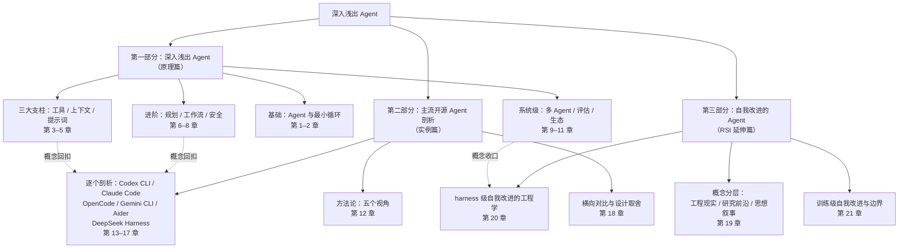

# 前言：为什么要写这本书

## 我们缺一本什么样的书

2024 年以来，Agent 从论文里的概念变成了数百万工程师每天使用的生产力工具：终端里的编码 Agent 能读代码、改文件、跑测试；浏览器里的研究 Agent 能查资料、写报告。但关于「Agent 到底是什么、怎么造出来」的资料，分布并不均匀：

- **论文与规范**足够严谨，却默认读者已经理解全部背景，新人难以入门；
- **多数中文入门书**以框架（AutoGen、LangGraph 等）与企业落地为主线，止步于「调一次 API、注册一个工具」，把 Agent 讲成黑盒——模型怎么决定下一步、上下文装不下怎么办、它会不会删错文件，这些问题在入门纸书里很难找到答案；
- 与此同时，一批优秀的免费资源已经出现：李博杰的《深入理解 AI Agent》以「自己动手实现」为主线讲透了原理，Simon Willison 的系列长文讲清了编码 Agent 的工作机制，黄佳的《Claude Code 实战》则深入剖析了单个产品。

但「**新人友好的原理拆解**」与「**主流开源实现逐一横向剖析**」这两半，至今没有在一本书里合上：前者不系统剖析真实实现，后者要么只讲单个实现、要么默认读者已是熟手——而 Codex CLI、Claude Code、OpenCode、Gemini CLI、Aider、DeepSeek Harness 六个实现中，后三者甚至没有任何系统性的中文剖析。

本书要做的正是这个交集：**从零开始、由浅入深，把 Agent 的每一个部件拆开讲清楚，再用真实的主流开源实现印证这些设计**——不只是罗列它们的功能，而是分析各自的设计与理念，让你把六种优秀设计中的思路变成自己的知识。

全书反复回扣一个心智模型：

> **Agent = 模型 + 工具 + 循环 + 上下文 + 护栏**

第 2 章你会看到，这句话展开之后就是一个 `while` 循环；而第一部分余下的章节，本质上都在回答「这个公式里的每一项，做到极致是什么样子」。

## 这本书的结构

**第一部分（第 1–11 章）** 与任何具体产品无关：它从「LLM 为什么需要工具」讲起，用一章一个主题的方式，把一个最小 Agent 逐步扩展成具备规划、安全护栏、多 Agent 协作和评估体系的完整系统。每一章都可以独立成篇，但按顺序阅读会获得一条清晰的主线。

**第二部分（第 12–18 章）** 用第一部分建立的概念去拆解真实项目：OpenAI 的 Codex CLI、Anthropic 的 Claude Code、OpenCode、Gemini CLI、Aider 与 DeepSeek Harness。这六种实现在业界有个统一的名字——**harness**（第 12 章解释这个术语为什么重要）。剖析不满足于罗列功能，而是始终回答同一个问题——*它们分别把第一部分里的哪些机制做到了什么程度，为什么这样取舍？*

**第三部分（第 19–21 章）** 把前两部分的能力收口到一个前沿问题：**Agent 能否改进 Agent？** 递归自我改进（RSI）这个词在流通中混着三层含义——已经落地的 harness 级自我改进（agent 修订自己的提示词、技能与工作流）、快速演进的训练级自我改进、以及关于「智能爆炸」的思想叙事。本部分逐层拆开：哪些是今天就能复现的工程，哪些是研究前沿，哪些只是故事。

读第二部分时你会发现一个反复出现的事实：**无论多先进的 Agent，核心机制仍然是第一部分讲过的那些部件**——差异只在于把哪一项打磨到什么程度、用什么代价换。这正是本书的立意所在：第一部分给你看懂任何一个 Agent 的底座，第二部分用六个广受关注的真实实现反过来印证这些原理——剖析得越多，原理越可信，优秀设计的思路也随之变成你自己的知识。

## 怎么读这本书

- **初级开发者**：按顺序阅读第一部分。代码示例看不懂可以跳过，不影响理解主线；读完第 1、2、3 章你就已经能写出一个可用的 Agent。
- **中高级开发者**：可以从第 12 章的「五个视角」方法论直接进入第二部分，遇到概念生疏处再回第一部分对应章节补课。
- **每一章的结构**基本一致：本章解决什么问题 → 概念与原理（配图）→ 代码示例 → 真实世界的对照 → 小结。
- **关注前沿的读者**：可直接进入第三部分；遇到概念生疏时，第 6 章（自我修正）、第 10 章（评估）、第 12.2 节（harness）是三个回看锚点。

## 写作约定

- **术语**：中文为主，首次出现标注英文原词（如「护栏（guardrail）」）；完整对照见附录 A。
- **代码**：以 TypeScript / Python 伪代码为主，聚焦结构而不绑定某个 SDK 的版本细节。
- **图表**：全部使用 [mermaid](https://mermaid.js.org/) 绘制，源码随书稿一起版本化，可随时修改。
- **事实口径**：涉及开源项目的事实以「截至 2026-10」的官方仓库与文档为准；这些项目演进很快，阅读时请以官方最新文档为准。

## 关于时效性的诚实说明

第一部分的概念（工具调用、上下文管理、权限模型、多 Agent 协作）是相对稳定的工程原理，预计多年内不会过时；第二部分描述的具体实现则处在快速演进中——书中给出的架构快照可能滞后于上游。为此，第二部分每章末尾都附有官方文档入口，把「验证最新状态」的路径一并交给你。**第三部分是三部分中最动荡的**：那里的研究结论与舆论格局都还在成形，请把它当作理解版图的地图，而不是可以背诵的定论。

## 勘误与共建

本书开源维护于 GitHub：<https://github.com/chongyi/deep-dive-agents>，线上阅读地址：<https://chongyi.github.io/deep-dive-agents/>。

- **勘误**：发现错别字、事实错误或失效链接，欢迎[提交 Issue](https://github.com/chongyi/deep-dive-agents/issues) 指出；错字、断链这类小改动，也欢迎直接提 Pull Request，通常会被很快合并。
- **共建**：新增章节、调整结构等较大改动，建议先开 Issue 说明动机与大致方案，达成一致后再动笔，避免返工。
- **提交前**：请先阅读仓库的 [CONTRIBUTING.md](https://github.com/chongyi/deep-dive-agents/blob/main/CONTRIBUTING.md)（写作约定、本地预览与构建细节），并在 `mdbook serve` 预览确认渲染无误后再提交。
- **许可**：本书内容与仓库代码均以 MIT 协议发布（见仓库 `LICENSE`），引用与转载请保留署名。
