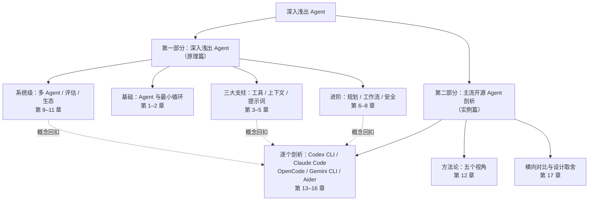

# 前言：为什么要写这本书

## 我们缺一本什么样的书

2024 年以来，Agent 从论文里的概念变成了数百万工程师每天使用的生产力工具：终端里的编码 Agent 能读代码、改文件、跑测试；浏览器里的研究 Agent 能查资料、写报告。但关于「Agent 到底是什么、怎么造出来」的资料却呈现出两个极端：

- **论文与规范**足够严谨，却默认读者已经理解全部背景，新人难以入门；
- **入门教程**往往止步于「调一次 API、注册一个工具」，把 Agent 讲成了一个黑盒，读完仍然无法回答最基本的问题——*模型是怎么决定下一步做什么的？上下文装不下怎么办？它会不会删错我的文件？*

这本书试图填补中间的地带：**从零开始、由浅入深，把 Agent 的每一个部件拆开讲清楚，再用真实的主流开源实现印证这些设计。**

全书反复回扣一个心智模型：

> **Agent = 模型 + 工具 + 循环 + 上下文 + 护栏**

第 2 章你会看到，这句话展开之后就是一个 `while` 循环；而第一部分余下的章节，本质上都在回答「这个公式里的每一项，做到极致是什么样子」。

## 这本书的结构

**第一部分（第 1–11 章）** 与任何具体产品无关：它从「LLM 为什么需要工具」讲起，用一章一个主题的方式，把一个最小 Agent 逐步扩展成具备规划、安全护栏、多 Agent 协作和评估体系的完整系统。每一章都可以独立成篇，但按顺序阅读会获得一条清晰的主线。

**第二部分（第 12–17 章）** 用第一部分建立的概念去拆解真实项目：OpenAI 的 Codex CLI、Anthropic 的 Claude Code、OpenCode、Gemini CLI 与 Aider。剖析不满足于罗列功能，而是始终回答同一个问题——*它们分别把第一部分里的哪些机制做到了什么程度，为什么这样取舍？*

## 怎么读这本书

- **初级开发者**：按顺序阅读第一部分。代码示例看不懂可以跳过，不影响理解主线；读完第 1、2、3 章你就已经能写出一个可用的 Agent。
- **中高级开发者**：可以从第 12 章的「五个视角」方法论直接进入第二部分，遇到概念生疏处再回第一部分对应章节补课。
- **每一章的结构**基本一致：本章解决什么问题 → 概念与原理（配图）→ 代码示例 → 真实世界的对照 → 小结。

## 写作约定

- **术语**：中文为主，首次出现标注英文原词（如「护栏（guardrail）」）；完整对照见附录 A。
- **代码**：以 TypeScript / Python 伪代码为主，聚焦结构而不绑定某个 SDK 的版本细节。
- **图表**：全部使用 [mermaid](https://mermaid.js.org/) 绘制，源码随书稿一起版本化，可随时修改。
- **事实口径**：涉及开源项目的事实以「截至 2026-10」的官方仓库与文档为准；这些项目演进很快，阅读时请以官方最新文档为准。

## 关于时效性的诚实说明

第一部分的概念（工具调用、上下文管理、权限模型、多 Agent 协作）是相对稳定的工程原理，预计多年内不会过时；第二部分描述的具体实现则处在快速演进中——书中给出的架构快照可能滞后于上游。为此，第二部分每章末尾都附有官方文档入口，把「验证最新状态」的路径一并交给你。

## 勘误与共建

本书以 mdBook 编写、Git 管理，修改任意章节后重新构建即可。发现事实错误或表述不清之处，欢迎直接修订并提交。
