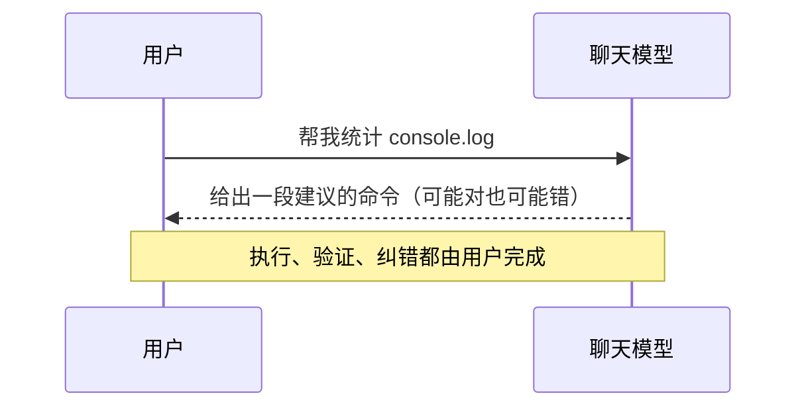
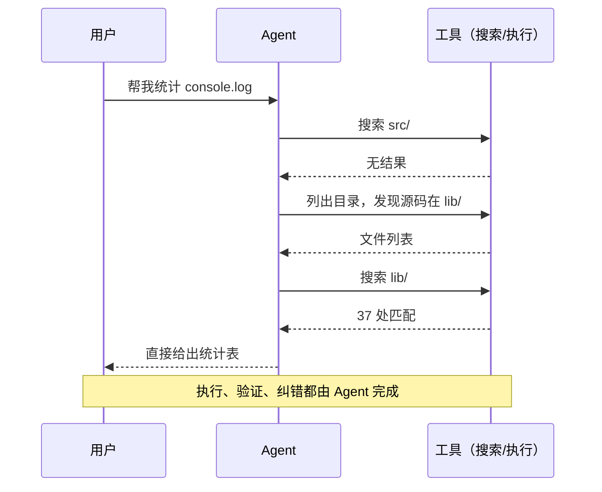
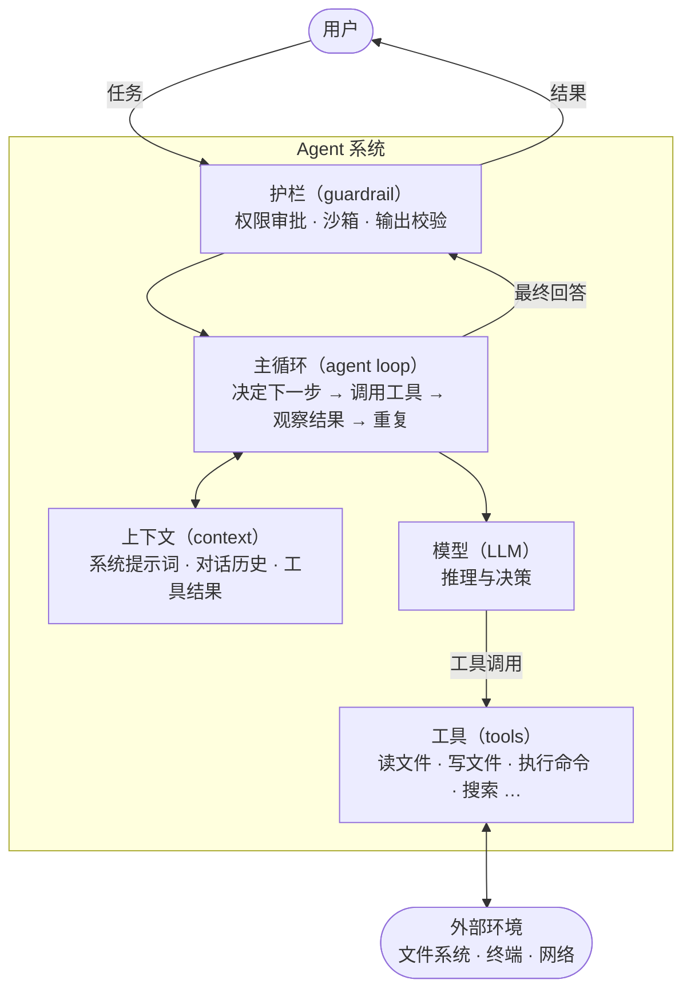
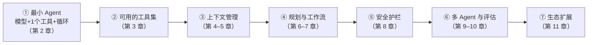

# 第 1 章 认识 Agent：从聊天到行动

> 本章解决一个问题：**Agent 和一个「能聊天的模型」到底差在哪里？**

## 1.1 从一个熟悉的场景说起

假设你对 AI 说：「帮我把这个项目里所有用到 `console.log` 的地方找出来，统计每个文件出现的次数。」

**如果对方只是一个聊天模型**，它只能给你一段「建议的命令」：

```text
你可以运行：grep -rn "console.log" src/ | awk -F: '{count[$1]++} END {...}'
```

命令可能对，也可能错——它没有见过你的项目，更没有运行过任何东西。你把命令复制到终端，报错了，再回来问它，它再猜一段。**你**是这个循环里的执行者。

**如果对方是一个 Agent**，过程是这样的：它自己调用搜索工具扫了你的 `src/` 目录，发现结果为空，注意到项目实际源码在 `lib/` 下，换个路径再扫，最后把统计表直接交给你——中途你没有敲过任何命令。**模型**成了执行者。

用两张时序图对比，差异一目了然：





第二张图里 Agent 做的事——**观察结果、修正方向、再尝试**——正是本书要拆解的全部内容。

## 1.2 LLM 的能与不能

要理解 Agent，先要诚实地面对大语言模型（LLM）本身的边界。一个「裸」的模型：

| 能力 | 局限 |
|---|---|
| 阅读、写作、总结、翻译、推理 | **无状态**：每次调用都是独立的，上一轮说了什么必须重新发给它才「记得」 |
| 理解代码、推测代码行为 | **无法行动**：不能读你的文件系统、不能联网、不能执行命令，只能生成文本 |
| 在上下文窗口内处理长文本 | **窗口有限**：且塞得越满，对细节的注意力越差（第 4 章详述） |
| 按 JSON 等格式输出、遵循指令 | **非确定**：同样的输入可能得到不同输出，会「一本正经地胡说」（幻觉） |

一句话总结：**模型是一颗强大的大脑，但它被关在一个只能收发文本的房间里。**

Agent 的全部工程，就是给这颗大脑装上眼睛（读环境）、双手（改环境）、记事本（上下文管理）和安全带（护栏）。Anthropic 在《Building Effective Agents》（2024）中把装好这些装备的模型称为**增强型 LLM（augmented LLM）**——LLM 加上检索、工具与记忆。这是全书一切讨论的起点。

## 1.3 定义：Workflow 与 Agent

「Agent」这个词被用得太滥，从带按钮的聊天窗口到全自动系统都自称 Agent。本书采用业界目前最通行的划分，来自 Anthropic《Building Effective Agents》：

- **Workflow（工作流）**：LLM 和工具通过**预定义的代码路径**编排的系统。步骤是开发者写死的，模型只在每一步里干活。
- **Agent（代理）**：LLM **动态指挥自己的流程和工具使用**、自主决定如何完成任务的系统。

OpenAI 在《A Practical Guide to Building Agents》（2025）中给出的定义与此一致：Agent 是「独立替你完成任务」的系统——它基于环境反馈动态决策、朝目标迭代工作，而不是沿着写死的路径走。

> [!NOTE] 本书的用词约定
> 我们把 Workflow 和 Agent 统称为 **agentic system**，但在具体行文中严格区分二者：**路径谁说了算**是唯一的分界线——开发者写死的是 workflow，模型自己决定的是 agent。第 7 章会看到，二者之间其实是连续过渡的，绝大多数生产系统落在两端之间的中间地带。

这个定义带来三个直接推论：

1. **「调用了工具」不等于「是 Agent」**。一个固定「先分类、再翻译、再校对」的流水线，每一步都调用了 LLM 和工具，但它是 workflow。
2. **Agent 的核心价值是应对无法预知步骤数的任务**。如果任务流程可以穷举，写 workflow 更便宜、更可控；只有在「不知道要走多少步、每步做什么取决于上一步结果」的任务上，才值得付出 Agent 的额外成本。
3. **自主是有代价的**。Anthropic 原文提醒：Agent 延迟更高、token 成本更大，且存在**错误的复合效应（compounding errors）**——每一步的小错误会被后续步骤放大。这就是为什么护栏（guardrail）是 Agent 的一等公民，而不是可选项。

## 1.4 心智模型：一个公式看懂全书

现在给出全书反复回扣的心智模型：

> **Agent = 模型 + 工具 + 循环 + 上下文 + 护栏**

- **模型**是大脑：决定下一步做什么。可以全程一个模型，也可以按任务混用大小模型。
- **工具**是双手：把决定变成对真实世界的读写动作（第 3 章）。
- **循环**是心跳：模型 → 工具 → 结果 → 再喂给模型 → 再决定，直到任务完成（第 2 章）。
- **上下文**是工作记忆：模型每一步「看得见什么」完全由它决定，是 Agent 工程中最微妙的部分（第 4、5 章）。
- **护栏**是安全带：权限审批、沙箱隔离、输出校验，让放权不变成失控（第 8 章）。

这四个非模型部件合在一起，业界有个正式的名字——**harness**（挽具）：套在模型身上、既驱动又约束它的全部外围工程系统。于是公式还有一个更简洁的流行写法：**Agent = Model + Harness**。这个词的来龙去脉与分量见第 12 章；第二部分剖析的每一个开源项目，本质上都是一种 harness 的实现。

画成一张结构图：



每个部件单独看都不复杂，难的是组合：工具越多，模型选择越难；任务越长，上下文越难管理；权限越开放，护栏越重要。**Agent 工程的本质就是管理这些互相牵制的张力。**

## 1.5 能力演进路径与本书地图

把公式里的部件逐步加进来，就得到了从「玩具」到「生产级」的成长路径，也是本书第一部分的目录逻辑：



每加一层，系统就多一分能力，也多一分复杂度。而第二部分会证明一件事：**无论 Codex CLI、Claude Code 还是 OpenCode，剥开语言与产品化的外衣，核心都是这张图的变体。**

## 1.6 小结

- 聊天模型只能「说」，Agent 能「做」：差别在于模型获得了工具、循环和记忆。
- 划分 Workflow 与 Agent 的唯一标准是**路径由谁决定**：开发者预定义的是 workflow，模型动态决定的是 agent。
- 记住公式：**Agent = 模型 + 工具 + 循环 + 上下文 + 护栏**，本书就是对这个公式的逐项展开。
- 自主性有代价：成本更高、错误会复合，所以护栏与评估从一开始就要在清单上。

下一章，我们把公式里最核心的「循环」拆出来——用五十行代码写出一个真正能跑的 Agent。
