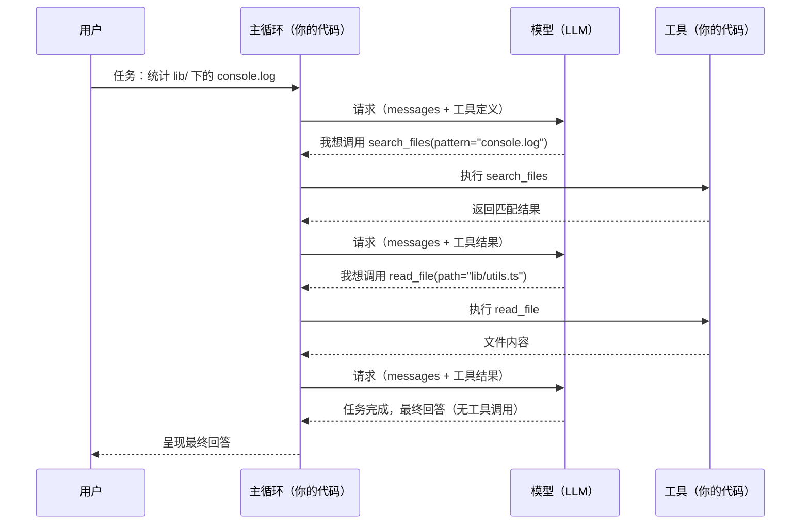

# 第 2 章 最小的 Agent：一个 while 循环

> 本章解决一个问题：**剥掉所有产品化外壳，一个 Agent 最小到什么程度还能称之为 Agent？**
> 答案会出乎意料地简单：一个 `while` 循环，加一个能被模型调用的工具。

## 2.1 先看全景：一轮任务里发生了什么

Agent 运行时的一切状态都装在一个**消息列表**（messages）里。用户任务是一条消息，模型的回答是消息，模型的工具调用请求是消息，工具执行的结果还是消息。所谓「运行一个 Agent」，就是不断往这个列表尾部追加消息，直到模型给出不再需要工具的回答。



注意图中的一个关键细节：**模型自己从不执行任何东西**。它只会「申请」调用某个工具；真正执行工具的永远是你的代码。模型是大脑，你的主循环才是脊髓和肌肉。这个分工是理解一切安全问题的前提（第 8 章）。

## 2.2 消息列表：Agent 的全部状态

主流模型的对话 API 都以「消息数组」为核心数据结构。一条消息大致由**角色**（role）+ **内容**（content）构成：

| 角色 | 谁写的 | 内容 |
|---|---|---|
| `system` | 开发者 | 系统提示词：人设、规则、工作方式（第 5 章） |
| `user` | 用户（或程序注入） | 任务、问题、补充说明 |
| `assistant` | 模型 | 回答文本，或**工具调用请求** |
| `tool`（OpenAI）/ `tool_result`（Anthropic） | 你的代码 | 工具执行的结果 |

一个微妙但重要的点：模型是**无状态**的（第 1 章）。每次调用 API，你都要把整个消息列表完整发过去，模型「记得」之前发生的一切，只是因为你在请求里重发了历史。这也意味着——消息列表就是 Agent 的全部短期记忆，它的长度受上下文窗口约束，它的内容质量直接决定模型的表现。第 4 章的全部主题就是如何管好这个列表。

## 2.3 工具调用：一次完整的往返

「工具调用（tool calling）」在不同厂商的 API 里有个更老的名字：**函数调用（function calling）**。机制是一样的：你在请求里声明有哪些工具可用，模型在回答里表达「我想调用哪个工具、传什么参数」，你执行后把结果回传。

以 Anthropic Messages API 为例（OpenAI 的形态见下方对照）。第一步，请求时声明工具：

```json
{
  "model": "claude-sonnet-4-5",
  "max_tokens": 1024,
  "tools": [
    {
      "name": "search_files",
      "description": "在指定目录下按正则搜索文件内容，返回匹配的文件与行",
      "input_schema": {
        "type": "object",
        "properties": {
          "directory": { "type": "string", "description": "搜索起始目录" },
          "pattern": { "type": "string", "description": "正则表达式" }
        },
        "required": ["pattern"]
      }
    }
  ],
  "messages": [
    { "role": "user", "content": "统计 lib/ 下所有 console.log" }
  ]
}
```

第二步，模型如果决定用工具，响应里的 `stop_reason` 会是 `tool_use`，并带一个工具调用块：

```json
{
  "stop_reason": "tool_use",
  "content": [
    { "type": "text", "text": "我先搜索目标文件。" },
    {
      "type": "tool_use",
      "id": "toolu_01A09q90",
      "name": "search_files",
      "input": { "directory": "lib", "pattern": "console\\.log" }
    }
  ]
}
```

第三步，你的代码执行 `search_files`，然后把**两条消息**追加进列表再发请求：先回显模型的 assistant 消息，再以 `user` 角色回传工具结果（`tool_result` 的 `tool_use_id` 必须与请求中的 `id` 配对）：

```json
{
  "messages": [
    { "role": "user", "content": "统计 lib/ 下所有 console.log" },
    { "role": "assistant", "content": [ { "type": "tool_use", "id": "toolu_01A09q90", "...": "..." } ] },
    {
      "role": "user",
      "content": [
        {
          "type": "tool_result",
          "tool_use_id": "toolu_01A09q90",
          "content": "lib/utils.ts:12\nlib/api.ts:4,57\n共 2 个文件 3 处匹配"
        }
      ]
    }
  ]
}
```

OpenAI Chat Completions 的对应形态只是字段名不同：工具定义嵌在 `tools[].function` 下（`name` / `description` / `parameters`）；模型的调用请求出现在 assistant 消息的 `tool_calls` 数组里（`function.name` + `function.arguments`，后者是 **JSON 字符串**）；结果用 `role: "tool"` + `tool_call_id` 回传。OpenAI 当前主推的 Responses API 则改为扁平的 `function_call` / `function_call_output` 条目。

> [!TIP] 记不住字段名很正常
> 两家厂商的形态差异只需要记住一句：**万变不离「请求里声明工具 → 响应里申请调用 → 回传结果 → 再请求」这四拍**。所有框架、所有产品，封装的都是这个往返。

## 2.4 主循环：五十行代码的 Agent

把四拍往复写成代码，就是 Agent 的主循环（agent loop）：

```typescript
// 一个最小但完整的 Agent。伪代码：省略了 SDK 初始化与错误处理细节。
import Anthropic from "@anthropic-ai/sdk";

const client = new Anthropic();

// ① 工具注册表：名字 → 真正的执行函数
const toolRegistry = {
  search_files: (input: { directory?: string; pattern: string }) =>
    grepFiles(input.directory ?? ".", input.pattern),
  read_file: (input: { path: string }) => readFile(input.path),
};

const toolDefs = [
  {
    name: "search_files",
    description: "在指定目录下按正则搜索文件内容，返回匹配的文件与行",
    input_schema: {
      type: "object",
      properties: {
        directory: { type: "string", description: "搜索起始目录，默认当前目录" },
        pattern: { type: "string", description: "正则表达式" },
      },
      required: ["pattern"],
    },
  },
  // read_file 的定义同理，略
];

async function runAgent(task: string) {
  const messages: any[] = [{ role: "user", content: task }];

  // ② 主循环：唯一的退出条件是模型不再申请调用工具
  for (let turn = 0; turn < 25; turn++) {          // max turns：安全阀
    const response = await client.messages.create({
      model: "claude-sonnet-4-5",
      max_tokens: 4096,
      tools: toolDefs,
      messages,
    });

    messages.push({ role: "assistant", content: response.content });

    // ③ 挑出所有工具调用，逐一执行，收集结果
    const toolUses = response.content.filter((b: any) => b.type === "tool_use");
    if (toolUses.length === 0) {
      return response.content.filter((b: any) => b.type === "text").join("\n");
      // 模型不再调用工具 = 它认为任务完成（stop_reason 为 end_turn）
    }

    const toolResults = [];
    for (const call of toolUses) {
      const fn = toolRegistry[call.name];
      const output = fn
        ? await safeRun(() => fn(call.input))     // 错误也要变成文本回传
        : `错误：未知工具 ${call.name}`;
      toolResults.push({
        type: "tool_result",
        tool_use_id: call.id,
        content: typeof output === "string" ? output : JSON.stringify(output),
      });
    }

    // ④ 工具结果以 user 角色回传，进入下一轮
    messages.push({ role: "user", content: toolResults });
  }
  return "已达最大轮数，强制停止。";                // 兜底退出
}

console.log(await runAgent("统计 lib/ 下所有 console.log，并读取 utils.ts 给出统计说明"));
```

不到五十行，但它具备 Agent 的定义性特征：**路径完全由模型决定**——它可以选择先搜索还是先读文件，可以搜不到换目录重试，也可以中途宣布任务无法完成。对比第 1 章的定义，你会发现这里没有任何分支逻辑是开发者写死的。

## 2.5 终止条件：循环何时结束

主循环必须有明确的出口，否则一个「越努力越糟糕」的模型可能无限循环下去。工程上同时用三层保险：

1. **自然终止**：模型的 `stop_reason` 不再是 `tool_use`（如 `end_turn`），说明它认为任务完成，直接输出最终回答。这是唯一的「正常出口」。
2. **最大轮数（max turns）**：硬性上限（示例中的 25 轮）。OpenAI 在其实践指南里把「达到最大轮数」与工具调用、结构化输出、错误并列为 Agent 的标准退出条件。触顶时应当明确报告「未完成」，而不是假装成功。
3. **预算与超时**：token 花费上限、单工具执行超时、整体时间上限。生产系统三层都要有。

> [!WARNING] 别删掉安全阀
> 最常见的教学示例 bug 就是把 `for` 写成 `while (true)` 又忘了终止分支——模型偶尔会陷入「调用同一个失败工具」的死循环，而你为每一轮付费。

## 2.6 这个循环还缺什么

恭喜，你已经拥有一个真正的 Agent。但拿它和 Claude Code 或 Codex CLI 对比，缺的东西正是后面九章的目录：

| 缺口 | 现状 | 对应章节 |
|---|---|---|
| 工具太少、太粗糙 | 只有搜索和读文件，没有写文件、执行命令 | 第 3 章：工具设计 |
| 上下文会爆 | 消息列表无限增长，几十轮后撞上窗口上限 | 第 4 章：上下文工程 |
| 没有行为规范 | 模型不知道自己是谁、该优先怎么做 | 第 5 章：系统提示词 |
| 没有规划 | 长任务容易走一步看一步、丢三落四 | 第 6 章：规划与推理 |
| 没有任何防护 | 模型让你 `rm -rf` 你就执行 | 第 8 章：权限与沙箱 |
| 单打独斗 | 大任务无法拆分、无法并行 | 第 9 章：多 Agent |
| 无法度量 | 改了提示词之后是好是坏，全凭感觉 | 第 10 章：评估 |

## 2.7 小结

- Agent 的全部运行时状态就是一个**消息列表**；模型无状态，「记忆」来自每次重发历史。
- 工具调用的四拍：**声明工具 → 模型申请调用 → 你的代码执行 → 结果回传再请求**。
- 主循环 = `while`（模型还在申请工具）+ 三层终止保险（自然终止 / 最大轮数 / 预算超时）。
- 模型从不直接执行任何东西——**执行权永远在你的代码手里**，这是一切权限设计的基础。

下一章给这具骨架装上真正的双手：如何设计一组让模型「用得对」的工具。
