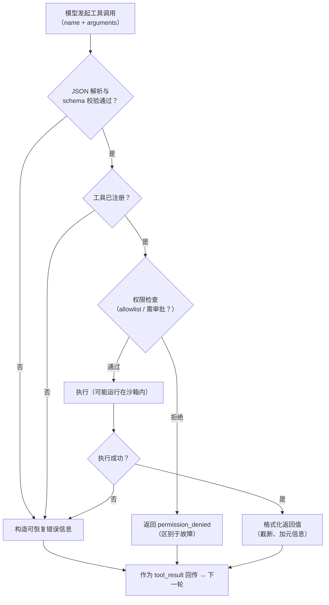

# 第 3 章 工具调用：Agent 的双手

> 本章解决一个问题：**为什么同样接了模型的两个 Agent，一个好用、一个废物？差距往往不在模型，而在工具设计。**

第 2 章我们已经能让模型调用工具，本章回答的是更高一层的工程问题：**什么样的工具是模型「用得对」的？** 记住一个视角转换：工具定义是写给两方看的——JSON Schema 给校验器看，而 `description` 和参数说明是**写给模型看的 API 文档**。模型选错工具、传错参数，第一嫌疑人永远是这份文档。

## 3.1 工具定义的解剖

每个工具由三部分构成，缺一不可：

```json
{
  "name": "read_file",
  "description": "读取指定路径的文本文件内容。适合查看源码、配置与文档。",
  "input_schema": {
    "type": "object",
    "properties": {
      "path": {
        "type": "string",
        "description": "相对工作区根目录的路径，如 src/index.ts"
      },
      "offset": { "type": "integer", "description": "起始行号，从 1 开始，缺省为 1" },
      "limit": { "type": "integer", "description": "最多读取的行数，缺省读全文件" }
    },
    "required": ["path"]
  }
}
```

- **`name`**：动词短语、snake_case，名字本身就是第一层语义。`read_file` 不叫 `file_op`。
- **`description`**：一句话说清「做什么 + 什么时候该用它」。这是模型做选择的头号依据。
- **`input_schema`**：JSON Schema 描述参数。每个参数的 `description` 同样重要——模型传错参数，多半是这里没写清。

> [!TIP] 一个实用的经验法则
> Anthropic 文档里有一条值得贴在工位上：**如果你正在写正则去从模型输出里抠一个「决定」，那这个决定本该是一个工具调用。** 与其让模型说「我认为接下来应该搜索」，不如给它一个可调用的工具，让决定落进结构化参数里。

## 3.2 描述怎么写：给模型看的 API 文档

工具描述的写作质量与模型表现的关系，比大多数人直觉的强得多。几条经过大规模验证的原则：

**说清「何时用」与「何时不用」。** 只写「做什么」是不够的。多个工具语义相近时（比如 `grep` 与 `read_file`），必须在描述里划清边界：

> ✅ `search_content`：**按正则**在文件内容中搜索，返回文件与行号。当你不知道目标在哪个文件时用；已知道路径时请改用 `read_file`。

**写使用条件与副作用。** 有副作用的工具（写文件、执行命令、发请求）必须显式声明，因为模型需要据此决定「先确认再动手」。

**给枚举而不是自由文本。** 参数取值可枚举时用 `enum`，把选择题变成填空题：`"mode": { "enum": ["exact", "fuzzy"] }`。

**示例进描述。** 复杂参数（正则、路径模式）在 `description` 里给一个最小示例，能显著降低传参错误。

**术语与系统提示词对齐。** 如果系统提示词里把「工作区」叫 workspace，工具描述就不要叫 project root——模型会把两处不一致的术语当成两个概念。

## 3.3 参数与返回值的设计

**参数粒度：宁可多个简单工具，不要一个万能工具。** 一个 `manage_project(action, ...)` 接收十种 action 的设计，等于让模型做两次决策（先选 action 再拼参数），出错面更大。拆成 `list_files` / `read_file` / `delete_file` 各司其职，模型反而更准。

**返回值：结构化、可截断、带元信息。** 工具返回值会原文进入上下文（第 4 章），设计时就要考虑「模型读它做什么」：

```json
{
  "ok": true,
  "path": "src/api.ts",
  "total_lines": 812,
  "returned_lines": 200,
  "truncated": true,
  "content": "前 200 行内容...",
  "note": "文件过长已截断，可用 offset 翻页"
}
```

带 `truncated` 标记和翻页提示，模型才知道如何取回剩余内容——**返回值本身就是下一轮决策的输入**。

**严格模式。** OpenAI 的 Structured Outputs（`strict: true`）与 Anthropic 的 `strict` 工具会把 JSON Schema 变成模型输出的硬约束（要求 schema 满足 `additionalProperties: false` 等条件）。对于参数易错的工具值得打开，但注意严格模式不等于「参数语义正确」，文档仍然不可省。

## 3.4 错误处理：把错误变成反馈

工具执行失败时，最常见的错误做法是抛异常打断循环，或者返回一句干巴巴的 `error`。正确姿势是：**错误信息是给模型的排障指南**。

```json
{
  "ok": false,
  "error_type": "file_not_found",
  "message": "src/indx.ts 不存在。相近的文件：src/index.ts、src/index.test.ts",
  "hint": "可先用 list_files 确认路径"
}
```

三条要点：

1. **错误要可恢复**：告诉模型「发生了什么 + 有什么相近的选项 + 下一步可以怎么办」。模型读到这种错误，下一轮通常能自己纠正。
2. **未知工具、参数校验失败同样要回传**（Anthropic 允许在 `tool_result` 上标 `is_error: true`），让模型重试而不是崩溃。
3. **区分「工具坏了」与「工具被拒绝」**：前者是故障，模型应换路走；后者是权限拒绝（第 8 章），模型应调整方案或向用户解释。混在一起会让模型反复撞墙。

## 3.5 一次工具调用的完整生命周期

把上面几节串起来，一次「模型申请 → 结果回传」之间，工程上其实要经过好几道工序：



这张图也是第二部分的解剖地图：读任何一个开源 Agent 的源码，工具执行路径上基本都能找到这五个框——解析、校验、权限、执行、格式化。

## 3.6 工具的分类学

OpenAI 的实践指南给出过一个清晰的三分类，很适合作为设计工具集时的检查表：

| 类别 | 定义 | 例子 |
|---|---|---|
| **Data（数据）工具** | 只读地获取事实，无副作用 | 读文件、搜索代码、查数据库、网页抓取 |
| **Action（动作）工具** | 对外部世界产生副作用 | 写文件、执行命令、发邮件、创建工单 |
| **Orchestration（编排）工具** | 把**其他 Agent** 当作工具调用 | 派发子任务、移交对话（第 9 章） |

这个分类的真正价值在于**安全与审批策略可以按类施策**：Data 工具可以默认放行；Action 工具需要权限门槛（第 8 章）；Orchestration 工具决定系统的并发与成本结构。

对照一个真实编码 Agent 的典型工具集（这几乎是 Codex CLI、Claude Code、OpenCode 的公共子集）：

| 工具 | 类别 | 说明 |
|---|---|---|
| `read_file` / `list_files` | Data | 读环境 |
| `search`（grep/glob） | Data | 定位信息 |
| `write_file` / `edit` | Action | 修改环境；`edit` 通常以「精确匹配旧文本 → 替换」的方式实现 |
| `bash` / `shell` | Action | 万能但高危，因此是权限系统的重点对象 |
| `web_search` / `web_fetch` | Data | 接入外部知识 |
| `todo` / `task list` | Data（对模型自身） | 维护任务计划（第 6 章） |
| `subagent` / `task` | Orchestration | 派发子 Agent（第 9 章） |

## 3.7 工具不是越多越好

直觉上「工具越多能力越强」，实际相反：工具过多时，模型选择准确率下降，且每个工具的定义都会**常驻消耗上下文**（工具定义计入每次请求的输入 token）。工程上的应对：

- **合并语义重叠的工具**，用参数区分模式而不是拆成多个；
- **按任务裁剪工具集**：子 Agent 只带它需要的工具（第 9 章），planning 模式下干脆不给写类工具（第 6 章）；
- **工具数量确实巨大时**，让「找工具」本身成为工具——OpenAI 2026 年的 `tool_search` 机制就是把上千个工具放进目录、由模型按需检索，这正是「按需检索」思想（第 4 章）在工具维度的应用。

> [!NOTE] 一条经验数字
> 主流编码 Agent 的内置工具都在十几个的量级，而非上百个——其余能力通过 MCP（第 11 章）按项目需要外挂，或通过 Skills 按需加载。**克制是工具设计的默认美德。**

## 3.8 小结

- 工具描述是**写给模型的 API 文档**：何时用/何时不用、副作用、示例，一样都不能少。
- 参数宁可枚举不可自由发挥；返回值要结构化、可截断、带翻页与元信息。
- 错误信息要**可恢复**：故障要给排查线索，权限拒绝要单独区分。
- 一次工具调用在工程上是五道工序：解析 → 校验 → 权限 → 执行 → 格式化。
- 用 Data / Action / Orchestration 三分类审视工具集，工具数量保持克制。

工具解决「手脚」的问题，但模型每次决策只能看见上下文窗口里的东西。下一章进入 Agent 工程中最微妙的部分：上下文。
