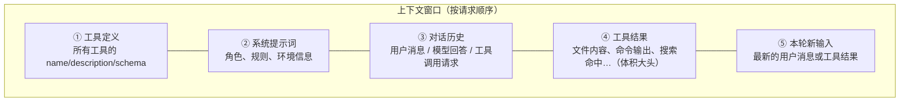
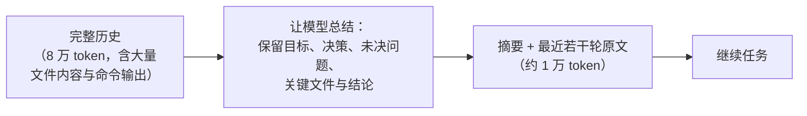

# 第 4 章 上下文工程：记忆与注意力

> 本章解决一个问题：**模型的每一次决策，质量上限由它「此刻看得见什么」决定。** 上下文工程（context engineering）就是管理这份可见性的手艺。
> 2025 年之后，这个词在业界逐步取代了「提示词工程」的说法——Karpathy 的定义流传最广：为 LLM 解决任务提供全部上下文的艺术。

## 4.1 窗口里装了什么

先把「上下文」这个黑盒拆开。每次请求模型时，上下文窗口里堆叠着这些东西：

一个关键事实：**工具结果通常是体积大头**。读一个大文件、跑一个输出冗长的命令，一条消息就可能吃掉几万 token。因此上下文工程的主战场从来不是「用户说了什么」，而是「工具结果怎么进、怎么留、怎么退」。

第二个关键事实：窗口不是免费的。Anthropic 把两个现象命名为 **context rot（上下文腐烂）**——token 越多，对具体细节的召回越差；以及**注意力预算（attention budget）**——Transformer 的注意力随序列长度摊薄，且训练数据里长序列本来就少。**「窗口能装下」从来不等于「模型用得好」**，窗口大小是物理约束，注意力质量才是工程约束。

因此，上下文工程的核心原则一句话：**找到能让模型得出正确结果的最小高信号 token 集合**（smallest set of high-signal tokens）——注意是最小「信号集」，不是最短文本。

## 4.2 策略一：压缩（Compaction）

任务变长、历史逼近窗口上限时，用一次模型调用把历史**总结成摘要**，然后用摘要替换原始历史、重开窗口：

压缩的取舍在于**保留什么**。Claude Code 的压缩策略是个好参照：优先保留任务目标、架构决策、未解决的 bug、关键实现细节，以及最近访问过的几个文件的上下文；而早期那些冗长的命令输出、走错路的尝试，都可以被总结掉。Anthropic 的经验是：**调压缩提示词时先最大化「该记的都记得」（recall），再收紧「别记太多」（precision）**——丢掉关键决策的压缩是灾难，多留一点只是浪费。

两个更轻量的变体值得知道：

- **工具结果清理（tool result clearing）**：不动对话，只把最占体积的旧工具结果替换成一行占位符（如 `[已省略：cat package.json 的输出]`）。这是「最安全、最轻手」的压缩。
- **上下文编辑（context editing）**：Anthropic 2025 年起提供的 API 能力，在服务端按策略清除历史中的工具结果与旧思考块，客户端保留完整历史用于审计。

## 4.3 策略二：结构化笔记与记忆文件

压缩是「被动应付」，笔记是「主动管理」：让 Agent 把重要信息**写到上下文窗口之外的文件里**，需要时再读回来。

- **任务笔记**：长任务进行中把进度、发现、未决问题写进 `NOTES.md`，即使触发压缩甚至重开任务，关键事实也不丢。Anthropic 有个著名例子：让 Claude 通关宝可梦游戏，就是靠笔记文件跨数千步保持着精确的状态计数。
- **待办清单**：把任务计划写成结构化 todo 文件（或通过 todo 工具维护），既是给模型的进度锚点，也是给用户的进展展示（第 6 章展开）。
- **项目记忆文件**：把「这个项目怎么构建、有什么约定」写成常驻文件，每次会话开头注入。这就是 `CLAUDE.md`、`AGENTS.md`、`GEMINI.md` 这类文件的由来——事实上的行业标准 AGENTS.md 已由 Linux Foundation 旗下的基金会托管，被 Codex、Cursor、Gemini CLI、Copilot 等几十种工具采用。写法细节在第 5 章。
- **记忆工具（memory tool）**：Anthropic 2025 年把这种模式做成了标准工具——模型通过 `view` / `create` / `str_replace` 等命令操作一个 `/memories` 目录，由你的代码映射到真实存储。它与压缩的关系被官方总结得很清楚：**编辑清理具体的工具结果，压缩总结整个对话，记忆让必须幸存的信息跨越总结而存活**。

## 4.4 策略三：子代理隔离（预告）

当任务的探索量远超一个窗口时，与其反复压缩主上下文，不如**派一个子 Agent 用干净的窗口去探索，只带结论回来**。主 Agent 的上下文里只留下千余 token 的精华摘要，而不是几十万 token 的探索过程。

这是多 Agent 系统最硬核的工程理由——不是「多个脑子更聪明」，而是**上下文隔离**。第 9 章专门展开。

## 4.5 策略四：按需检索（just-in-time retrieval）

最后一类策略：**不要预加载，只保留轻量索引，用时再取**。

- 上下文里只放文件路径列表、符号名、链接这类「标识符」，不放内容本身；
- 模型需要时通过工具读取具体文件——这就是第 3 章工具设计的返回值为什么要支持分页与截断；
- Aider 的 repo map（第 16 章）是这一策略的经典实现：用语法树加图排序，把整个仓库的「骨架」压进约一千 token，模型看着地图决定读哪几个文件。

代价是明显的：运行时多了一跳「先找再读」，慢一些。收益是上下文永远只装当前真正需要的内容。对于法律、金融这类低变动领域，可以退一步用混合策略：预加载核心文档 + 按需检索外围资料。

## 4.6 提示词缓存：上下文的经济学

上下文不只是质量问题，还是成本与延迟问题。好在现代 API 提供**提示词缓存（prompt caching）**：前缀相同的请求，命中缓存的 token 按约一折计费，且大幅降低首 token 延迟。

用好缓存的工程规则只有一条：**把不变的内容放前面，把变化的内容放后面**。回看 4.1 的堆叠图——工具定义、系统提示词、较早的对话历史都是稳定前缀，天然适合缓存；最新一条工具结果永远在尾部，不影响前缀命中。这正是消息列表按「追加」方式演进的原因之一：任何对历史的原地改写（包括上一节的工具结果清理）都会使缓存失效，**「动历史」和「省缓存」是一对需要显式权衡的矛盾**。

Claude Code 团队 2026 年的工程复盘甚至把这一点上升为第一定律：「Prompt caching is everything」——一个生产 Agent 的成本与响应速度，很大程度上由前缀稳定性设计决定（第 14 章展开）。

## 4.7 策略选择速查

| 症状 | 首选策略 | 参考 |
|---|---|---|
| 长任务撞窗口上限 | 压缩（先工具结果清理，再全量总结） | 4.2 |
| 关键事实在压缩后丢失 | 结构化笔记 / 记忆文件 | 4.3 |
| 探索型子任务污染主上下文 | 子代理隔离 | 4.4 / 第 9 章 |
| 上下文塞满「可能有用」的内容 | 按需检索，只留索引 | 4.5 |
| 成本与延迟失控 | 前缀稳定 + 提示词缓存 | 4.6 |

> [!TIP] 一个反直觉的总结
> 新手往上下文里拼命加东西（更多文件、更多历史、更多规则），高手在做减法（更准的摘要、更小的索引、更早的清理）。**上下文工程的默认动作是「收」，不是「放」。**

## 4.8 小结

- 上下文 = 工具定义 + 系统提示词 + 历史 + 工具结果，**体积大头是工具结果**。
- 窗口能装下 ≠ 模型用得好：context rot 与注意力预算要求「最小高信号集合」。
- 四板斧：**压缩、笔记/记忆、子代理隔离、按需检索**，各自解决不同的窗口病。
- 「动历史」会打破提示词缓存，前缀稳定性是生产 Agent 的经济命脉。

上下文回答了「模型看见什么」，下一章回答「这些内容里，哪些由开发者事先写死」——系统提示词的设计学。
