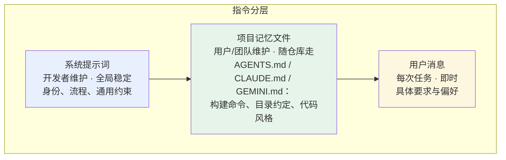

# 第 5 章 系统提示词：Agent 的操作手册

> 本章解决一个问题：**同一个模型、同一组工具，为什么换个系统提示词就像换了个人？** 因为系统提示词是 Agent 的「操作手册 + 员工守则」，它规定了这个 Agent 是谁、在什么环境里工作、按什么流程做事、哪些事绝对不许做。

## 5.1 系统提示词是什么、不是什么

先纠正一个常见误解：系统提示词不是「聊天的开场白」，也不是「人设玩具」。在 Agent 系统里，它是一份**每次请求都以最高优先级注入的运行时文档**，模型在生成每一个动作时都会参照它。

它擅长承载三类信息：

1. **身份与使命**：你是一个终端编码 Agent，服务对象是工程师，完成任务优先于解释。
2. **环境事实**：工作目录、操作系统、当前日期、项目技术栈。模型对环境一无所知，你不说它就猜。
3. **流程与约束**：接到任务先做什么再做什么；什么情况必须先征求用户同意；输出遵循什么格式。

它**不擅长**的事同样要清楚：

- 不能替代工具描述（第 3 章）：工具怎么用应写在工具定义里，系统提示词只写「使用策略」层面的规则；
- 不能承载项目特定信息：项目怎么构建、目录约定是什么，应该放进项目记忆文件（见 5.4）；
- 不能当作安全边界：「你在提示词里说了不许删文件」不是安全机制，权限系统才是（第 8 章）。提示词约束的是**倾向**，不是**能力**。

## 5.2 一份生产级系统提示词的解剖

把主流编码 Agent 的系统提示词（社区对 Claude Code 等产品的分析还原）抽象一下，成功的结构高度一致：

```text
[身份]   你是一个运行在终端里的编码 Agent……

[环境]   操作系统：macOS；Shell：zsh；工作目录：/repo；
         平台特定注意事项（如路径引号规则）……

[工作流] 1. 接到任务先探索理解，再动手；一次只改最小必要范围；
         2. 修改后运行测试验证；
         3. 不确定时用工具收集信息，而不是猜测……

[工具使用策略] 优先用 grep/glob 定位；批量读文件时并行调用；
         执行长命令注意超时；避免交互式命令……

[安全约束] 不主动删除用户数据；破坏性命令前必须确认；
         不提交密钥……

[输出规范] 回答简洁；先给结论；改动给出文件与行号……
```

几条从真实产品提示词里学到的细节：

- **环境信息具体到令人发指**：连「macOS 上 cp 行为与 Linux 不同」这类事实都会写进去——因为模型确实会在这里犯错。
- **流程写成编号步骤**：模型对编号列表的遵循度显著高于散文段落。
- **「先做什么」比「不做什么」多**：好的手册教正确路径，而不是罗列禁令。
- **长度可以很长**：Claude Code 的系统提示词以千行计。长度本身不是问题（有缓存兜底，第 4 章），**矛盾才是问题**——两条互相冲突的规则会显著放大模型行为的不确定性。

## 5.3 写作六原则

1. **可执行优于形容词**：「回答要简洁」不如「默认不超过 10 行，除非用户要求展开」。
2. **正面表述**：「用 Read 工具读文件」优于「不要用 cat 读文件」。模型对「做什么」的遵循远好于「别做什么」。
3. **关键规则前置并重复**：注意力预算（第 4 章）对系统提示词同样生效——最重要的规则放开头，涉及安全的关键约束可在流程处二次强调。
4. **给示例**：输出格式要求复杂时，直接放一个填好的示例，比三段描述都管用。
5. **一条规则一个理由**：写「不要并行运行多个测试（会互相污染临时目录）」，模型在边界场景下能自己推断，而赤裸的禁令不行。
6. **版本化**：系统提示词是代码，不是文案。改动必须走 git，且要跑回归（第 10 章）——提示词的改动是 Agent 系统里性价比最高、也最容易引发回归的改动。

## 5.4 指令的三层分工

一个成熟的 Agent 产品里，「告诉模型怎么做」的信息分布在三层，分工清晰：



为什么项目信息要单独一层？因为它们**跟着仓库走而不是跟着产品走**：同一个 Agent 打开不同项目，记忆文件不同；同一个项目换一个 Agent 工具，`AGENTS.md` 照常生效。这一层 2024 年由各产品各自发明（`CLAUDE.md`），2025 年起收敛到开放约定 `AGENTS.md`——「给 Agent 看的 README」，monorepo 里就近生效（离被编辑文件最近的文件优先）。

写好一份 `AGENTS.md` 的要点：写**模型猜不出来**的东西（构建命令、测试命令、目录语义、坑），不要写模型本来就知道的常识；保持在一两页以内，太长了会稀释注意力。

## 5.5 常见反模式

| 反模式 | 为什么有害 | 改法 |
|---|---|---|
| 「绝对不要产生幻觉」 | 模型无法执行抽象禁令 | 给它验证手段：「不确定的事实必须先用工具核实」 |
| 威胁式语气（「否则将被惩罚」） | 无实证收益，还可能干扰正常推理 | 就事论事写规则与理由 |
| 把所有规则堆成一段 | 关键规则被注意力稀释 | 分区 + 编号 + 前置 |
| 与工具描述矛盾 | 两处不一致时模型行为随机 | 术语、流程、命名统一维护 |
| 塞满「偶尔有用」的百科 | context rot（第 4 章） | 常驻只留高频规则，低频内容交给按需加载（第 11 章 Skills） |

## 5.6 小结

- 系统提示词是 Agent 的**操作手册**：身份、环境事实、流程、约束、输出规范，一次写好、每次注入。
- 它不是安全边界、不替代工具描述、不承载项目细节——后者由 `AGENTS.md` 这层项目记忆承担。
- 写作要点：可执行、正面表述、结构化、给示例、讲理由、进版本控制。
- 指令分三层：**系统提示词（全局）→ 项目记忆文件（随仓库）→ 用户消息（当下）**，各司其职。

至此，「模型 + 工具 + 循环 + 上下文 + 提示词」都已就位，我们的 Agent 能干具体的活了。但让它干**长活**还需要一样东西——规划。下一章从 ReAct 讲起。
