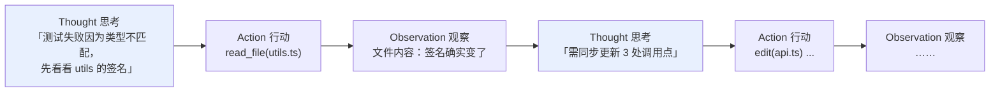
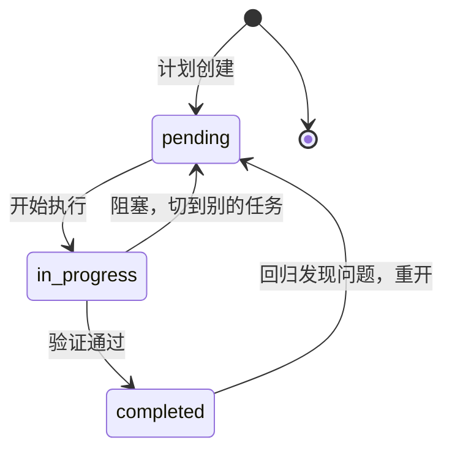
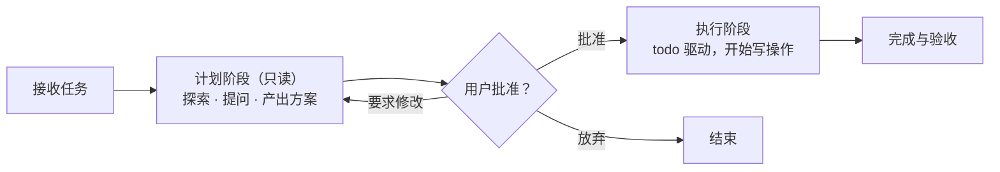

# 第 6 章 规划与推理：走得更远

> 本章解决一个问题：**第 2 章的最小 Agent 是「走一步看一步」的——短任务没问题，长任务会迷路。** 规划与推理技术让 Agent 在几十步的任务里不丢目标、不绕圈、不烂尾。

## 6.1 没有规划的 Agent 会怎样

观察一个只靠基础循环驱动的 Agent 处理「给这个项目加上 CI 并修复所有测试」这类多步任务，典型病状有三：

1. **局部最优陷阱**：修好眼前的测试，忘了还有三个文件没改——目标在长任务中逐渐「淡出」注意力（正是第 4 章的 context rot）。
2. **绕圈**：方案 A 失败 → 换方案 B → 又回到方案 A，没有「已尝试路线」的记忆。
3. **过早收工**：改完第一个报错就宣布完成，没有对照全局目标验收。

有意思的是，这些问题多数不需要「更聪明的模型」来解决，而需要**工程结构**：把思考、计划、进度显式地落到上下文里。

## 6.2 ReAct：思考与行动的交替

一切的起点是 2022 年的论文 ReAct（Yao et al., *Synergizing Reasoning and Acting in Language Models*）。名字是 Reason + Act 的合成词，思想极其朴素：让模型在「行动」之间插入显式的「思考」：

Thought → Action → Observation 循环往复。论文证明了两个收益：**推理轨迹让计划可跟踪、错误可回溯**（行动有了「为什么」），**外部观察弥补了模型内部知识的不足**（先看再动，减少幻觉式自信）。ReAct 之后的几乎所有 Agent 产品，内核都是这个模式——只是 Thought 有时以「推理模型」的内部思考呈现（见 6.3），有时以对话文本呈现。

## 6.3 思考链与推理模型

ReAct 之前一年，思考链（chain-of-thought，CoT，Wei et al. 2022）就证明了：让模型先产出中间推理步骤再给答案，复杂推理准确率大幅提升——论文中的著名结果是，仅用八个示例提示 5400 亿参数模型，就在 GSM8K 数学基准上达到当时最佳。

到 2024–2025 年，这条技术线演化为产品形态的**推理模型（reasoning models）**：o 系列、Gemini Thinking、Claude 的 extended thinking。它们的「思考」发生在模型内部专属的推理 token 里，不占用回答正文，但同样消耗 token 与上下文（对 Agent 意味着：工具多轮之间，历史里的思考块会持续膨胀——这正是第 4 章「上下文编辑清理旧思考块」要解决的问题）。

对 Agent 工程师的影响很实际：

- **默认用推理模型当核心**已成为主流编码 Agent 的共识——规划质量对长任务的影响超过单步工具调用的准确率；
- **思考深度可调**：Claude Code 允许用户切换思考预算档位，简单任务省钱省时，复杂任务深想；
- **推理模型的中间产物要随对话回传**（如 OpenAI Responses API 的 reasoning 条目），丢了模型会「忘记自己是怎么得出结论的」。

## 6.4 显式规划：todo 清单

思考发生在模型脑子里，会随上下文滚动而磨损。**把计划落到结构化载体上**是更可靠的工程手段——主流做法是给 Agent 一个 todo 工具（Claude Code 的 TodoWrite/TaskCreate 系列、Codex 的 update_plan、OpenCode 的 todowrite）：

别小看这个清单，它同时服务三方：

- **给模型**：一份常驻上下文的目标锚点，每轮决策前「看一眼还剩什么」，是对抗 context rot 最便宜的特效药；
- **给用户**：长任务的可视化进度条（Claude Code 在终端里实时渲染这个清单）；
- **给系统**：结构化的进度状态，可用于中断恢复、审计与评估（第 10 章）。

## 6.5 计划模式：先谋而后动

todo 解决「执行中不忘」，还有一个更前置的问题：**要不要先获得批准再动手？** 这就是**计划模式（plan mode）**：Agent 先进入只读阶段——探索代码、评估方案、产出一份计划，**期间不执行任何写操作**；用户批准后再切换到执行阶段。

Claude Code 的 plan mode、Cline 的 Plan/Act 双模式（第 16 章）、OpenCode 的 plan agent 都是这一模式的产品化。它的价值在于**把「理解偏差」的纠正成本降到最低**：改一行计划比改一堆代码便宜得多。对高风险、大范围的任务，先谋而后动应当是默认行为。

## 6.6 计划的执行学：预设路线 vs 涌现路线

什么时候把计划写死、什么时候让模型自己规划？这是 workflow 与 agent 之争（第 1 章）在规划维度的再现：

- **Plan-and-execute（预设路线）**：先用一个（往往更强的）模型产出完整多步计划，再由执行器逐步执行，出错时重新规划。优点是步骤可控、可以给便宜模型执行；缺点是计划赶不上变化，长任务中每一步的现实都可能让原计划失效。
- **涌现式规划（emergent planning）**：不预先写死路线，由模型在循环中借助 todo 清单**持续维护**计划——计划是一个活文档而非一次性产物。当代主流编码 Agent 全部采用这种模式，理由很实际：真实代码任务的分支太多，预先规划的收益撑不起它的刚性。

一个常见的混合用法是**模型分工**：让推理强的模型出方案、执行型的模型落地编辑——Aider 的 architect/editor 模式（第 16 章）是这一思路的代表。

## 6.7 自我修正：失败了怎么办

规划解决方向，修正解决颠簸。工程上把「失败后的行为」分为三档，由系统提示词和工具返回值（第 3 章）共同塑造：

1. **重试**：瞬时故障（网络、超时）直接重试，幂等工具可安全重试；
2. **换路**：确定性失败（编译错误、测试不过）说明方案有问题——把错误信息完整回传，让模型基于新观察调整策略，这正是 ReAct 循环的强项；
3. **升级**：超过重试预算或涉及权限/歧义时，**停下来问人**，而不是硬着头皮继续。好的 Agent 知道什么时候认怂——「触发最大轮数后假装成功」是最坏的行为（第 2 章的终止条件设计在这里再次生效）。

## 6.8 小结

- 长任务的失败多是**结构性**的：目标淡出、绕圈、过早收工——用工程结构治，不靠换模型。
- ReAct 的 Thought–Action–Observation 是一切 Agent 的内核；思考链演进为推理模型，成为当代 Agent 的默认大脑。
- **todo 清单**是最便宜的进度锚点，一份结构化计划同时服务模型、用户与系统。
- **计划模式**把理解偏差的纠正成本降到最低：先只读探索、批准后执行。
- 计划作为活文档（涌现式）优于一次性预设路线；失败处理分三档：重试、换路、升级问人。

单Agent的「内功」至此齐备。下一章把视角拉高：当多个 LLM 调用需要组合起来时，业界沉淀出了哪些标准结构——工作流模式。
