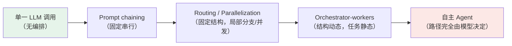
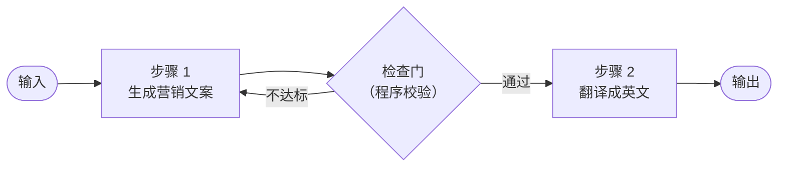
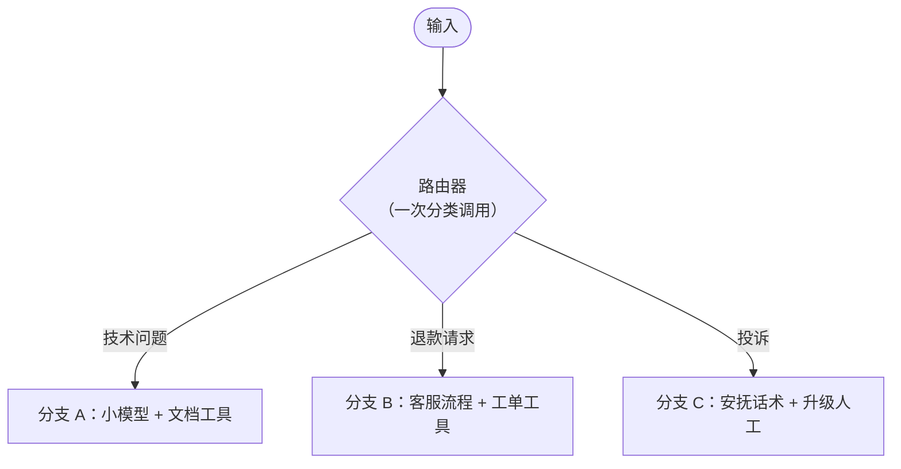
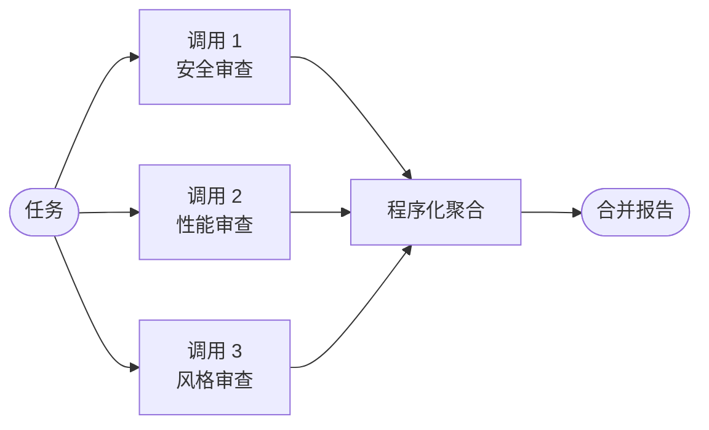
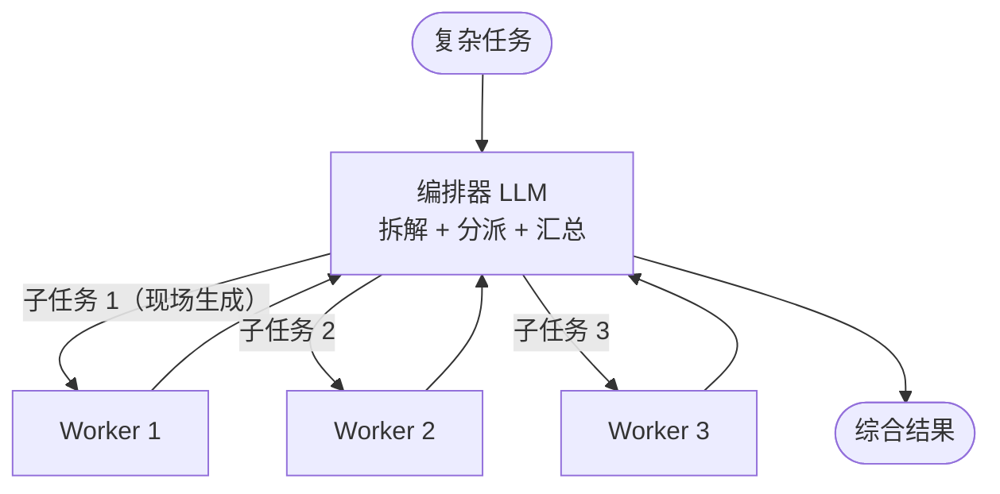
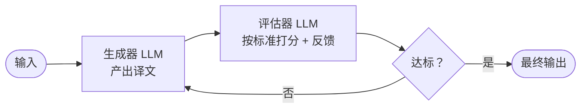

# 第 7 章 工作流模式：从流水线到自主

> 本章解决一个问题：**当任务需要多次 LLM 调用时，如何组织它们？** Anthropic《Building Effective Agents》总结的五种工作流模式是当前业界的事实标准词汇。掌握它们，你就掌握了讨论 Agent 架构的通用语言——第二部分剖析每个开源项目时都会反复用到这套词汇。

## 7.1 先看全景：从确定性到自主性

第 1 章说过，workflow 与 agent 的分界是「路径谁说了算」。真实的系统分布在这条从确定性到自主性的连续区间上：

越靠左：越可预测、越便宜、越容易调试；越靠右：越灵活、越能处理开放问题、成本与不确定性越高。Anthropic 的建议值得当作第一原则：**从最简单的方案开始，只在需要时增加复杂度**——最成功的实现靠的是简单可组合的模式，而不是复杂框架。

## 7.2 提示链（Prompt Chaining）

把任务拆成**固定的串行步骤**，每一步一次 LLM 调用，吃上一步的输出。步骤之间可以插入**程序化检查门（gate）**，不达标就不进入下一步。

- **适用**：任务能干净地拆成固定子任务（先生成后校对、先提纲后成文）。用延迟换质量。
- **真实例子**：代码修改类 Agent 常见的「定位 → 修改 → 生成说明」三段流水线；Aider 的 architect 模式「出方案 → 落补丁」（第 16 章）。
- **要点**：每一步目标单一，中间结果可用廉价模型处理；检查门是程序逻辑，不是 LLM。

## 7.3 路由（Routing）

先对输入**分类**，再把不同类别导给**专门的处理分支**。各分支可以用不同的提示词、不同的工具集、甚至不同价位的模型。

- **适用**：输入有明确类别、分别处理明显更优的场合（客服分流是教科书案例）。
- **Agent 视角的应用**：路由思想在编码 Agent 里化身「大模型干规划、小模型干杂活」的成本策略，以及 plan/执行模式的工具集切换（第 6 章）。

## 7.4 并行化（Parallelization）

多个 LLM 调用**同时**进行，结果由程序化聚合。两个变体：

- **分区（sectioning）**：把任务拆成互不依赖的子任务并行跑。例子：让多个调用分别审查代码的安全、性能、风格问题，合并成一份报告；或者**把护栏作为并行任务**——主任务与安全审查同时进行（乐观执行），护栏晚到再拦截。
- **投票（voting）**：同一个任务跑多次，取多数或取并集，用多样性换置信度。例子：对同一段代码用不同提示词并行找漏洞，并集作为结果。

- **适用**：子任务天然独立（提速），或需要多视角提高置信度（提准）。
- **真实例子**：Anthropic 的多 Agent 研究系统并行派出多个子 Agent 检索（第 9 章）；Codex CLI 对多个文件的独立修改（第 13 章）。

## 7.5 编排器-执行器（Orchestrator-Workers）

一个中央 LLM（编排器）**动态拆解**任务、委派给多个执行器（workers）、再综合结果。与并行化的本质区别：**子任务不是预先定义的，而是编排器现场决定的**。

- **适用**：无法预测子任务结构的复杂工作——多文件代码修改、多源信息综合。
- **说明**：这是「workflow 与 agent 之间的过渡形态」——单层是模式，递归起来就是多 Agent 系统（第 9 章的主角）。OpenAI 对应的概念是 **Manager 模式**：manager 把子 Agent 当工具调用，保留控制权。

## 7.6 评估器-优化器（Evaluator-Optimizer）

一个 LLM 生成回答，另一个 LLM 在循环中**评估并给出反馈**，生成器据此改进，直到评估通过。

- **适用**：有清晰评估标准、且迭代能带来可度量收益的任务（文学翻译反复润色、搜索-检验-再搜索）。
- **判断信号**：当你（人类）给出反馈时模型回答明显改善，这个模式就值得上。
- **Agent 视角的应用**：编程任务的天然评估器是**编译器和测试**——「跑测试 → 修 → 再跑」本质上是把评估器从 LLM 换成了确定性程序，这也是编码 Agent 可靠性的最大来源。

## 7.7 怎么选：四问决策法

面对一个具体任务，按顺序问自己：

1. **单次调用能解决吗？** 能就别编排（区间最左端）。
2. **步骤能预先写死吗？** 能就上提示链/路由/并行化——便宜、可控、好调试。
3. **子任务结构是否无法预知？** 是才考虑编排器-执行器或完整 Agent。
4. **有明确验收标准吗？** 有就加评估器循环（或干脆用确定性程序当评估器）。

## 7.8 护栏：与流程并行的安全层

OpenAI 的实践指南把**护栏**（guardrails）设计为与 Agent 主流程**并行运行**的独立检查层（乐观执行，不阻塞主流程，出问题再拦截）。一个生产级护栏体系通常包括：

| 护栏类型 | 检查什么 | 实现方式 |
|---|---|---|
| 相关性 / 安全分类器 | 输入是否偏离业务、有害 | 并行小模型分类 |
| 隐私过滤 | PII 是否外泄 | 规则 / NER 模型 |
| 工具风险分级 | 低风险自动执行、中风险加防护、高风险人工审批 | 权限规则（第 8 章） |
| 规则保护 | 拒绝列表、速率限制、预算上限 | 确定性代码 |
| 输出校验 | 结构化输出格式、事实一致性 | schema 校验 + 评估器 |

**人工干预**（human intervention）是护栏的最后一段：失败次数超阈值、置信度过低、或动作触及高风险边界（金额、不可逆操作）时，把控制权交还给人。第 8 章将把这些原则落成具体的权限与沙箱机制。

## 7.9 小结

- 五种模式一句话：**提示链**串行分工、**路由**分类分流、**并行化**分区/投票提速提准、**编排器-执行器**动态拆解、**评估器-优化器**循环打磨。
- 选择次序永远是：**先最简单，按需加复杂度**；框架不会替你做对这件事。
- 评估器未必是 LLM——编译器、测试、lint 是更硬的评估器，这是编码 Agent 可靠的根源。
- 护栏与主流程并行、按风险分级、以人工兜底，是下一章权限设计的总纲。

模型会规划了、流程会编排了，现在必须直面那个被推迟的问题：**当 Agent 真的能删你的文件、发你的请求时，怎么保证它只在允许范围内行动？**
