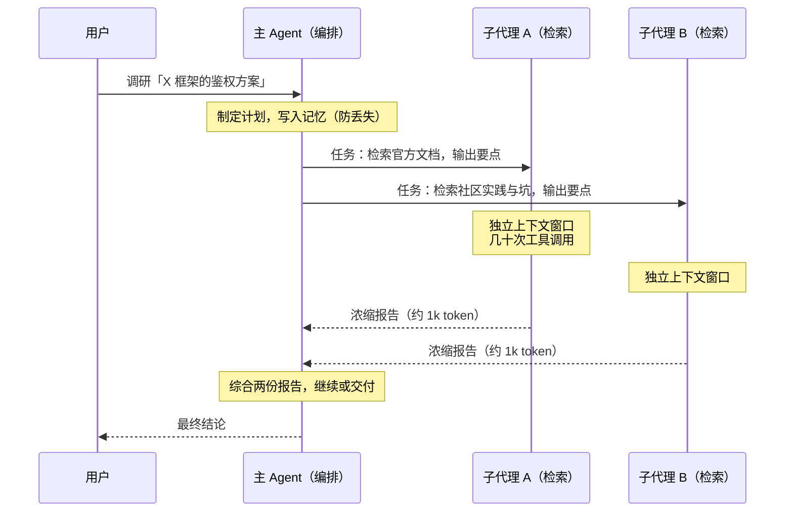
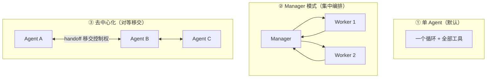

# 第 9 章 子代理与多 Agent 系统

> 本章解决一个问题：**什么时候值得用多个 Agent，怎么组织它们？** 答案的出发点不是「多个脑子更聪明」，而是一个朴素的工程事实：**每个 Agent 一个独立的上下文窗口，是最强的隔离与并行机制。**

## 9.1 为什么需要多 Agent

回顾第 4 章的结论：上下文是稀缺资源，工具结果是体积大头。于是出现一类任务——探索量大、来源多、子方向彼此独立——单 Agent 怎么做都难受：

- 全塞进一个窗口 → context rot，细节召回崩塌；
- 反复压缩 → 关键线索在摘要中丢失；
- 串行探索 → 时间不可接受。

把「探索」外包给一组**上下文互不污染**的子 Agent（subagent），主 Agent 只接收浓缩结论，两难自解。这就是多 Agent 系统的第一性原理：**隔离**。并行提速只是副产品。

## 9.2 子代理的机制解剖

子代理不是一个独立部署的服务，而是**同一套引擎的又一次递归调用**。产品实现高度一致（以 Claude Code 为例）：

1. 主 Agent 调用一个编排类工具（`Agent`/`Task`），参数是**任务描述 + 子代理类型**；
2. 引擎创建一个新的 Agent 实例：**全新的消息列表**、独立的工具集与系统提示词（子代理通常是预先定义的专门角色：代码审查、检索、测试……）；
3. 子代理跑完整的主循环（第 2 章那个循环），完成后**只把最终文本报告回传**给主 Agent；
4. 主 Agent 的上下文里只增加一条千余 token 的结果消息——子代理内部几十万 token 的探索过程被完全挡在外面。

两个工程细节决定成败：

- **委派单要完整**：目标、期望的输出格式、可用工具/信息源、清晰的任务边界。模糊的委派（「去调研一下」）会导致子代理重复劳动或答非所问——Anthropic 的多 Agent 实践把「给子代理的指令质量」列为影响结果的第一因素。
- **影响半径要递减**：子代理的权限应当是主 Agent 的真子集（第 8 章「最小权限」的递归应用），防止编排层被注入后放大破坏面。

## 9.3 编排的三种拓扑

OpenAI 的实践指南给出三种组织方式，复杂度递增：

- **单 Agent**：默认选择。OpenAI 的建议是复杂度线性增长后再拆分——过早拆分只会引入协调成本。
- **Manager（编排器-执行器）**：中央 Agent 把子 Agent 当工具调用（第 7.5 节），保留全部控制权。Claude Code 的 `Agent` 工具、Anthropic 研究系统的 lead-subagent 都是此型。
- **去中心化（decentralized）**：同层 Agent 之间通过**移交（handoff）**转交对话控制权——客服场景「接线员转专家」的自然映射，OpenAI Agents SDK 把 handoff 做成了一等原语。没有中央大脑，灵活性最高，可控性最低。

## 9.4 实证：Anthropic 多 Agent 研究系统的数字

多 Agent 是烧钱的架构，值不值要有数据。Anthropic 2025 年公开了其内部研究系统的复盘，这组数字是目前最有分量的公开证据：

- 研究类任务的内部评测中，多 Agent 系统**比单 Agent 高 90.2%**——增益主要来自并行探索与多视角；
- 代价：单 Agent 的 token 消耗约为聊天式回答的 **4 倍**，多 Agent 约 **15 倍**；
- 在 BrowseComp 基准上，**token 用量解释了 80% 的成绩方差**——「预算买性能」在这个范式里近乎线性成立；
- 并行化把复杂研究任务的耗时最多缩短了 **90%**。

结论的适用边界同样重要，原文说得很直白：**「大多数编码任务中真正可并行的子任务，比研究任务少得多」**。搜索类、调研类任务天然适合扇出；强耦合、需要共享上下文的任务（多数开发工作）适合单 Agent。

## 9.5 什么时候不要用多 Agent

把否定条件列清楚，比正面罗列更有用：

- **子任务强耦合**：每步都要「看见」其他步骤的完整上下文——隔离反而制造信息损失；
- **任务浅**：几次工具调用能完成的任务，编排开销占比过高；
- **预算敏感**：10–15 倍 token 是真实成本，要有对应的价值证明；
- **需要稳定可控**：每多一层 Agent，行为的可预测性与调试难度都变差（第 10 章的评估复杂度同样翻倍）。

> [!TIP] 判断口诀
> **扇出有增益，串行无收益。** 子任务能独立探索、结果能压缩成摘要回传，才值得拆出去；否则留在主循环里。

## 9.6 更大的图景：Agent 之间的互操作

本章讨论的多 Agent 都在**一个引擎、一个信任域**内。再往外一步是跨组织、跨厂商的 Agent 协作：Google 2025 年发起的 **A2A（Agent2Agent）协议**（已捐入 Linux Foundation，2026 年 3 月发布 v1.0）定义了 Agent 卡片发现、任务生命周期与互操作消息格式。它与 MCP 的关系是正交互补：**MCP 连接 Agent 与工具，A2A 连接 Agent 与 Agent**。对应用开发者而言，这是「外购能力」与「自建能力」之间的新选项——本书只在第 11 章生态一节再简要提及。

## 9.7 小结

- 多 Agent 的第一性原理是**上下文隔离**，并行是副产品；
- 子代理 = 引擎的递归实例：独立窗口、受限工具集、只回传浓缩报告；
- 三种拓扑按可控性递减：单 Agent → Manager 集中编排 → 对等移交；
- 实证数字：研究类任务 +90.2% 质量、约 15 倍 token、耗时 −90%——**用预算买性能**；
- 反口诀：**扇出有增益，串行无收益**；编码类任务多半留在单 Agent。

系统能力至此全部就位。但还有一个所有工程系统都逃不掉的问题：**你怎么知道它变好了还是变坏了？**
