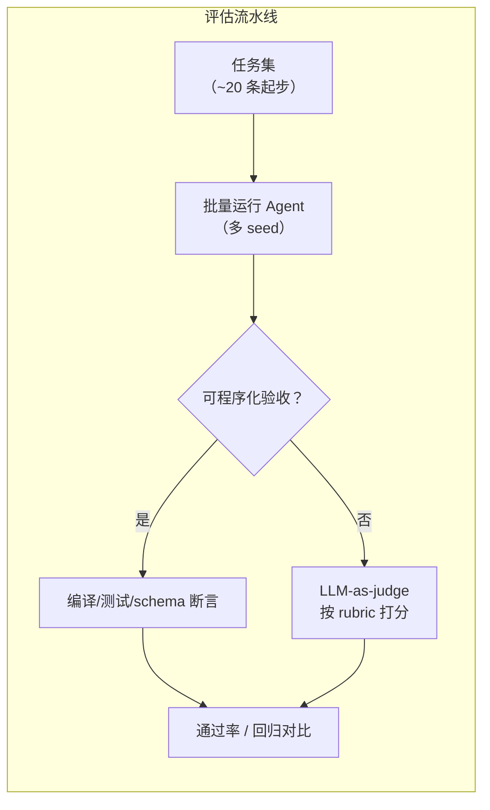
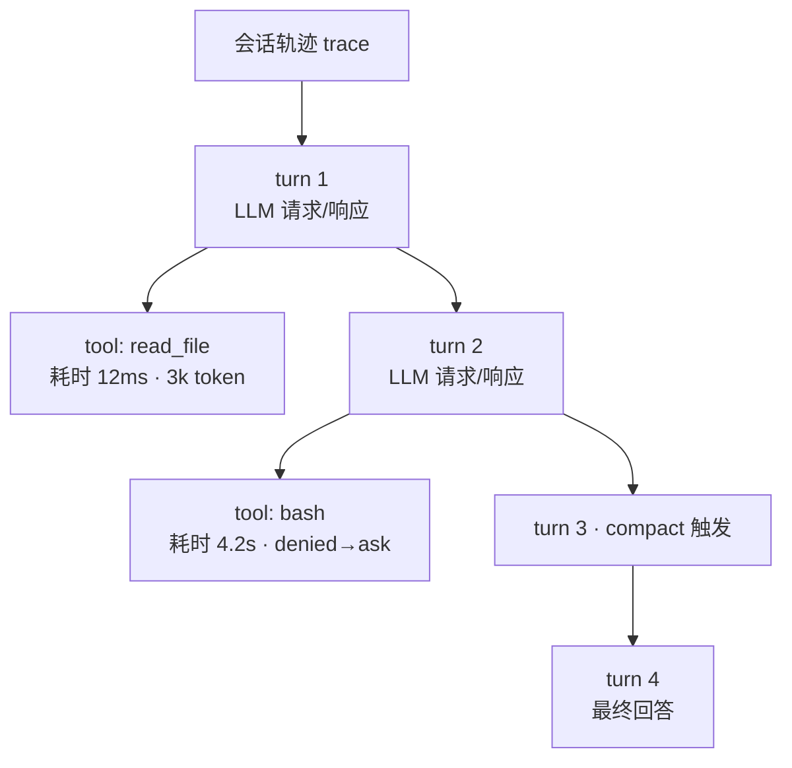

# 第 10 章 评估与可观测性：让 Agent 可迭代

> 本章解决一个问题：**Agent 是非确定系统，改一行提示词、换一个模型、加一个工具，行为都会漂移。没有评估与可观测性，你就是在盲飞——不是「能不能变好」的问题，而是「变好变坏都不知道」的问题。**

## 10.1 为什么 Agent 评估特别难

传统软件测试的断言是确定性的；Agent 的评估难在三点：

1. **多路径**：同一个任务存在多条有效路径。逐字对比标准答案会误伤所有「绕了路但对的」执行。
2. **非确定**：同一输入两次运行，轨迹和措辞都不同。必须接受统计意义的通过率，而不是单次成败。
3. **错误复合**（第 1 章）：一步的偏差会在后续放大，**末端的失败未必指向根因步骤**。只看结果会漏诊，只看过程会误诊。

## 10.2 评估的三个层次

### 层次一：端到端任务评估（主战场）

构造一组**代表性任务**，跑完整个 Agent，对**最终状态**打分。Anthropic 的实践经验里有两条极其亲民的结论：

- **从约 20 条任务起步就够了**——早期提示词的粗糙问题，20 条就能暴露大部分；他们观察到早期迭代里成功率从 30% 提升到 80% 的大幅跳变，靠的就是这个小集合。
- **评判终点状态而非逐步路径**：任务是有验收的（测试通过、文件正确），路径交给模型自由发挥。

任务设计原则：覆盖高频场景 + 已知失败模式 + 边界情况；每条任务有明确的验收标准（可程序化检查的尽量程序化——编译通过、测试通过、JSON schema 合法）。

### 层次二：轨迹评估（辅助诊断）

对**工具调用序列**做评判：有没有绕圈？有没有该读不读、不该写乱写？适合诊断「结果对但过程离谱」（浪费、危险动作）和「结果错在中间哪一步」。注意与层次一互补：轨迹评估**不作为主判据**（多路径问题），只用于定位。

### 层次三：LLM-as-judge（打分器）

当验收无法程序化（开放性回答、报告质量），用一个模型按**评分细则**（rubric）打分。工程要点：

- rubric 要具体到维度（准确性、完整性、引用质量、工具效率），每维 0–1 分 + 总体 pass/fail；
- 用强模型当裁判，单次调用完成全部维度打分（一致性最好）；
- 裁判本身也要抽查校准——用人工标注对齐，防止裁判系统性偏移。

## 10.3 失败模式分类学

评估的前提是知道要抓什么。生产中最常见的六类失败：

| 失败模式 | 症状 | 根因方向 |
|---|---|---|
| 死循环 | 反复调用同一失败工具 | 错误信息不可恢复（第 3 章）；缺终止保险（第 2 章） |
| 幻觉工具 | 调用不存在的工具/参数 | 工具描述不清或工具集与文档不同步 |
| 上下文溢出 | 跑着跑着开始「失忆」、重复提问 | 缺压缩/清理策略（第 4 章） |
| 过早放弃 | 「这个任务无法完成」 | 系统提示词的韧性规则；权限拒绝与故障混淆（第 3、8 章） |
| 假装成功 | 报告完成但没验证 | 缺「验证后再宣称」的流程约束；缺硬验收 |
| 权限绕行尝试 | 试图用别的工具达到被拒目的 | 权限语义不一致；deny 信息未讲清原因 |

建评估集时，每修一个 bug 就沉淀一条「曾失败任务」进回归集——这是 Agent 团队最重要的资产积累习惯，和传统软件把 bug 变测试用例完全同构。

## 10.4 可观测性：轨迹是一切的基础

评估是抽样，可观测性是全量。Agent 的最小观测单元是**轨迹（trace）**：一次运行中所有 LLM 请求与工具调用的时序记录。标准化的结构正在收敛——OpenTelemetry 的 GenAI 语义约定（`gen_ai.*` 属性）已覆盖推理、Agent span、工具调用与 token 用量，主流框架（OpenAI Agents SDK、LangGraph 生态）内置了对接。

一条有用的轨迹至少要能回答：

- 每一轮**模型看到了什么**（完整请求上下文）、说了什么；
- 每次工具调用的**参数、结果、耗时、成功与否**；
- token 与成本累计（第 9 章那组「token 解释 80% 方差」的数字，就是靠这个算出来的）；
- 压缩、子代理派发等系统事件（这两者会「隐藏」大部分上下文，没记录等于黑盒）。

> [!TIP] 落地建议
> 先做最朴素的：把每次请求的 messages 与每次工具调用的出入参**落成 JSONL 文件**（本地先行，不引入任何平台）。排查九成问题够用，之后想接 OTel 再接。

## 10.5 从评估到迭代：一个工作闭环

把前三节串成日常节奏：

1. **改动前**：跑一遍评估集，记录基线通过率；
2. **改动**（提示词 / 工具 / 模型版本）：同集合同 seed 重跑；
3. **对比**：总体通过率 + 分任务 diff——**涨的为什么涨、掉的为什么掉**都要看，防止「修好 A 踩坏 B」的隐性回归；
4. **沉淀**：新失败进回归集；轨迹异常进失败模式表。

这套循环是第二部分每个成熟项目的共同内功：Aider 的 polyglot 基准（第 16 章）甚至把「评估集」做成了行业公共财产——模型与 Agent 的选型标尺。

## 10.6 小结

- Agent 评估三难：多路径、非确定、错误复合——对策是**判终点不判路径、统计通过率、轨迹辅助定位**。
- 三层评估：**端到端任务（主）+ 轨迹（辅）+ LLM-as-judge（开放任务）**；20 条任务就值得开始。
- 六类失败模式建分类学，**bug 进回归集**是最重要的资产习惯。
- 轨迹（trace）是评估与调试的共同底座；先落 JSONL，再谈平台。
- 工作闭环：基线 → 改动 → 同集合同 seed 对比 → 沉淀。

到这里，单机 Agent 的原理篇即将收官。最后一章抬头看生态：当你的 Agent 需要连接几十个外部能力时，谁来统一「工具的接口」？
