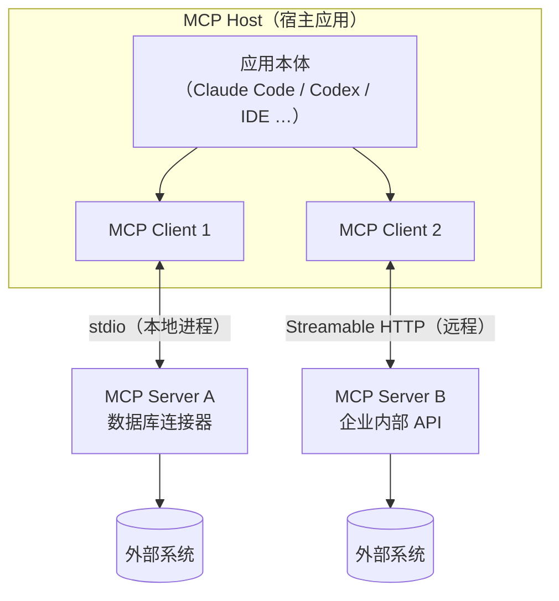
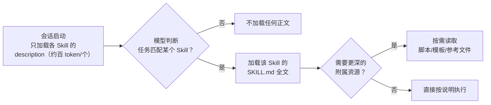
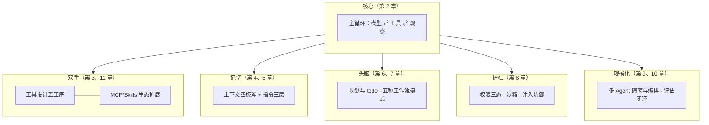

# 第 11 章 扩展生态：MCP 与 Skills

> 本章解决一个问题：**Agent 的能力边界就是工具集，但工具不可能都由 Agent 开发者自己写。** 当「接工具」变成一个生态问题，就需要标准协议——MCP 管连接，Skills 管能力封装。这也是原理篇的收官：读完本章，你就能以「装备齐全」的状态进入第二部分。

## 11.1 M×N 集成困境

没有标准时，M 个 AI 应用接 N 个外部系统要写 M×N 份胶水代码。2024 年 11 月，Anthropic 开源了 **MCP（Model Context Protocol，模型上下文协议）**来把 M×N 压成 M+N：工具提供方实现一次 MCP server，应用方实现一次 MCP client，即可互通。官方的比喻广为流传——**「AI 应用的 USB-C 接口」**。

MCP 的中立化进程很快：2025 年 12 月与 Agent Skills、AGENTS.md 等一并捐入 Linux Foundation 旗下基金会，由中立组织治理；官方 registry（注册表）上线后，发现与分发 MCP server 也有了公共入口。截至 2026 年，主流编码工具（Claude 系、Codex、OpenCode、Gemini CLI、Cursor、VS Code……）全部支持 MCP，「写一次、处处接入」已是现实。

## 11.2 MCP 的架构

三个角色、两层协议：

- **Host（宿主）**：你的 Agent 应用，协调一个或多个 MCP client；
- **Client（客户端）**：宿主内维护与某个 server 连接的组件，负责发现能力、转发调用；
- **Server（服务器）**：暴露工具与数据的服务进程。

协议分两层：**数据层**基于 JSON-RPC 2.0（能力发现、调用、通知）；**传输层**只有两种——本地 **stdio**（子进程，零网络开销，适合本地工具）与远程 **Streamable HTTP**（支持鉴权与流式，2025 年 3 月起取代了旧的 HTTP+SSE 方案）。

Server 向 Host 提供三类**服务端原语**：

| 原语 | 语义 | 类比 |
|---|---|---|
| **Tools** | 可执行函数（`tools/list`、`tools/call`） | 第 3 章的工具 |
| **Resources** | 可读取的数据源（文件、数据库行、文档） | 只读内容 |
| **Prompts** | 可复用的交互模板 | 预制提示词 |

另有两类反向能力：**Elicitation**（server 请求用户补输入）与 **Sampling**（server 借宿主的模型生成）——后者在 2026 版规范中已标记弃用（建议 server 直接对接模型 API），协议整体也转向无状态化的新形态。对初学者只需记住：**读 spec 要认准版本号**（如 2025-06-18 版、2026-07-28 版），不同版本细节差异不小。

## 11.3 MCP 解决了什么、没解决什么

**解决了**：接入的边际成本趋近于零。给编码 Agent 接上数据库、设计工具 Figma、浏览器自动化，都是「配置一个 server」的事。它同时给了团队一种**权限治理**手段——某个 server 只暴露只读 resource，等于天然的能力下界。

**没解决**（至少没完全解决）：

- **质量参差**：MCP 统一了「接口」，没统一「质量」。一个 description 写得糟糕的 MCP 工具照样让模型选错（第 3 章的功课在这里同样适用）。
- **上下文成本**：接入的每个 server 的工具定义都常驻上下文（第 4 章），接十个 server 可能吃掉上万 token。
- **安全边界**：MCP server 是运行在你机器上的第三方进程，拥有它所声称的一切权限——供应链信任问题在 MCP 生态里真实存在（第 8 章的沙箱与最小权限原则适用于每一个 server）。

## 11.4 Skills：能力的「文档化封装」

另一条扩展路线针对的是**知识型能力**而非「连接型能力」。2025 年 10 月，Anthropic 发布 **Agent Skills** 并在年底开放为跨平台标准：一个 Skill 就是一个**文件夹 + 一份 SKILL.md**（YAML 头声明 `name` 与 `description`），正文是教 Agent「怎么做某类事」的说明，可附带脚本、模板与参考文件。例如「Excel 技能」教 Agent 怎么用公式与脚本处理表格，「PDF 填表技能」附带可运行的处理脚本。

其核心机制是**渐进披露（progressive disclosure）**——这本质上是第 4 章「按需检索」策略在能力维度的应用：

与 MCP 的分工由此清晰：

| 维度 | MCP | Skills |
|---|---|---|
| 封装的是 | **连接**：外部系统的接口 | **能力**：做事的方法与资产 |
| 形态 | 运行的 server 进程 | 静态的文件夹 + 文档 |
| 上下文成本 | 工具定义常驻 | description 常驻，正文按需 |
| 典型场景 | 接数据库、接浏览器、接内部 API | 「会用 Excel」「会写周报」「会做 PPT」 |

两者不互斥：一个 Skill 的说明里完全可以指导模型使用某个 MCP 工具。

## 11.5 选型：什么时候用什么

把「给 Agent 加能力」的四条路径放进一张决策表：

| 需求 | 首选路径 | 理由 |
|---|---|---|
| 核心通用能力（读写文件、执行命令） | **内置工具** | 每个产品都内置；性能与权限控制最优 |
| 接外部系统/团队私有服务 | **MCP server** | 标准化、复用生态、可治理 |
| 教「某类任务怎么做」（方法论 + 资产） | **Skill** | 渐进披露，几乎零常驻成本 |
| 一次性、项目专属的小动作 | **自定义工具/插件** | 不值得走标准协议 |

## 11.6 原理篇总结：一张完整的地图

十一章走完，把全书的公式最终展开成一张工程地图，作为进入第二部分的行囊：

## 11.7 小结

- MCP 把 M×N 集成压成 M+N：**Host/Client/Server 三角色 + JSON-RPC 数据层 + stdio/HTTP 两种传输**，Tools/Resources/Prompts 三类原语；已由 Linux Foundation 中立治理。
- MCP 统一了接口、没统一质量与安全：工具描述功课照做，server 按不可信代码对待。
- Skills 封装「方法与资产」，靠**渐进披露**控制常驻成本；与 MCP 一纵一横，互为补充。
- 加能力四条路：内置、MCP、Skill、自定义——按复用范围与上下文成本选。

原理讲完。接下来是验证时刻：**这十一章的每一件武器，都会在 Codex CLI、Claude Code、OpenCode、Gemini CLI 与 Aider 的源码与文档里一一现身。**
