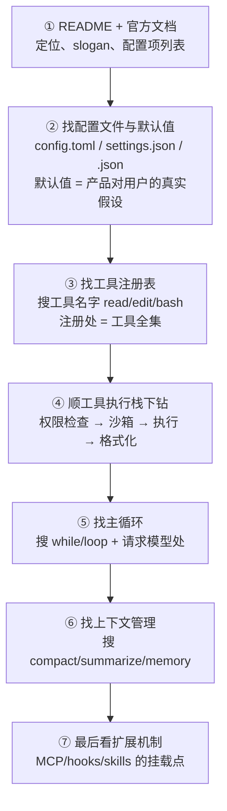

# 第 12 章 剖析方法论：五个透镜读源码

> 第二部分开篇先解决一个问题：**给你任何一个开源 Agent 仓库，从哪里读起？** 直接顺着目录漫游极易迷路——产品迭代快、术语各自发明、核心逻辑常藏在「引擎」层。本章给出一套可复用的解剖流程，后续五章都用它来拆解各个项目。

## 12.1 为什么读 Agent 源码特别容易迷路

三个客观原因：

1. **概念名词不统一**：同样是「子代理」，Claude Code 叫 `Agent` 工具（曾用名 `Task`），Codex 相关讨论里混用 subagent/worker，OpenCode 里是内置的 `general/explore` agent——说的是同一件事（第 9 章）。
2. **核心循环埋得深**：CLI 项目的入口都是终端 UI 代码（渲染、按键、主题），真正的主循环往往在第二、三层目录里（如 Codex 的 `codex-rs/core`、Gemini CLI 的 `packages/core`）。
3. **产品化噪音多**：遥测、账号、更新器、主题……这些占代码量大头，但不是 Agent 的本体。

对策：**带着第一部分的地图去读**。地图上有五个必看点，也就是五个透镜。

## 12.2 五个透镜

| 透镜 | 要回答的问题 | 对应原理章节 |
|---|---|---|
| ① 主循环 | while 循环在哪？终止条件有哪些？ | 第 2 章 |
| ② 工具表 | 内置工具清单？工具如何注册、执行、限流？ | 第 3 章 |
| ③ 上下文 | 系统提示词长什么样？上下文满了怎么办？记忆文件叫什么？ | 第 4、5 章 |
| ④ 权限与沙箱 | 默认权限策略？有没有 OS 级沙箱？ | 第 8 章 |
| ⑤ 扩展机制 | MCP？Skills？Hooks？子代理？ | 第 9、11 章 |

五个透镜的顺序也是依赖顺序：先找到循环（骨架），再看循环里流动什么（工具、上下文），最后看约束与外延（权限、扩展）。

## 12.3 一条通用的阅读路线

以典型 CLI Agent 仓库为例，建议的动线：



两个屡试不爽的技巧：

- **从配置文件读起**。配置项是产品暴露的「能力地图」，且每个默认值都透露了产品的安全/易用取向（对比第 8 章：OpenCode 默认全放行，Claude Code 默认逐项询问——两种产品哲学写在默认值里）。
- **用工具名当锚点反查**。在代码里全文搜索 `apply_patch`、`todo`、`web_search` 这类通用工具名，注册、执行、文档会一起浮出水面。

## 12.4 解剖记录表

为让五章剖析可比，后续每章都按同一张表记录（这就是本书版的「考察提纲」）：

```text
定位与历史    一句话定位 + 关键时间线
架构          语言、进程模型、仓库结构（配图）
① 主循环      循环位置形态、终止条件
② 工具        内置工具清单、执行管线
③ 上下文      系统提示词、记忆文件、压缩策略
④ 权限沙箱    权限模型、沙箱技术、默认值
⑤ 扩展        MCP / Skills / hooks / 子代理 / 插件
工程亮点      2–4 个值得学的决策（为什么这么做）
回扣原理      与第一部分概念的映射表
延伸阅读      官方入口
```

## 12.5 本部分的选择与口径说明

第二部分深剖五个项目，并按「光谱两端」原则挑选：

- **Codex CLI**（OpenAI）：Rust 重写、内核级沙箱、协议化引擎——工程安全派的代表；
- **Claude Code**（Anthropic）：单进程产品化范本、权限规则 DSL、hooks 生态——产品打磨派的代表；
- **OpenCode**（社区，现属 Anomaly）：客户端/服务端彻底分离、提供商中立——架构开放派的代表；
- **Gemini CLI**（Google）：免费层产品化、扩展打包——生态获客派的代表；
- **Aider**：受约束的结对编程——「反 Agent 的 Agent」，光谱另一端的对照组。

> [!NOTE] 关于事实口径
> 这些项目迭代极快。书中快照统一标注「截至 2026-10」，且尽量采用官方文档口径；社区流传但未经官方确认的细节（如代码行数）一律注明或不用。每章末尾给出官方入口，请以最新文档为准。另外要说明：Claude Code 并非开源项目（source-available 的混淆分发），因其在品类中的标杆地位与公开文档的完整性，仍纳入剖析。

## 12.6 小结

- 读 Agent 源码用**五个透镜**：主循环、工具表、上下文、权限沙箱、扩展机制——正好映射第一部分地图。
- 动线技巧：**配置默认值是产品哲学、工具名是代码锚点**。
- 剖析按统一记录表输出，保证五个项目可横向对比（第 17 章）。

工具就绪，从 OpenAI 的 Codex CLI 开始。
