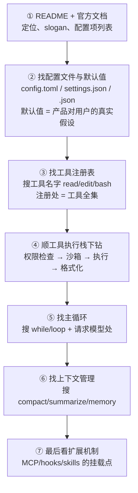

# 第 12 章 剖析方法论：五个视角读源码

> 第二部分开篇先解决一个问题：**给你任何一个开源 Agent 仓库，从哪里读起？** 直接顺着目录漫游极易迷路——产品迭代快、术语各自发明、核心逻辑常藏在「引擎」层。本章给出一套可复用的解剖流程，后续六章都用它来拆解各个项目。

## 12.1 为什么读 Agent 源码特别容易迷路

三个客观原因：

1. **概念名词不统一**：同样是「子代理」，Claude Code 叫 `Agent` 工具（曾用名 `Task`），Codex 相关讨论里混用 subagent/worker，OpenCode 里是内置的 `general/explore` agent——说的是同一件事（第 9 章）。
2. **核心循环埋得深**：CLI 项目的入口都是终端 UI 代码（渲染、按键、主题），真正的主循环往往在第二、三层目录里（如 Codex 的 `codex-rs/core`、Gemini CLI 的 `packages/core`）。
3. **产品化噪音多**：遥测、账号、更新器、主题……这些占代码量大头，但不是 Agent 的本体。

对策：**带着第一部分的地图去读**。地图上有五个必看点，也就是五个观察视角。

## 12.2 剖析对象的正式名字：harness

读源码之前，先给剖析对象正名。本书公式「Agent = 模型 + 工具 + 循环 + 上下文 + 护栏」里，**模型之外的全部外围工程系统**，业界有一个专门称呼：**harness**（直译「挽具/马具」——套在模型这匹烈马身上、既驱动也约束它的那一整套装备）。从业者的表述更直接：

> Agent = Model + Harness. If you're not the model, you're the harness.（你不是模型，那你就是 harness。）——Viv Trivedy

这个词的来历值得一分钟了解（来源见附录 B）：

- 词根是软件工程里的 **test harness**（测试挽具：驱动被测代码的配套脚手架）；进入 LLM 世界的标志性载体是 2021 年 EleutherAI 的 lm-evaluation-harness——中文社区一直把它意译成「评测框架」，harness 本身不译。
- 2023–2024 年，SWE-bench 的 evaluation harness 与 METR 的评测话语让它在编码评测圈扩散；同期学术界多用近义词 scaffold（脚手架）。
- 2025–2026 年，终端编码 Agent 普及后，"Claude Code is a harness" 一类表述成为主流，harness engineering 被视为继提示词工程、上下文工程之后的第三个工程范式；术语地位的最终确证，是 DeepSeek 在 2026 年 8 月直接以 Harness 为名开源了自己的 Agent 运行时（第 17 章）。

与相邻术语的辨析，一张表说清：

| 术语 | 含义 | 与 harness 的关系 |
|---|---|---|
| **harness** | 模型之外的全部外围工程系统 | 本书第二部分的主角 |
| **scaffold**（脚手架） | 早期用语，偏指模型「看到」的结构（提示、上下文组织） | 大体同义；细究时 harness ⊇ scaffold，学术界偏爱 scaffold，工程界偏爱 harness |
| **framework**（框架） | LangGraph 这类可下载的通用开发库 | harness 可以用 framework 搭，但 framework ≠ harness |
| **orchestrator**（编排器） | 多模型/多 Agent 的调度组件 | 是 harness 内的一个部件，不是同层概念 |

为什么这个词重要到值得单独一节？因为它修正了一个流传很广的误解——「换更强的模型 = 更强的 Agent」。实证数字：同一模型仅更换 harness，第三方在 DeepSWE 基准上测得约 8.7 分的差异；GPT-6 Astra 在 ARC-AGI 3 上仅因 harness 不同，成绩从 62.7% 变到 99.9%。Addy Osmani 的总结一针见血：*A decent model with a great harness beats a great model with a bad harness*（好挽具配中等模型，胜过烂挽具配顶级模型）。这也呼应第 10 章的结论：**你评测的从来不是模型，而是「模型 × harness」复合体**。

> [!NOTE] 中文怎么译
> harness 尚无通行中文译名。中文社区的严肃写作主流是**保留英文**（本书亦然）；「挽具/马具」多作修辞，「脚手架」会与 scaffold 混淆，都不作为正式术语使用。

因此，第二部分剖析的六种实现，就是六种 harness 的取法；12.3 节的五个视角，就是进入任何一个 harness 的五个入口。

## 12.3 五个视角

| 视角 | 要回答的问题 | 对应原理章节 |
|---|---|---|
| ① 主循环 | while 循环在哪？终止条件有哪些？ | 第 2 章 |
| ② 工具表 | 内置工具清单？工具如何注册、执行、限流？ | 第 3 章 |
| ③ 上下文 | 系统提示词长什么样？上下文满了怎么办？记忆文件叫什么？ | 第 4、5 章 |
| ④ 权限与沙箱 | 默认权限策略？有没有 OS 级沙箱？ | 第 8 章 |
| ⑤ 扩展机制 | MCP？Skills？Hooks？子代理？ | 第 9、11 章 |

五个视角的顺序也是依赖顺序：先找到循环（骨架），再看循环里流动什么（工具、上下文），最后看约束与外延（权限、扩展）。

## 12.4 一条通用的阅读路线

以典型 CLI Agent 仓库为例，建议的动线：



两个屡试不爽的技巧：

- **从配置文件读起**。配置项是产品暴露的「能力地图」，且每个默认值都透露了产品的安全/易用取向（对比第 8 章：OpenCode 默认全放行，Claude Code 默认逐项询问——两种产品哲学写在默认值里）。
- **用工具名当锚点反查**。在代码里全文搜索 `apply_patch`、`todo`、`web_search` 这类通用工具名，注册、执行、文档会一起浮出水面。

## 12.5 解剖记录表：第二部分的统一模板

为让六章剖析可比，后续每章都按同一张模板展开。模板的每一项都对应一条方法论考量：

```text
定位与历史           一句话定位 + 关键时间线
架构演进与版本锚定    架构是否变过、何时为何而变；
                    当前架构对应哪个版本（截至 2026-10）
① 主循环–⑤ 扩展      五视角拆解（见 12.3），与架构结合讲解；
                    附概念对照表：本项目自造术语 ↔ 第一部分标准概念
工程亮点             2–4 个值得学的决策（为什么这么做）
与第一部分的呼应      速查清单表：本实现 ↔ 原理章节，免去读者自行提炼
延伸阅读             官方入口
```

三条贯穿原则，值得在进入第一章剖析前说清：

**其一，架构节讲特色，五视角讲共性。** 所有编码 Agent 的底层终归是同一个结构（第 2 章那个循环加护栏）；真正值得逐家挖掘的是架构特色——它们在哪里分道扬镳、为什么。所以每章的架构节只写差异化的部分，共性全部收进五视角。

**其二，统一表述，不锚定源码。** 源码文件与实现细节随版本随时会变，锚定它们的分析半年就腐烂；本书改用语言无关的伪代码与图示呈现设计本质——呈现介质按需选择：代码最直观、图示最简明、文字最轻量。这同时也是五视角最大的价值：**把各家自造的概念词汇翻译回通用概念**。直接阅读各家文档时，学习者常被层出不穷的「新概念」所累，而这些概念大多只是第一部分标准概念换了名字；每章的概念对照表负责完成这次翻译。

**其三，版本锚定优先。** 每章开篇即声明「架构有无变迁、当前架构对应哪个版本」，其后内容都锚定该快照；项目演进后，只需更新演进小节与版本号，剖析主体不受牵连。

## 12.6 本部分的选择与信息时效

第二部分深剖六个项目，挑选时刻意覆盖自主性程度的两个极端：

- **Codex CLI**（OpenAI）：Rust 重写、内核级沙箱、协议化引擎——工程安全派的代表；
- **Claude Code**（Anthropic）：单进程产品化范本、权限规则 DSL、hooks 生态——产品打磨派的代表；
- **OpenCode**（社区，现属 Anomaly）：客户端/服务端彻底分离、提供商中立——架构开放派的代表；
- **Gemini CLI**（Google）：免费层产品化、扩展打包——生态获客派的代表；
- **Aider**：受约束的结对编程——「反 Agent 的 Agent」，自主性最低一端的对照组。
- **DeepSeek Harness（dsh）**：模型厂商直接以 harness 为名开源的微内核 Agent 运行时，2026 年最受关注的新入场者（第 17 章）。

> [!NOTE] 关于信息时效
> 这些项目迭代极快。书中快照统一标注「截至 2026-10」，且尽量以官方文档为准；社区流传但未经官方确认的细节（如代码行数）一律注明或不用。每章末尾给出官方入口，请以最新文档为准。另外要说明：Claude Code 并非开源项目（source-available 的混淆分发），因其在品类中的标杆地位与公开文档的完整性，仍纳入剖析。

## 12.7 小结

- 剖析对象的正式名字是 **harness**：模型之外的一切外围工程；「好挽具配中等模型，胜过烂挽具配顶级模型」。
- 读 Agent 源码用**五个视角**：主循环、工具表、上下文、权限沙箱、扩展机制——正好映射第一部分地图。
- 动线技巧：**配置默认值是产品哲学、工具名是代码锚点**。
- 剖析按统一记录表输出，保证六个项目可横向对比（第 18 章）。

工具就绪，从 OpenAI 的 Codex CLI 开始。
