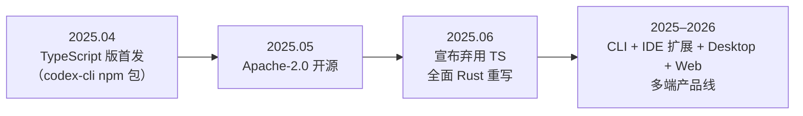
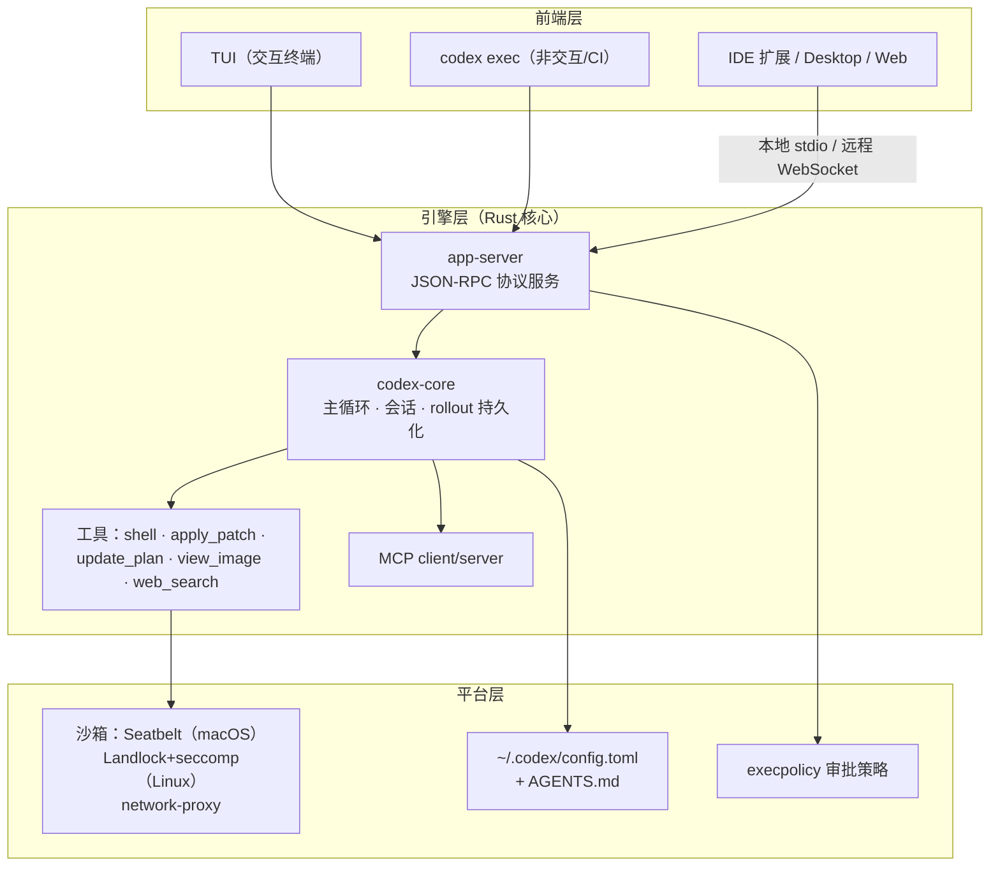

# 第 13 章 Codex CLI：Rust 内核与协议化前端

> 本章用第 12 章的五个视角解剖 OpenAI Codex CLI。它是「**用系统工程的严肃态度对待 Agent 安全**」的代表：Rust 重写换取内核级沙箱，JSON-RPC 协议换取引擎与界面解耦。（事实口径：截至 2026-10）

## 13.1 定位与历史

Codex CLI 是 OpenAI 官方的终端编码 Agent。时间线浓缩了它几次关键转身：



为什么重写？官方给出的理由几乎全是系统工程视角：更强的内核级沙箱集成（Node.js 运行时调不了 Landlock/Seatbelt 这类系统原语）、更少的依赖、更小的二进制、更好的性能。**「为了沙箱而换语言」是 Agent 安全工程化的标志性事件**——值得每个设计者记住。

## 13.2 架构总览

仓库主体是 `codex-rs/` Rust workspace（数十个 crate，统一 `codex-` 前缀），按职责分层：



两个结构性决策值得划重点：

- **app-server 协议**：引擎通过 JSON-RPC 暴露 `thread/start`、`thread/resume`、`turn/start`、`model/list` 等方法，TUI、exec、IDE、Desktop 全是协议客户端。「Agent 引擎即服务」让 CLI 产品自然长成多端形态——这是第 15 章 OpenCode「Agent 即 HTTP 服务」思想的同源设计。
- **rollout 持久化**：会话以 rollout 文件落盘，`codex resume` 可恢复，`codex exec` 可重放——轨迹（第 10 章）在这里是一等公民。

## 13.3 五视角速查

**① 主循环**：`codex-core` 中执行「模型 → 工具调用 → 审批/沙箱执行 → 结果回填」的轮次循环；非交互模式（`codex exec`）复用同一循环，便于 CI 与评估。

**② 工具**：克制的小集合——`shell`（命令执行）、`apply_patch`（自定义补丁格式的文件编辑）、`update_plan`（计划追踪，对应第 6 章 todo）、`view_image`（多模态查看）、`web_search`（可选开启）；MCP 工具动态注册进同一循环。`apply_patch` 是从 TS 时代继承的招牌：用「精确上下文块」描述编辑（见下），比裸 diff 更抗错，被多家产品借鉴：

```text
*** Begin Patch
*** Update File: src/api.ts
@@
- const port = 3000;
+ const port = Number(process.env.PORT ?? 3000);
*** End Patch
```

**③ 上下文**：项目指令采用开放标准 **AGENTS.md**（`codex /init` 生成），这既是 Codex 的贡献也是全行业的公共财产；会话历史由 rollout 文件承载，压缩（compaction）能力在引擎层持续演进；跨会话记忆是进行中的方向。

**④ 权限与沙箱**：Codex 的招牌设计——**两个正交旋钮**（第 8 章理论的产品化）：

| 旋钮 | 取值 | 语义 |
|---|---|---|
| `sandbox_mode` | `read-only` / `workspace-write` / `danger-full-access` | **物理边界**：内核强制（macOS Seatbelt / Linux Landlock+seccomp），网络出站另配 |
| `approval_policy` | `untrusted` / `on-failure` / `on-request` / `never` | **信任策略**：何时升级为人审 |

组合出细粒度策略（如「工作区可写但每次失败都问我」）。安全底线刻在设计里：**项目级配置被禁止覆盖 `sandbox_mode`、`approval_policy` 等敏感项**——防止被注入的项目文件给自己提权（第 8.5 的纵深防御落地）。

**⑤ 扩展**：MCP 双向（client 接入外部工具；`codex mcp-server` 让 Codex 本身可被当作 MCP server 嵌入别的工作流）；hooks、skills、插件机制在 2026 年版本中陆续加入；企业侧用 `requirements.toml` 做管控。

## 13.4 工程亮点小结

1. **为沙箱换语言**：安全需求驱动的 Rust 重写，示范了「Agent 安全必须落在系统原语上」。
2. **协议化引擎**：JSON-RPC 把引擎与一切前端解耦，多端共享一个心智模型。
3. **正交双旋钮 + 不可覆盖的安全配置**：权限模型教科书。
4. **apply_patch**：为「模型的编辑输出」专门设计的数据格式，格式即可靠性。

## 13.5 回扣第一部分

| 原理概念 | Codex 中的形态 |
|---|---|
| 主循环与终止（第 2 章） | `codex-core` 轮次循环；`codex exec` 的确定性退出 |
| 工具执行五工序（第 3 章） | shell → 审批 → 沙箱执行 → 格式化回填 |
| 记忆文件（第 4、5 章） | AGENTS.md（该约定的发源地） |
| 规划（第 6 章） | `update_plan` 工具 |
| 权限/沙箱正交（第 8 章） | sandbox_mode × approval_policy 双旋钮 |
| 轨迹与恢复（第 10 章） | rollout 持久化 + resume |

## 13.6 延伸阅读

- 仓库：<https://github.com/openai/codex>（重点看 `codex-rs/` 各 crate 与 `docs/` 下 config、sandbox 文档）
- 官方文档与配置指南：`learn.chatgpt.com/docs/codex/cli`（原 developers.openai.com/codex 重定向）
- InfoQ: *Another Rust Rewrite: OpenAI's Codex CLI Goes Native*（2025-06，重写动机的第一手报道）
