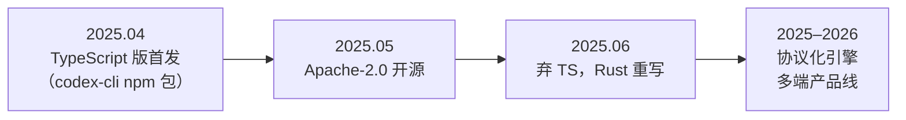
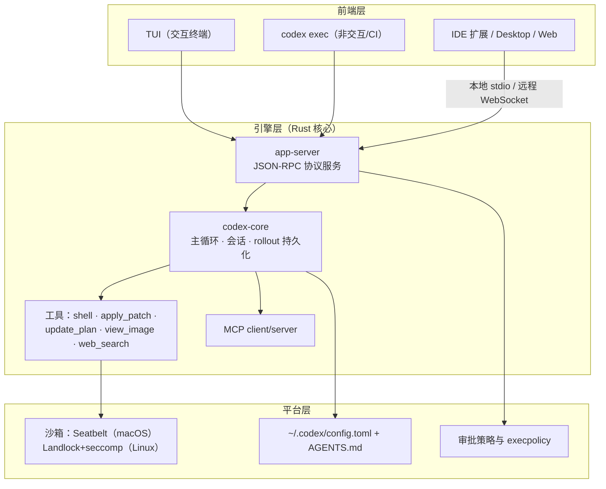

# 第 13 章 Codex CLI：Rust 内核与协议化前端

> 本章用第 12 章的方法论解剖 OpenAI Codex CLI。它是「**用系统工程的严肃态度对待 Agent 安全**」的代表：Rust 重写换取内核级沙箱，JSON-RPC 协议换取引擎与界面解耦。（内容截至 2026-10，版本锚定见 13.2）

## 13.1 定位与历史

Codex CLI 是 OpenAI 官方的终端编码 Agent，也是 OpenAI 首个真正开源的 Agent 产品（2025-05，Apache-2.0）。产品形态已从纯 CLI 扩展为 CLI + IDE 扩展 + Desktop + Web 的多端线；GitHub 星标约 12.7 万，是 star 数最高的厂商系编码 Agent 之一。



一句话定位：**工程安全派的代表**——把第 8 章的安全理论做成了操作系统级的强制执行。

## 13.2 架构演进与版本锚定

**版本锚定**：本章架构快照锚定 **Codex CLI 0.160.0**（2026-10-01 发布）。Codex 发版极快——stable 每隔数天滚动、每日自动产出 alpha 预发布——本章内容只对这个快照负责；最新版本请以官方 [Releases](https://github.com/openai/codex/releases) 为准。这也正是版本锚定的意义：**剖析主体不随版本漂移，演进史与版本号单独维护**。

Codex 的架构经历过三次关键变迁，每一次的动因都值得当作案例学习：

**变迁一：TypeScript 单体 → Rust workspace（2025-06）。** 起点是 2025 年 4 月的 TS/Node 单体 CLI；两个月后官方宣布弃用、全面 Rust 重写。动因是硬约束：Node 运行时调不到 Landlock/Seatbelt 这类内核沙箱原语，依赖树与二进制体积也拖累分发。**行业背景**更重要——2025 年编码 Agent 从尝鲜转向生产，安全的主流范式从「提示词自律」转向「操作系统他律」，**为了安全换语言**是这场转变最极端的例证。结果是一个数十个 crate 的 Rust workspace（`codex-rs/`）。

**变迁二：单体引擎 → 协议化引擎（app-server）。** 引擎与终端界面原本一体；为支撑 CLI/IDE/Desktop/Web 多端，引擎把全部能力暴露为 JSON-RPC 协议（`thread/start`、`thread/resume`、`turn/start` 等），TUI 降级为普通客户端。学习点：引擎与外壳解耦后，Codex 的生态位从「工具」变成了「平台」——任何前端都能平等接入（第 15 章 OpenCode 会把这条路走得更远）。

**变迁三：三档审批 → 双旋钮正交。** TS 时代的权限是 `suggest / auto-edit / full-access` 三档；重写后拆成 **sandbox_mode（物理边界）× approval_policy（信任策略）** 两个正交旋钮。动因是原三档把「能碰到什么」和「要不要问人」耦合在一起，表达不出「工作区可写、但失败要问我」这类组合。学习点：**当配置项之间隐含耦合时，最好的重构是把它们拆成正交维度**——第 8 章的理论在这里有了一部产品演化史。

当前架构（0.160.0 快照）的分层：



## 13.3 五视角拆解

**① 主循环与工具。** 用第 2 章的统一伪代码写 Codex 的轮次循环（语言无关表述，不对应任何真实源文件）：

```typescript
// 统一伪代码：Codex 的轮次循环
while (!task.done) {
  const response = await model.request(context.messages, context.tools);
  context.append(response);
  if (response.stopReason !== "tool_use") break;          // 自然终止
  for (const call of response.toolCalls) {
    const verdict = policy.check(call, sandboxMode, approvalPolicy);
    const result = verdict.allowed
      ? await sandbox.execute(call)                        // 沙箱执行世界内运行
      : { error: "permission_denied", hint: verdict.reason };
    context.append(result);
  }
}
session.flushToRollout();                                  // 轨迹落盘
```

特色有二：其一，**每轮都写入 rollout**——会话轨迹是一等公民，`codex resume` 随时恢复现场（第 10 章的轨迹观）；其二，工具执行统一走「策略判定 → 沙箱执行」两段管线，第 3 章的工具五工序在此被拆成独立模块。工具家族维持克制的小集合，其中 `apply_patch` 是 TS 时代流传至今的招牌——用「精确上下文块」描述编辑，比裸 diff 更抗错：

```text
*** Begin Patch
*** Update File: src/api.ts
@@
- const port = 3000;
+ const port = Number(process.env.PORT ?? 3000);
*** End Patch
```

**② 上下文。** 项目指令采用开放标准 **AGENTS.md**（`codex /init` 生成）——由 Codex 发起的这个约定如今已是全行业公共财产；会话历史由 rollout 文件承载，压缩能力在引擎层持续演进。一个值得记住的架构事实：**上下文的持久层就是轨迹层**——同一份 append-only 记录既是恢复现场，也是审计与评估的输入。

**③ 权限与沙箱。** 双旋钮的裁决逻辑用统一伪代码呈现：

```typescript
// 统一伪代码：一次工具调用的双旋钮裁决
function check(call, sandboxMode, approvalPolicy) {
  // 旋钮一 sandbox_mode：物理边界——read-only / workspace-write / danger-full-access
  // 旋钮二 approval_policy：信任策略——untrusted / on-failure / on-request / never
  if (violatesBoundary(call, sandboxMode)) return deny("超出沙箱边界");
  if (needsApproval(call, approvalPolicy)) {
    return (await askUser(call)).approved ? allowOnce() : deny("用户拒绝");
  }
  return allow();
}
```

| 组合 | 语义 |
|---|---|
| `workspace-write` × `on-request` | 默认日常档：可写工作区，模型自认为必要时问人 |
| `read-only` × `untrusted` | 最高怀疑档：只读，且每个有副作用的调用都过审 |
| `danger-full-access` × `never` | 一次性沙箱环境档：全放行，靠外部环境兜底 |

沙箱在内核层强制（macOS Seatbelt、Linux Landlock+seccomp），且**安全配置禁止被项目级文件覆盖**——防止被注入的项目文件给自己提权（第 8.5 节纵深防御的落地）。

**④ 扩展。** MCP 双向（client 接外部工具；`codex mcp-server` 让 Codex 本身可被嵌入其他工作流）；hooks、skills、插件机制在 2026 年版本陆续加入；企业侧用 `requirements.toml` 管控。

**⑤ 概念对照。** Codex 的自造术语翻译回第一部分的概念：

| Codex 术语 | 本书概念 | 原理章节 |
|---|---|---|
| rollout | 轨迹（trace）/ 会话持久化 | 第 10 章 |
| thread / turn | 会话 / 轮 | 第 2 章 |
| apply_patch | 编辑工具（精确上下文块格式） | 第 3 章 |
| update_plan | todo 计划工具 | 第 6 章 |
| AGENTS.md | 项目记忆文件 | 第 5 章 |
| sandbox_mode | 沙箱边界 | 第 8 章 |
| approval_policy | 审批策略 | 第 8 章 |
| codex exec | headless 非交互模式 | 第 2 章 |
| app-server | 引擎与前端解耦（协议化） | 第 12 章 |

## 13.4 工程亮点小结

1. **为沙箱换语言**：安全需求驱动的 Rust 重写，示范了「Agent 安全必须落在系统原语上」。
2. **协议化引擎**：JSON-RPC 把引擎与一切前端解耦，多端共享一个心智模型。
3. **正交双旋钮 + 不可覆盖的安全配置**：权限模型教科书。
4. **apply_patch**：为「模型的编辑输出」专门设计的数据格式，格式即可靠性。

## 13.5 与第一部分的呼应

| 原理概念 | Codex 中的形态 |
|---|---|
| 主循环与终止（第 2 章） | `codex-core` 轮次循环；`codex exec` 的确定性退出 |
| 工具执行五工序（第 3 章） | shell → 审批 → 沙箱执行 → 格式化回填 |
| 记忆文件（第 4、5 章） | AGENTS.md（该约定的发源地） |
| 规划（第 6 章） | `update_plan` 工具 |
| 权限与沙箱正交（第 8 章） | sandbox_mode × approval_policy 双旋钮 |
| 轨迹与恢复（第 10 章） | rollout 持久化 + resume |

## 13.6 延伸阅读

- 仓库与 Releases：<https://github.com/openai/codex>（重点：`codex-rs/` 各 crate、`docs/` 下 config 与 sandbox 文档；版本跟踪看 Releases）
- 官方文档：<https://learn.chatgpt.com/docs/codex/cli>
- InfoQ《Another Rust Rewrite: OpenAI's Codex CLI Goes Native》（2025-06，重写动机的一手报道）
