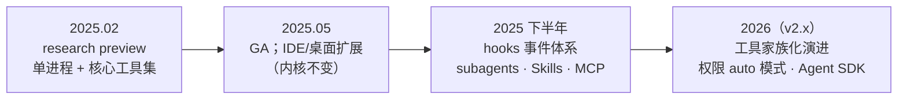
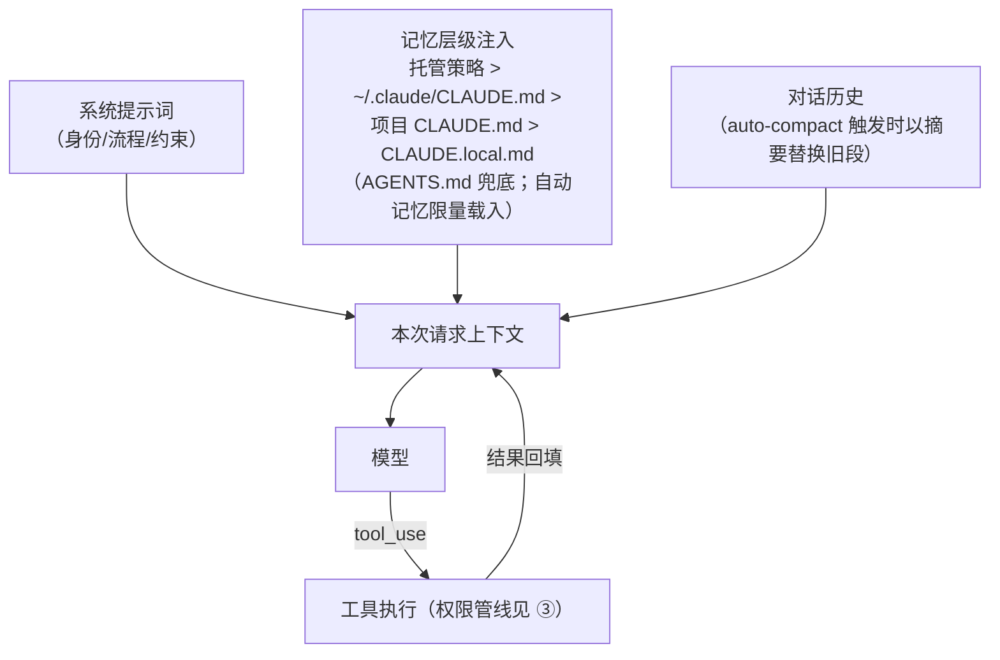

# 第 14 章 Claude Code：产品化 Agent 的范本

> 本章解剖 Anthropic 的 Claude Code。如果说 Codex 展示了「系统工程派」的上限，Claude Code 展示的就是「**产品打磨派**」的上限：一个单进程应用，把第 1 章公式的每个部件都打磨出行业模仿对象——权限规则 DSL、hooks 事件体系、渐进披露的 Skills。（内容截至 2026-10；Claude Code 为 source-available 而非开源，剖析基于官方文档与工程复盘）

## 14.1 定位与历史

2025 年 2 月随 Claude 3.7 Sonnet 以 research preview 发布、同年 5 月 GA 的终端优先编码 Agent，是这一品类的**事实标杆**——后续几乎所有竞品的设计对话都绕不开「对比 Claude Code」。产品形态从 CLI 扩展到 VS Code/JetBrains 扩展、桌面端与移动端；headless 模式（`claude -p`）与 Claude Agent SDK 复用同一引擎，把「Agent 作为可编程组件」开放给开发者。

## 14.2 架构演进与版本锚定

**版本锚定**：本章锚定 **stable 通道 2.1.285**（2026-09-29；latest/next 通道已至 2.1.289）。Claude Code 走高频 npm 发版（每周多个），`stable / latest / next` 三条通道并行——版本跟踪看 [npm](https://www.npmjs.com/package/@anthropic-ai/claude-code)。

Claude Code 的架构演进是一个**反直觉的案例：主架构从未改变**。创建者 Boris Cherny 在访谈中确认了这个决策——自始至终是**单进程 TypeScript 应用**，CLI、IDE 扩展、桌面端共享同一内核。真正值得学的是：**架构不变，能力靠扩展点生长**——



两个「演进而不改架构」的典型案例：

**案例一：工具家族化（v2.x）。** 版本间最大的变化发生在工具层——`Task` 更名为 `Agent`（旧名保留别名）、`TodoWrite` 让位于 TaskCreate/TaskGet/TaskList/TaskUpdate 四件套、计划模式被工具化为 `EnterPlanMode`/`ExitPlanMode`。学习点：**产品演化优先落在工具语义层**（模型看得见、提示词可教），而不是进程结构层。

**案例二：hooks 从 shell 钩子长成事件总线。** 早期 hooks 是简单的命令钩子；如今是 30+ 生命周期事件（`PreToolUse`、`PostToolUse`、`SessionStart/End`、`Stop`、`SubagentStart/Stop`、`PreCompact`、`PermissionRequest`……）× 五种处理器形态（command / http / MCP 工具 / prompt / agent）。**策略执行被外包给任意基础设施，但仍在同一进程模型内**——用扩展点而非微服务承载演化。

单进程的适用条件同样值得记下：Agent 的每轮循环都高频读写同一份会话状态，跨进程拆分只增加延迟与一致性成本。对照第 13 章（协议化）与第 15 章（彻底 C/S 分离），三种答案没有对错，只有约束不同：Anthropic 优化产品体验的连贯性。

## 14.3 五视角拆解

**① 主循环与思考档位。** 主循环与第 2 章的标准骨架一致（headless 与 SDK 复用同一循环）；特色是**思考预算分级**——用户可切换思考档位（社区流传的 think / ultrathink 关键词即此机制的产品化），简单任务省钱、复杂任务深想。统一伪代码：

```typescript
// 统一伪代码：Claude Code 循环中的思考档位
const budget = userThinkingPreference.for(task);        // 低/中/高档位
while (!task.done) {
  const response = await model.request({
    messages: context.messages, tools: context.tools,
    thinking: { budgetTokens: budget },                  // 可调思考深度（第 6 章）
  });
  context.append(response);
  if (response.stopReason !== "tool_use") break;
  await executeTools(response.toolCalls);                // 见 ③ 权限管线
}
```

**② 工具与上下文。** 工具是六家中最「家族化」的：文件与命令（Bash/PowerShell、Read/Edit/Write、Glob/Grep）、网络（WebFetch/WebSearch）、协作（Agent 子代理派发）、任务管理（TaskCreate 四件套）、计划（EnterPlanMode/ExitPlanMode）等长尾家族。上下文管理的组装流程是它最值得画下来的设计：



四级记忆层级 + 定量载入（自动记忆每会话仅载入前 200 行/25KB）+ 窗口可调的自动压缩 + `/context` 可视化——第 4 章「上下文工程四板斧」在这里全部产品化，甚至把「压缩」变成了用户可见、可操作的命令。经济学上，官方工程复盘的结论直接成为名言：「Prompt caching is everything」。

**③ 权限与沙箱。** 权限规则 DSL 是六家中表达力最强的设计，匹配逻辑用统一伪代码呈现：

```typescript
// 统一伪代码：一次调用的权限裁决（deny → ask → allow）
function decide(call, rules, mode) {
  const matched = rules.matching(call);                  // 规则如 Bash(npm run *)、Edit(docs/**)
  if (matched.some(r => r.effect === "deny"))  return DENY;   // deny 全局优先
  if (matched.some(r => r.effect === "allow")) return ALLOW;
  if (mode.defaults.includes(call.kind))       return ALLOW;  // 模式默认（如 acceptEdits 放行编辑）
  return ASK;                                            // 升级问人
}
```

求值顺序 deny → ask → allow，企业托管策略跨层胜出；模式（default / acceptEdits / plan / auto / dontAsk / bypassPermissions）整体换挡默认值。OS 级隔离由 `/sandbox` 提供（macOS Seatbelt / Linux bubblewrap + 网络代理白名单）——第 8 章三态模型的出处级实现。

**④ 扩展。** hooks（事件 × 五形态处理器，见 14.2）、子代理（`.claude/agents/` 下 Markdown+YAML 定义，嵌套与并发有上限——影响半径递减）、Skills（`.claude/skills/`，遵循 agentskills.io 开放标准，渐进披露）、MCP 与 Plugins（把 skills+hooks+subagents+MCP 打包分发）。

**⑤ 概念对照。**

| Claude Code 术语 | 本书概念 | 原理章节 |
|---|---|---|
| CLAUDE.md（四级层级） | 项目/用户记忆文件 | 第 5 章 |
| auto-compact / /compact | 压缩（compaction） | 第 4 章 |
| Agent 工具（旧名 Task） | 编排工具（子代理派发） | 第 3、9 章 |
| .claude/agents | 子代理定义 | 第 9 章 |
| TaskCreate/Get/List/Update | todo 计划工具 | 第 6 章 |
| plan mode（Enter/ExitPlanMode） | 计划模式 | 第 6 章 |
| permission rules（Tool(specifier)） | 权限规则表 | 第 8 章 |
| permission modes | 权限模式（默认值换挡） | 第 8 章 |
| hooks（PreToolUse 等） | 生命周期钩子 / 护栏挂点 | 第 7 章 |
| Skills（渐进披露） | 技能包 | 第 11 章 |
| think / ultrathink | 可调思考深度 | 第 6 章 |
| claude -p / Agent SDK | headless 非交互模式 | 第 2 章 |

## 14.4 工程亮点小结

1. **单体架构的坚持**：产品连贯性优先于架构时尚；演化走扩展点而非拆服务。
2. **权限规则 DSL**：gitignore 风格模式匹配 + deny 优先 + 分层配置，行业模仿对象。
3. **hooks 的泛化**：从 shell 钩子长成五形态事件总线，策略执行外包而不失控。
4. **渐进披露的记忆/技能体系**：四级记忆 + 定量载入 + 按需加载，系统治疗「指令膨胀」。

## 14.5 与第一部分的呼应

| 原理概念 | Claude Code 中的形态 |
|---|---|
| 主循环（第 2 章） | 单进程循环，headless/SDK 复用 |
| 工具（第 3 章） | 家族化工具 + Task 任务族 |
| 上下文四板斧（第 4 章） | 四级记忆 + auto-compact + /context |
| 指令分层（第 5 章） | 系统提示词 / CLAUDE.md / 用户消息 |
| 规划（第 6 章） | 计划模式工具化 + 任务管理族 |
| 权限三态（第 8 章） | 模式 + 规则 DSL + /sandbox |
| 子代理（第 9 章） | .claude/agents + Agent 工具 |
| 护栏（第 7 章） | hooks 事件总线 |

## 14.6 延伸阅读

- 官方文档：<https://code.claude.com/docs>（tools、permissions、hooks、memory、sub-agents、skills、best-practices 各页）
- 版本跟踪：npm [`@anthropic-ai/claude-code`](https://www.npmjs.com/package/@anthropic-ai/claude-code)
- 工程复盘：《How we built Claude Code auto mode》、《Lessons from building Claude Code: Prompt caching is everything》（Anthropic Engineering，2026）；访谈《How We Built Claude Code》
