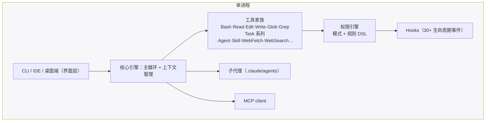

# 第 14 章 Claude Code：产品化 Agent 的范本

> 本章解剖 Anthropic 的 Claude Code。如果说 Codex 展示了「系统工程派」的上限，Claude Code 展示的就是**「产品打磨派」**的上限：一个单进程应用，把第 1 章公式的每个部件都打磨出行业模仿对象——权限规则 DSL、hooks 事件体系、渐进披露的 Skills。（事实口径：截至 2026-10；Claude Code 为 source-available 而非开源，剖析基于官方文档与工程复盘）

## 14.1 定位与历史

2025 年 2 月随 Claude 3.7 Sonnet 以 research preview 发布、同年 5 月 GA 的终端优先编码 Agent，是这一品类的**事实标杆**——后续几乎所有竞品的设计对话都绕不开「对比 Claude Code」。产品形态从 CLI 扩展到 VS Code/JetBrains 扩展、桌面端与移动端；headless 模式（`claude -p`）与 Claude Agent SDK 复用同一引擎，把「Agent 作为可编程组件」开放给开发者。

## 14.2 架构：刻意选择的单进程单体

创建者 Boris Cherny 在访谈中确认了这个「反直觉」的决策：**单进程 TypeScript 应用**，没有按能力拆微服务。CLI、IDE 扩展、桌面端共享同一内核；工具、子代理、hooks、MCP 全部在进程内协作。

为什么单体？**低延迟与状态一致性**。Agent 的每轮循环都高频读写同一份会话状态，跨进程拆分只增加复杂度。对比第 13 章（引擎协议化）与第 15 章（彻底 C/S 分离），这是同一问题的三种答案——**没有唯一正确，只有约束不同**：Anthropic 优化产品体验的连贯性，Codex 优化多端复用，OpenCode 优化开放生态。

## 14.3 五视角速查

**① 主循环**：标准「模型 ⇄ 工具」循环（headless 与 SDK 复用）；特色是**思考预算分级**——用户可切换思考档位（社区流传的「think / ultrathink」等关键词即此机制的产品化），对应第 6 章推理模型的可调思考深度。

**② 工具**：家族化演进是最大看点：`Bash`/`PowerShell`、`Read`/`Edit`/`Write`、`Glob`/`Grep`、`WebFetch`/`WebSearch`、`NotebookEdit`；`Agent`（由 `Task` 更名）派发子代理；TaskCreate/TaskGet/TaskList/TaskUpdate 系列（取代早期 `TodoWrite`）承载结构化任务管理（第 6 章）；`EnterPlanMode`/`ExitPlanMode` 把计划模式做成显式工具（第 6.5 节）；还有 `Workflow`（多子代理工作流）、`LSP`、`SendMessage`、定时任务等长尾。工具数量与职责边界随版本快速演进，是最能体现「产品在原理框架内做加法」的地方。

**③ 上下文**：教科书级的全量实践——

- **记忆文件四级层级**：托管策略 > 用户级（`~/.claude/CLAUDE.md`）> 项目级（`./CLAUDE.md`）> 本地（`CLAUDE.local.md`），支持 `@path` 导入与按路径条件的规则片段；`AGENTS.md` 作为兜底约定；
- **自动记忆**：自动写至用户目录的项目记忆文件，每次会话限量载入（防止记忆膨胀反噬上下文——第 4 章「收比放难」的直接体现）；
- **压缩**：auto-compact 窗口可调，`/compact <指令>` 定向摘要（保留什么由指令控制），`/context` 命令可视化当前占用——把「上下文工程」变成了用户可见、可操作的产品功能；
- **经济学**：官方工程复盘的结论直白到成为名言——「**Prompt caching is everything**」（第 4.6 节的原则在此成为第一定律）。

**④ 权限与沙箱**：第 8 章三态模型的出处级实现——模式（default / acceptEdits / plan / auto / dontAsk / bypassPermissions）+ 规则 DSL（`Bash(npm run *)`、`Edit(docs/**)`、`WebFetch(domain:...)`），求值顺序 deny → ask → allow，企业托管策略全局胜出；OS 级隔离由 `/sandbox` 提供（macOS Seatbelt / Linux bubblewrap + 网络代理白名单）。

**⑤ 扩展**：可能是全行业最丰富的扩展面——

- **Hooks**：30+ 生命周期事件（`PreToolUse`、`PostToolUse`、`SessionStart/End`、`Stop`、`SubagentStart/Stop`、`PreCompact`、`PermissionRequest`……），处理器五种形态（command / http / MCP 工具 / prompt / agent）——把「策略执行」从 CLI 进程外包给任意基础设施，这是第 7.8 节护栏层的产品化极致；
- **子代理**：`.claude/agents/` 下 Markdown+YAML 定义（name/description/tools/model/权限模式），默认嵌套与并发都有上限——影响半径递减原则（第 9.2 节）的落地；
- **Skills**：`.claude/skills/<name>/SKILL.md`，遵循 agentskills.io 开放标准（第 11.4 节的渐进披露）；
- **MCP** 与 **Plugins**（把 skills+hooks+subagents+MCP 打包分发）。

## 14.4 工程亮点小结

1. **单体架构的坚持**：产品连贯性优先于架构时尚，适合「状态高度共享」的 Agent 本质。
2. **权限规则 DSL**：gitignore 风格的模式匹配 + deny 优先 + 分层配置，成为行业模仿对象。
3. **Hooks 的泛化**：从 shell 钩子长成五形态事件总线，安全与定制都不再依赖修改产品本体。
4. **渐进披露的记忆/技能体系**：四级记忆 + 定量载入 + 按需加载，对「指令膨胀」这个 Agent 产品特有疾病的系统治疗。

## 14.5 回扣第一部分

| 原理概念 | Claude Code 中的形态 |
|---|---|
| 主循环（第 2 章） | 单进程循环，headless/SDK 复用 |
| 工具（第 3 章） | 家族化工具 + Task 计划工具族 |
| 上下文四板斧（第 4 章） | 四级记忆 + auto-compact + /context |
| 指令分层（第 5 章） | 系统提示词 / CLAUDE.md / 用户消息 |
| 规划（第 6 章） | 计划模式工具化 + 任务管理工具族 |
| 权限三态（第 8 章） | 模式 + 规则 DSL + /sandbox |
| 子代理（第 9 章） | .claude/agents + Agent 工具 |
| 护栏（第 7 章） | hooks 事件总线 |

## 14.6 延伸阅读

- 官方文档：<https://code.claude.com/docs>（tools、permissions、hooks、memory、sub-agents、skills、best-practices 各页）
- 工程复盘：《How we built Claude Code auto mode》、《Lessons from building Claude Code: Prompt caching is everything》（Anthropic Engineering，2026）
- 访谈：Boris Cherny《How We Built Claude Code》（单体架构决策的第一手陈述）
