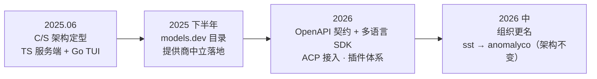
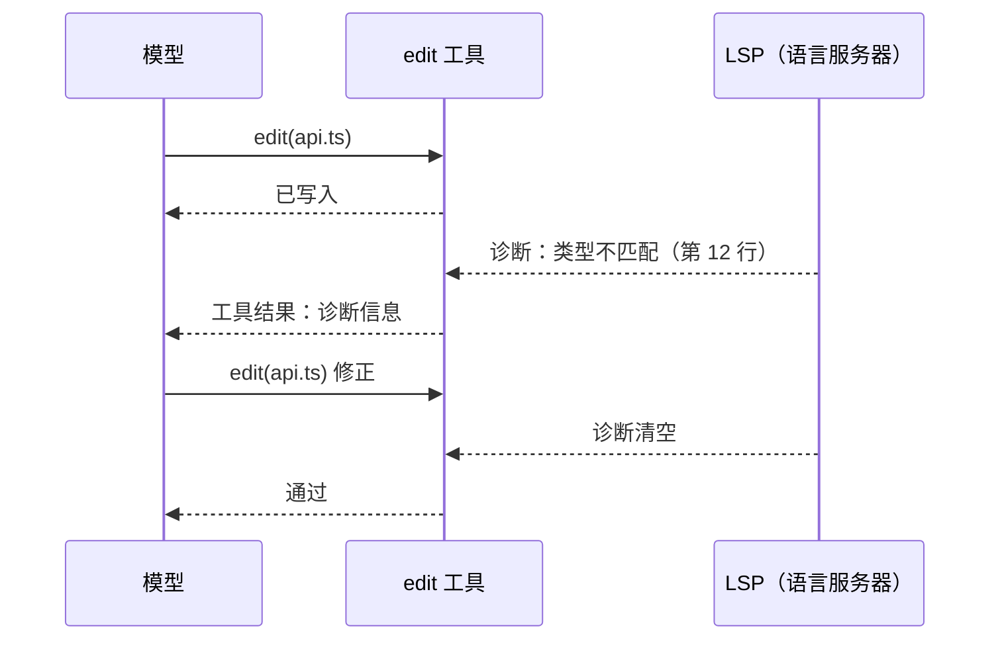

# 第 15 章 OpenCode：客户端/服务端分离

> 本章解剖 OpenCode——把「Agent 即服务」推到最激进的实现：引擎是一个带 OpenAPI 契约的 HTTP 服务，一切界面（终端、IDE、浏览器）都是平权的客户端。它还示范了另一个方向的极致：**提供商中立**。（内容截至 2026-10）

## 15.1 定位与历史

OpenCode 的 slogan 直白：「开源版的 Claude Code」。2025 年 6 月由 SST 团队（以 Serverless Stack 框架闻名）推出，npm 包名 `opencode-ai`；2026 年随公司更名，仓库由 `sst/opencode` 迁移至 `anomalyco/opencode`（旧地址自动重定向）。它是开源编码 Agent 中星标最高的项目之一（约 21 万），也是「不锁定任何模型厂商」路线的旗舰。

## 15.2 架构演进与版本锚定

**版本锚定**：本章锚定 **v1.18.34**（2026-09-30 发布）。OpenCode 由机器人自动发 patch 版，间隔数天至两周——小步快跑、无破坏性大版本的节奏。注意：**它没有 2.0 大版本线**，网上偶见的「OpenCode v2」说法并不存在于包版本中（组织更名前后均为 1.x 线）。

OpenCode 的演进路径与前两章都不同：**架构自诞生即定型，从未动摇**——客户端/服务端分离是第一天就写下的决定。此后的演进全部发生在生态层：



学习点：**契约先行的架构让「前端种群」爆炸式增长而服务端保持稳定**——TUI、Web 客户端、IDE 扩展、Zed（经 ACP）全部是挂在同一个 HTTP 服务上的普通客户端；仓库迁移组织这种「公司级变动」对架构也毫无影响。这与第 13 章「先单体后协议化」、第 14 章「永不拆分」构成了三种演进哲学的完整光谱。

## 15.3 五视角拆解

**① 主循环与会话可逆性。** 服务端为每个会话执行标准循环；特色是把「试错可回滚」做进了会话模型本身——`fork` 从任意消息分叉出新会话、`revert/unrevert` 回退到任意消息。统一伪代码：

```typescript
// 统一伪代码：OpenCode 的会话即数组 + 可逆操作
session.messages = [];                                  // append-only 消息数组
while (!task.done) {
  const response = await model.request(session.messages, tools);
  session.messages.push(response);
  if (response.stopReason !== "tool_use") break;
  session.messages.push(...await executeTools(response.toolCalls));
}

fork(session, messageId):  // 复制该消息之前的前缀，得到新会话（第 9 章：并行探索另一条路）
revert(session, messageId): // 截断到该消息，可再 unrevert 恢复（第 8 章：可逆性兜底）
```

隐藏的系统级 agent（compaction/title/summary）自动负责压缩、命名与摘要——第 4 章的压缩策略在此被实现为「一群看不见的内部子代理」。

**② 工具与 LSP 回路。** 工具集与同类一致（`bash`、`read`、`edit`、`write`、`grep`、`glob`、`apply_patch`、`todowrite`、`webfetch`、`websearch`、`question`——把「升级问人」做成了显式工具）。最有教学价值的是 LSP 集成：约 35 个内置 language server 把类型错误与诊断作为工具结果回灌，形成「编辑 → 编译器反馈 → 修正」的紧回路——第 7.6 节「最硬的评估器是编译器与测试」的工程化：



**③ 上下文。** 项目指令 `/init` 生成 AGENTS.md；压缩由内部系统代理承担；按 agent 角色裁剪上下文与工具集（见 ⑤）。

**④ 权限与沙箱。** 与 Claude Code 相反的默认值哲学——**默认全部允许**，通过 `opencode.json` 的 permission 块按工具键收窄（`allow/ask/deny`，支持 glob 与 MCP 通配）。统一伪代码就是一张三层查表：

```typescript
// 统一伪代码：OpenCode 的权限三层查表（默认放行）
function decide(call, permissionConfig) {
  const rule = permissionConfig.match(call.tool, call.args);  // 如 "git *": "ask"
  return rule ?? "allow";                                       // 无规则即放行
}
```

无 OS 级沙箱——隔离责任交给用户环境（容器、VM）。默认值即产品哲学：**流畅性优先、信任用户环境**（第 8 章「审批疲劳 vs 安全默认」的另一极）。

**⑤ 扩展。** 内置双角色 agent（build 全量工具 / plan 将写类工具设为 ask）+ 自定义 agent（Markdown+YAML）；JS 插件可挂 `tool.execute.before/after`、`session.idle`、`file.edited` 等钩子，用 Zod schema 注册可覆盖内置的自定义工具；MCP 动态添加；ACP 支持让 Zed 等编辑器直接作为客户端驱动。商业层（Zen 模型网关、OpenCode Go 订阅）可选、不构成绑定。

**概念对照。**

| OpenCode 术语 | 本书概念 | 原理章节 |
|---|---|---|
| build / plan agent | 按角色裁剪的工具集 / 计划模式 | 第 3、6 章 |
| opencode serve / SDK | 引擎服务化（Agent 即服务） | 第 12 章 |
| fork / revert | 会话分叉 / 可逆回退 | 第 8、9 章 |
| compaction agent（隐藏） | 压缩（内部子代理实现） | 第 4 章 |
| permission 块（allow/ask/deny） | 权限规则表 | 第 8 章 |
| plugin hooks（tool.execute.before 等） | 生命周期钩子 | 第 7 章 |
| question 工具 | 升级问人（显式工具化） | 第 6 章 |
| models.dev | 提供商中立的模型目录 | 第 12 章 |
| ACP | 编辑器接入协议 | 第 11 章 |

## 15.4 工程亮点小结

1. **Agent 即 HTTP 服务**：契约驱动 SDK 生成，任意客户端平权接入——「Agent 后端化」做到底。
2. **会话可分叉、可回退**：把可逆性做进数据模型，试错成本逼近于零。
3. **LSP 诊断进循环**：编辑器级反馈成为模型的「第二双眼睛」，显著压缩改错回路。
4. **压缩即内部子代理**：优雅的实现模式——系统级维护型 agent 对用户不可见地料理上下文。

## 15.5 与第一部分的呼应

| 原理概念 | OpenCode 中的形态 |
|---|---|
| 主循环（第 2 章） | 服务端会话循环 + fork/revert |
| 工具裁剪（第 3 章） | 按 agent 角色（build/plan）配工具集 |
| 压缩与内部代理（第 4、9 章） | compaction/summary 系统 agent |
| 确定性评估器（第 7 章） | LSP 诊断回灌 |
| 权限默认值（第 8 章） | 默认全放行 + 可编程收窄 |
| MCP/插件（第 11 章） | 插件钩子 + 自定义工具 + ACP |

## 15.6 延伸阅读

- 仓库（现址）与 Releases：<https://github.com/anomalyco/opencode>（旧址 sst/opencode 自动重定向）
- 文档：<https://opencode.ai/docs>（server、agents、plugins、permissions、lsp、acp 各页）
- 播客：Baseten《Building AI agents, open code, and open source》（Dax Raad，2025-10）
- 深读：cefboud.com《How Coding Agents Actually Work: Inside OpenCode》（2025-09）
