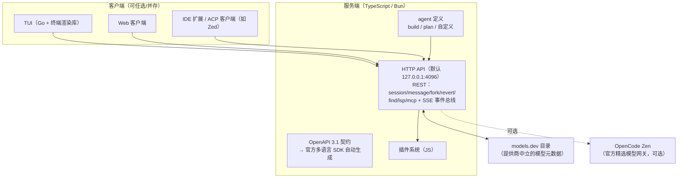

# 第 15 章 OpenCode：客户端/服务端分离

> 本章解剖 OpenCode——把「Agent 即服务」推到最激进的实现：引擎是一个带 OpenAPI 契约的 HTTP 服务，一切界面（终端、IDE、浏览器）都是平权的客户端。它还示范了另一个方向的极致：**提供商中立**。（事实口径：截至 2026-10）

## 15.1 定位与历史

OpenCode 的 slogan 直白：「开源版的 Claude Code」。2025 年 6 月由 SST 团队（以 Serverless Stack 框架闻名）推出，npm 包名 `opencode-ai`；2026 年随公司更名迁至 Anomaly 名下并发布 v2。它是开源编码 Agent 中星标最高的项目之一（16 万+），也是「不锁定任何模型厂商」路线的旗舰。

## 15.2 架构：服务端与客户端的彻底分离

三个结构性选择：

- **服务端有公开契约**：每个端点都在 OpenAPI 规范里，多语言 SDK 由规范自动生成——「接入 OpenCode」和「接入任何一个标准 REST 服务」一样简单。这是 Codex app-server（JSON-RPC，服务自有前端）与 OpenCode（HTTP+契约，服务任意第三方）的本质差异：**前者解耦，后者开放**。
- **TUI 用 Go 写**：渲染密集的终端界面与业务后端按语言优势分离——前后端分离思想在终端产品上的应用。
- **提供商中立**：模型接入数据来自 models.dev 社区目录，几十家提供商开箱可用；官方的 Zen 网关（按 token 计费、零加价聚合精选模型）与开源模型订阅（OpenCode Go）是可选的商业层，不构成绑定。

## 15.3 五视角速查

**① 主循环**：服务端为每个会话执行标准循环；会话/消息全量持久化，支持 **fork**（从任意消息分叉出新会话）与 **revert/unrevert**（回退/撤销到任意消息）——把「试错可回滚」（第 8 章可逆性）做进了会话模型本身。隐藏的系统级 agent（compaction/title/summary）自动负责压缩、命名与摘要——第 4 章的压缩策略在此被实现为「一群看不见的内部子代理」。

**② 工具**：`bash`、`read`、`edit`、`write`、`grep`、`glob`（后两者 ripgrep 实现）、`apply_patch`、`todowrite`、`webfetch`、`websearch`、`question`（向用户提问——把「升级问人」（第 6.7 节）工具化）、实验性的 `lsp` 与 `skill`。默认 primary agent 全量开放；plan agent 把 `edit`/`bash` 设为 ask——同一套工具、按 agent 角色裁剪（第 3 章「按任务裁剪工具集」的实现）。

**③ 上下文**：项目指令 `/init` 生成 **AGENTS.md**；LSP 集成是特色——约 35 个内置 language server 把**类型错误、诊断信息作为工具结果回灌给模型**，形成「编辑 → 编译器反馈 → 修正」的紧回路。这是第 7.6 节论断（「最硬的评估器是编译器与测试」）的工程化：把确定性反馈源直接接进循环。

**④ 权限与沙箱**：与 Claude Code 相反的默认值哲学——**默认全部允许**，通过 `opencode.json` 的 permission 块按工具键收窄（`allow/ask/deny`，支持 glob 与 MCP 通配）。这是「流畅性优先、信任用户环境」的开源软件姿态与「安全默认、不信任任何环境」的企业姿态之别（第 12 章说过：默认值就是产品哲学）。无 OS 级沙箱——隔离责任交给用户环境（容器、VM）。

**⑤ 扩展**：JS 插件可挂 `tool.execute.before/after`、`session.idle`、`file.edited` 等钩子，用 Zod schema 注册自定义工具（可覆盖内置同名工具）；MCP 动态添加；ACP（Agent Client Protocol）支持让 Zed 等编辑器直接作为客户端驱动；插件市场形态的分发在持续完善。

## 15.4 工程亮点小结

1. **Agent 即 HTTP 服务**：契约驱动 SDK 生成，任意客户端平权接入——把 Agent 后端化做到底，也为「Agent 编排 Agent」提供了最平坦的路径。
2. **会话可分叉、可回退**：把可逆性做进数据模型，试错成本逼近于零。
3. **LSP 诊断进循环**：编辑器级反馈成为模型的「第二双眼睛」，显著压缩改错回路。
4. **压缩即内部子代理**：一个优雅的实现模式——系统级维护型 agent 对用户不可见地料理上下文。

## 15.5 回扣第一部分

| 原理概念 | OpenCode 中的形态 |
|---|---|
| 主循环（第 2 章） | 服务端会话循环 + fork/revert |
| 工具裁剪（第 3 章） | 按 agent 角色（build/plan）配工具集 |
| 压缩与内部代理（第 4、9 章） | compaction/summary 系统 agent |
| 确定性评估器（第 7 章） | LSP 诊断回灌 |
| 权限默认值（第 8 章） | 默认全放行 + 可编程收窄 |
| MCP/插件（第 11 章） | 插件钩子 + 自定义工具 + ACP |

## 15.6 延伸阅读

- 仓库与文档：<https://github.com/sst/opencode>（现重定向至 Anomaly）、<https://opencode.ai/docs>（server、agents、plugins、permissions、lsp、acp 各页）
- 播客：Baseten《Building AI agents, open code, and open source》（Dax Raad 谈设计动机）
- 深读：cefboud.com《How Coding Agents Actually Work: Inside OpenCode》（2025-09）
