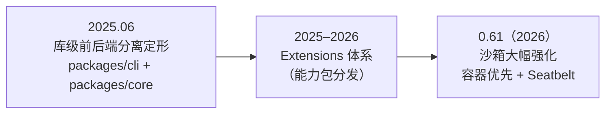
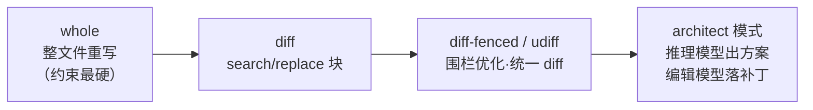

# 第 16 章 Gemini CLI 与 Aider：自主性的两个极端

> 本章一次看两个项目：Google 的 **Gemini CLI** 代表「平台生态派」——用免费额度和扩展体系把 Agent 变成获客漏斗；社区项目 **Aider** 代表「克制派」——刻意**不做**自主 Agent，用受约束的协议换取确定性。两者分别处于自主性程度的两个极端，正好检验前几章的概念在极端条件下如何取舍。（事实口径：截至 2026-10）

## 16.1 Gemini CLI：平台生态派

**定位与历史**。2025 年 6 月开源（Apache-2.0）的 TypeScript 终端 Agent，主打「登录 Google 账号即免费用」，现约 10.7 万星。

**架构演进与版本锚定**。本章锚定 **v0.62.0**（2026-09-29）；发版节奏为周更 stable + 每日 nightly。演进轨迹是一条「平台节奏」的曲线：



架构骨架（`packages/cli` 前端 + `packages/core` 引擎的库级分离）自诞生未变——同 core 可接不同前端，但不做 OpenCode 式跨进程服务。值得学的演进对比：Codex 是「安全先行、为沙箱换语言」，Gemini CLI 则是「生态先行、安全补强」——**平台型产品的安全节奏往往绑定生态阶段**：先把用户规模与扩展体系做起来，再在 0.61 一举强化沙箱（Docker/Podman 预构建镜像 + macOS Seatbelt）。两种节奏无对错，但安全债的偿还成本不同（第 8 章的纵深防御宜早不宜迟）。

**五视角深潜**（选最有特色的三点）：

- **工具与确认流**：工具集与同类一致（`run_shell_command`、文件族、检索族、`web_fetch`、`google_web_search`、`save_memory`），支持参数级禁用（如 `run_shell_command(rm -rf)`）；文件修改与 shell 默认需确认，只读操作可跳过——典型的「按工具类别施策」（第 3 章 Data/Action 分类的落地）。
- **上下文**：`GEMINI.md` 三级层级（全局/项目/子目录，`@path` 导入、默认深度 5），`contextFileName` 可改名——**这就是对 AGENTS.md 标准的兼容实现**；`save_memory` 把事实追加进全局记忆文件（记忆 = 第 4 章笔记策略 + 一等工具）；checkpoint 机制保存/恢复会话状态（可逆性）。
- **扩展：Extensions 三合一**。把「MCP server + 上下文文件 + 自定义命令」打成一个可安装单元（`gemini extensions install`），配套版本管理——团队共享一整套工具+提示词+命令，比裸配 MCP 更接近「能力包」（第 11 章）。

**概念对照**：

| Gemini CLI 术语 | 本书概念 | 原理章节 |
|---|---|---|
| GEMINI.md（三级层级） | 项目记忆文件 | 第 5 章 |
| contextFileName | 记忆文件改名（AGENTS.md 兼容） | 第 5 章 |
| save_memory | 记忆工具 | 第 4 章 |
| checkpoint | 会话快照（可逆性） | 第 8 章 |
| Extensions | 能力包（工具+指令+命令打包） | 第 11 章 |
| Trusted Folders | 目录信任边界 | 第 8 章 |
| 免费层（60 rpm / 1000 req/天） | 平台获客策略 | 第 12 章 |

## 16.2 Aider：克制派

**定位与历史**。Paul Gauthier 自 2023 年维护的「终端里的 AI 结对编程」，刻意定位为**对话式 pair programmer 而非自主 Agent**：人决定改哪些文件、何时提交，模型只负责生成编辑。

**架构演进与版本锚定**。本章锚定**约 v0.86.2**（2026 年 2 月，PyPI）。必须诚实记录一个事实：**Aider 在 2026 年近乎停滞**——GitHub 的 Latest 版本停留在 2025-08 的 v0.86.0，全年仅一次小版本。这不是本章的脚注，而是值得读出的行业信号：受约束工作流的先驱，在全行业转向高自主 Agent 的浪潮中沉寂了。它留下的资产（edit formats、repo map、benchmark）反而被整个行业继承——**一个项目的落幕姿势，也可以是遗产的扩散方式**。

架构本身是单体 Python、从未大变；真正的演进发生在**编辑协议（edit formats）的谱系上**——这条谱系本身就是「模型能力 × 协议刚性」的适配史：



规律很清楚：**模型越强，协议可以越松**——弱模型时代需要整文件重写兜底，强模型时代可以放手让它写 search/replace 块，甚至拆成双模型分工（architect 出方案 / editor 落补丁）。

**五视角深潜**（选最有特色的三点）：

- **受约束的「循环」**：Aider 没有开放式工具循环，取而代之的是固定协议。统一伪代码：

```typescript
// 统一伪代码：Aider 的受约束工作流（对照第 2 章的自由循环）
const files = userAddsWith("/add", "/drop");           // 人显式圈定文件集
while (chat.open) {
  const patch = await model.edit(user.message, files, editFormat);
  const applied = applyPatch(patch);                    // 解析失败则要求重试
  if (runLintTests && failed(applied)) {
    user.message = await model.fix(diagnostics);        // 确定性评估器驱动修正
  }
  git.commitAll(attribution: "(aider)");                // 每次修改自动提交，可 /undo
}
```

- **repo map**：招牌发明。全仓库太大读不完（第 4 章），Aider 用语法树抽符号、建引用图、按图排序选出最常被引用的符号，压成约 1k token 的「仓库地图」常驻上下文——**最小高信号集合 + 按需检索**的经典实现，被后来的产品广泛借鉴。
- **benchmark 即护城河**：polyglot 基准（225 题 × 5 语言，看 pass@1、格式正确率与成本）成了行业模型选型的公共标尺——第 10 章「评估资产」价值的外部证明。

**概念对照**：

| Aider 术语 | 本书概念 | 原理章节 |
|---|---|---|
| edit formats（whole/diff/udiff） | 受约束编辑协议（协议刚性 × 模型能力） | 第 3 章 |
| /add、/drop 文件集 | 显式上下文管理 | 第 4 章 |
| repo map | 按需检索 / 最小高信号索引 | 第 4 章 |
| architect / editor 双模型 | 模型分工（规划与执行分离） | 第 6 章 |
| 自动 git 提交 + /undo | 可逆性兜底（代替沙箱） | 第 8 章 |
| lint/test 钩子 | 确定性评估器 | 第 7、10 章 |
| polyglot benchmark | 评估资产 | 第 10 章 |

## 16.3 两端对照：自主性的经济学

| 维度 | Gemini CLI | Aider |
|---|---|---|
| 自主性 | 高（完整 agent 循环） | 低（受约束编辑协议） |
| 路径决定权 | 模型 | 用户 + 协议 |
| 安全哲学 | 确认清单 + 容器沙箱 | git 全程兜底 |
| 上下文策略 | 记忆文件 + checkpoint | repo map + 显式文件集 |
| 商业/生态逻辑 | 平台入口，免费获客 | 个人工具，基准立信 |
| 2026 境遇 | 活跃（周更） | 近乎停滞（资产被行业继承） |

两端共同验证了第一部分的总纲：**自主性不是免费午餐，是「灵活性 × 成本 × 可控性」的交换**。选哪端取决于任务的可枚举性与失败的代价——这正是第 7 章连续区间的实践版。

## 16.4 延伸阅读

- Gemini CLI：仓库与 Releases <https://github.com/google-gemini/gemini-cli>；文档 <https://google-gemini.github.io/gemini-cli/docs/>（tools、architecture、extensions、sandbox、checkpointing 各页）
- Aider：仓库 <https://github.com/Aider-AI/aider>；文档 <https://aider.chat/docs>（edit-formats、repomap、git、leaderboards）；版本跟踪 PyPI `aider-chat`
- 博客：《Separating code reasoning and editing》（2024-09，architect 模式）、repo map 构造文（2023-10）
