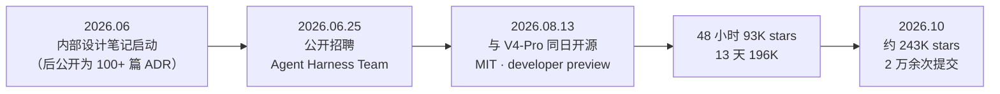
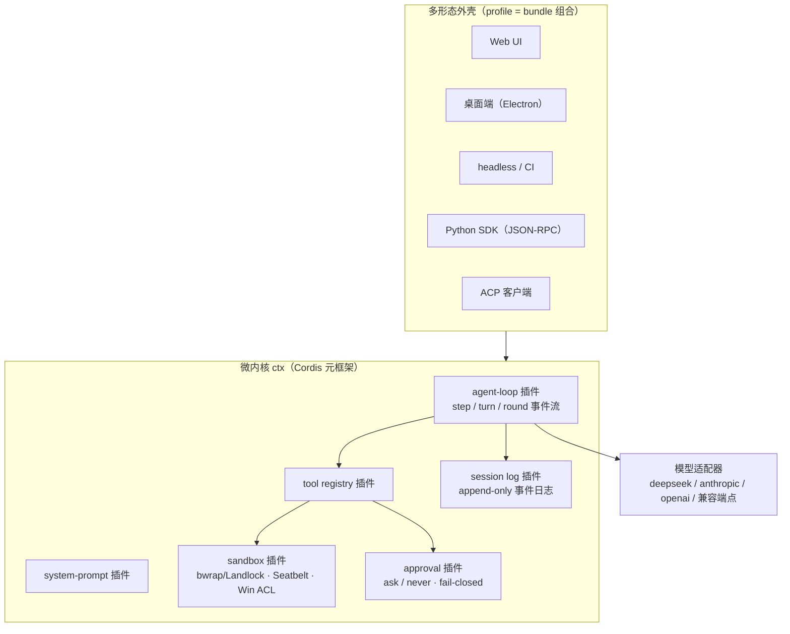

# 第 17 章 DeepSeek Harness：万物皆插件的微内核运行时

> 本章解剖 DeepSeek Harness（命令行名 `dsh`）——目前唯一直接以「harness」为名的主流开源 Agent 项目，也是「模型厂商下场做 harness」的代表作。它把第 12 章的术语推向极致：连主循环、系统提示词、审批策略本身，都是可插拔、可卸载的插件。（内容截至 2026-10）

## 17.1 定位与历史

DeepSeek 于 2026 年 8 月 13 日将内部 Agent 运行时以 MIT 协议开源，与 DeepSeek-V4-Pro 模型同日发布——模型与「模型的挽具」一起交到社区手里，这个动作本身就是「模型–harness 协同」的例证。



几个定位要点：

- **它不是模型，而是把模型变成 Agent 的软件层**——README 自述「an open-source agent harness」，口号「**Everything is a Plugin**（万物皆插件）」；
- **模型无关**：默认接入 `deepseek-flash`，同时内置 anthropic、openai、moonshotai（Kimi）、zai（GLM）等 provider 与任意 OpenAI 兼容端点；
- **多形态交付**：Web UI、Electron 桌面端、一次性 headless、Python SDK 与 ACP 接入——同一个内核，多种外壳。

## 17.2 架构演进与版本锚定

**版本锚定**：本章锚定 **v0.2.0-rc.2**（2026-09-29）。dsh 迄今**全部为预发布**（无正式 stable），走「rc → alpha」双通道高频迭代：v0.1.x 线止于 v0.1.7-rc.2（2026-09-24），一个月内已进入 v0.2.0-rc——开源两个月走完多数项目两年的版本节奏。README 明示「将有不兼容的破坏性变更」，版本跟踪看官方 [tags](https://github.com/deepseek-ai/deepseek-harness/tags)。

架构演进是五个样本里最特别的：**微内核自始定型（「生而微内核」），演进体现为插件种群的爆炸**。开源前的 100+ 篇带日期 ADR（`.agents/notes/`）记录了全部关键决策——微内核事件分类法、turn 闭包不变式、分层技能注册表、压缩的压力触发——开源后这些决策直接兑现为 `packages/` 下约 55 个插件组（core、session、llm、mcp、sandbox、compaction、skill、subagent、hooks、terminal、lsp、workflow、agent teams……）。**值得学的对照**：这是六个项目中架构演进最快的，却拥有最严格的决策文档纪律——developer preview 的激进迭代之所以没有失控，正是因为每个「破坏性变更」背后都有可追溯的 ADR。**速度靠纪律换来的**。

当前架构（v0.2.0-rc.2 快照）：



两个结构性机制值得记住：**profile/bundle**（应用按命名 profile 启动，等于一组 bundle 加补丁层；核心 `dsh-base` 承载模型适配、工具、持久化、沙箱与审批）与**能力缝（capability seam）**（文件系统与子进程服务「共享同一个 execution world」——把沙箱换成远程后端时，Bash、PTY、LSP 作为一个整体一起迁移）。

## 17.3 五视角拆解

**① 主循环：step / turn / round 三层语义。** dsh 给循环起了显式的三层名字，用统一伪代码呈现嵌套结构：

```typescript
// 统一伪代码：dsh 的三层循环（每层都有 start/end 事件，全程 waterfall）
for (const round of goalRounds) {                        // round：目标轮次
  for (const turn of turnsFor(goal)) {                   // turn：一次用户意图
    while (true) {                                       // step：一次模型请求 + 工具调用
      const response = await model.request(context.messages, context.tools);
      emit("step/start"); context.append(response);
      if (response.stopReason !== "tool_use") { emit("turn/end"); break; }
      for (const call of response.toolCalls) {
        emit("tools/pre-execute");
        const result = await withinExecutionWorld(call);  // 沙箱 + 审批在执行世界内
        context.append(result);
        emit("tools/post-execute");
      }
    }
  }
}
// 不变式：模型可见即已记录（一切对模型的输入都先写入 session 事件日志）
```

多数事件是必须放行的 waterfall——hook 体系（见 ④）就挂在这些事件上。

**② 工具。** 目录在同类产品中最大：文件族、一次性与持久 PTY 两种 `bash`、`run_code`（在沙箱内以 TS 代码调用其他工具——**工具编排本身成为工具**）、`todo_write`/`exit_plan_mode`/`ask_user_question`、`lsp`、`skill`、目标族（`create_goal`、`ralph` 新循环）、后台 `jobs`、终端族、会话检索族（`session_search`/`session_event_read`——第 10 章轨迹的「查询工具化」）、`subagent`、`workflow`、web 族。MCP 发现的工具被**适配为普通工具**（统一带上取消、权限检查与结果记录），而非特殊通道。

**③ 上下文：日志即真相。** 会话是 append-only 的 `SessionEvent` 事件日志（JSONL、压缩存储、已提交的代永不改写），模型上下文由 `deriveMessages()` 从日志**投影**得出：

```typescript
// 统一伪代码：上下文 = 日志的投影
context.messages = deriveMessages(session.events);        // 纯函数投影，可随时重建
if (pressure(sensor) === "high" || error === "context-overflow") {
  const summary = await model.summarize(project(session.events, window));
  session.append({ type: "user/message", surfaceOp: { op: "replace", range }, content: summary });
  // 压缩保持 tool-call/result 配对平衡；这是唯一允许的「改写历史」操作
}
```

压缩是可选的能力缝（不在主循环脊柱内）；另有确定性的工具结果裁剪（按码点头/中/尾截断）。记忆文件没有内置约定——官方指南建议用 MCP 接第三方记忆服务；仓库自己开发时大量使用 AGENTS.md 与设计笔记，是「用 Agent 开发 Agent 产品」的活样本。

**④ 权限与沙箱：极简词汇表。** 审批只有 `ask`（默认）与 `never`（headless/CI 立场，一切询问确定性拒绝）两级，结果为四种闭集取值，无人应答时 fail-closed；权限预设只有 `workspace-write` 与 `danger-full-access` 两个可配置项。沙箱**不用 Docker**——Linux 上 bwrap/Landlock、macOS 上 Seatbelt、Windows 上 ACL 受限令牌；沙箱不可用时直接报 `SANDBOX_UNAVAILABLE`，官方文档原话：「静默的无约束直通永远不合法」。这是第 8 章「确定性防御优先」的最严格版本。

**⑤ 扩展。** `dsh plugin` 命令 + `plugin_manager` 工具构成插件分发面（GitHub topic `dsh-plugin`、对话造插件的 Creator mode）；MCP 走 stdio 与 Streamable HTTP；Skills 是分层注册表（全局层 + 每预设层，近层覆盖远层）；子代理 **provider 化**——`spawn`（全新上下文）、`fork`（以父日志的完整轮次前缀为种子）、ACP、SDK 之外，甚至内置 `codex` 与 `claude-code` 后端，可以直接把子任务委派给竞品 CLI。

**概念对照**：

| dsh 术语 | 本书概念 | 原理章节 |
|---|---|---|
| Cordis | 插件元框架（微内核） | 第 12 章 |
| bundle / profile | 应用形态组合（bundle 组装） | 第 12 章 |
| capability seam | 扩展点 / 能力缝 | 第 12 章 |
| SessionEvent 日志 | 轨迹（append-only） | 第 10 章 |
| deriveMessages() | 上下文组装（对日志的投影） | 第 4 章 |
| step / turn / round | 轮 / 会话的目标分层 | 第 2、6 章 |
| ralph | 面向不可变目标的新循环 | 第 6 章 |
| execution world | 执行环境整体（沙箱换则整体迁移） | 第 8 章 |
| ask / never（fail-closed） | 审批策略（极简两级） | 第 8 章 |
| 分层 SkillRegistry | 技能包（分层覆盖） | 第 11 章 |
| session_search 等工具 | 轨迹查询的工具化 | 第 10 章 |

> [!NOTE] 时效提醒
> dsh 处于 developer preview，全部版本为预发布且 README 明示破坏性变更；本章快照截至 2026-10（v0.2.0-rc.2），包结构与工具名请以官方仓库为准。

## 17.4 工程亮点小结

1. **微内核 + 可逆效应**：连 agent loop 都是插件，卸载自动回滚；换沙箱即整体迁移执行世界。「万物皆插件」不是营销语，是可验证的架构性质。
2. **日志即真相**：上下文工程退化为「对日志的投影」，重放、审计、跨会话检索、token 复算全部免费获得——第 4 章与第 10 章的两条线在这里合流成一个原语。
3. **模型–harness 协同设计与「诚实的变体跑分」**：V4 系列官方基准跑在 dsh 上，且官方公布 Minimal/Standard/PTC 等 harness 变体——第三方测算同一模型仅换 harness 变体，DeepSWE 相差约 8.7 分。第 10 章「评测对象是模型与 harness 的复合体」由此从观点变成官方实践。
4. **fail-closed 的极简权限词汇表**：两级审批、两个预设、无 Docker 的原生沙箱、拒绝静默降级——最小词汇表换可推理的安全性。

## 17.5 与第一部分的呼应

| 原理概念 | DeepSeek Harness 中的形态 |
|---|---|
| 主循环与终止（第 2 章） | step/turn/round 三层语义的插件化 agent loop |
| 工具执行五工序（第 3 章） | 统一事件流中的 tool/call → pre-execute → execute → post-execute |
| 日志投影与压缩（第 4 章） | append-only 会话日志 + deriveMessages() + 可选 compaction 缝 |
| 系统提示词分层（第 5 章） | system-prompt 插件 + MCP server instructions 注入 |
| 计划与目标（第 6 章） | todo_write / exit_plan_mode / goal 族 / ralph 循环 |
| 权限与沙箱（第 8 章） | ask/never + fail-closed；原生内核沙箱三平台覆盖 |
| 子代理（第 9 章） | provider 化 spawn/fork，支持委派竞品 CLI |
| 评估与轨迹（第 10 章） | 「模型可见即已记录」；官方 harness 变体跑分 |
| MCP 与插件（第 11 章） | MCP 适配为普通工具 + 万物皆插件分发体系 |

## 17.6 延伸阅读

- 仓库与版本标签：<https://github.com/deepseek-ai/deepseek-harness>（tags 页跟踪 rc/alpha）；文档站 <https://deepseek-harness.github.io/deepseek-harness/>（重点：`docs/architecture.md`、`docs/tool-catalog.md`、`docs/subsystems/*`）
- 产品页：<https://www.deepseek.com/harness>；Cordis 论文：arXiv:2608.25512
- 深度阅读：KDnuggets《What I've Learned About DeepSeek Harness》（2026-09）；Developers Digest《We Read DeepSeek Harness》（2026-08）
