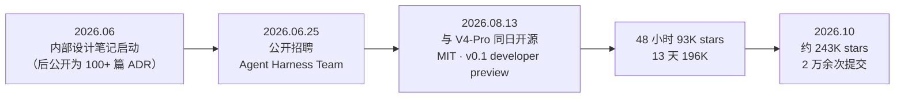
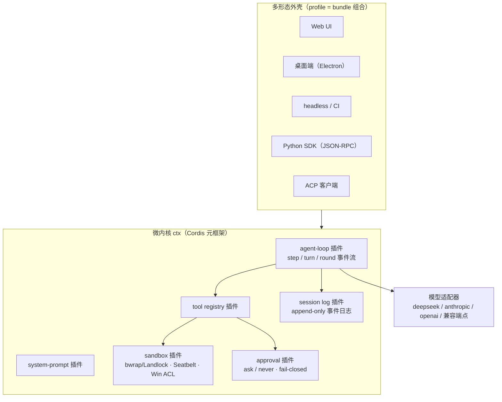

# 第 17 章 DeepSeek Harness：万物皆插件的微内核运行时

> 本章解剖 DeepSeek Harness（命令行名 `dsh`）——目前唯一直接以「harness」为名的主流开源 Agent 项目，也是「模型厂商下场做 harness」的代表作。它把上一章介绍的术语推向极致：连主循环、系统提示词、审批策略本身，都是可插拔、可卸载的插件。（事实口径：截至 2026-10）

## 17.1 定位与历史

DeepSeek 于 2026 年 8 月 13 日将内部 Agent 运行时以 MIT 协议开源，与 DeepSeek-V4-Pro 模型同日发布——模型与「模型的挽具」一起交到社区手里，这个动作本身就是上一章「模型–harness 协同」的注脚。

几个定位要点：

- **它不是模型，而是把模型变成 Agent 的软件层**——仓库 README 的自我描述是「an open-source agent harness」，口号「**Everything is a Plugin**（万物皆插件）」。
- **模型无关**：默认接入 `deepseek-flash`，同时内置 anthropic、openai、moonshotai（Kimi）、zai（GLM）等 provider 与任意 OpenAI 兼容端点，支持 completions/responses/anthropic-messages 三种协议适配。
- **多形态交付**：`npx @deepseek-ai/dsh web` 起本地 Web UI，另有 Electron 桌面端、一次性 headless 模式、Python SDK 与 ACP 接入——同一个运行时内核，多种外壳。
- 代码主体为 TypeScript（第三方统计约 45 万行），自研插件元框架 **Cordis**（有配套论文）。

> [!NOTE] 时效提醒
> dsh 处于 developer preview，README 明确警告「将有不兼容的破坏性变更」。本章快照截至 2026-10，包结构与工具名请以官方仓库 master 为准。

## 17.2 架构：微内核与「万物皆插件」

dsh 的架构决策一句话概括：**没有特权内核**。模型适配器、工具注册表、会话日志、沙箱策略，乃至 agent loop 本身，全部是运行在共享上下文 `ctx` 上的插件；插件向 `ctx` 贡献服务、类型化事件与**可逆效应**——卸载时注册自动回滚。

两个结构性机制值得记住：

- **profile/bundle**：应用按命名 profile 启动（`web`/`headless`/`sdk`/`acp`），profile 等于一组 bundle 的组合加补丁层；核心 bundle `dsh-base` 承载模型适配、工具、持久化、沙箱与审批，其余按形态叠加。
- **能力缝（capability seam）**：文件系统与子进程服务「共享同一个 execution world」——把沙箱换成远程后端时，Bash、PTY、LSP 会作为一个整体一起迁移，而不是各改各的。这是第 12 章五视角里「权限与沙箱」一栏被插件化重塑的例子。

## 17.3 五视角速查

**① 主循环**。dsh 给循环语义起了显式的三层名字：**step**（一次模型请求及其引发的工具调用）、**turn**（零或多个 step）、更外层的 **round**（目标轮次）。循环全程是一条类型化事件流（`turn/start → step/start → llm/stream → tool/call → tool/result → turn/end`），大多数事件是必须放行的 waterfall。设计不变式只有一句：**「模型可见即已记录」（Model-visible means logged）**。

**② 工具**。目录在同类产品中最大：文件族（`read`/`edit`/`write`/`glob`/`grep`/`read_image`）、一次性与持久 PTY 两种 `bash`、`run_code`（在沙箱内以 TS 代码调用其他工具——工具编排本身成为工具）、`todo_write`/`exit_plan_mode`/`ask_user_question`、`lsp`、`skill`、目标族（`create_goal` 等）与 `ralph`（面向不可变目标的新循环）、后台 `jobs`、终端族、会话检索族（`session_search`/`session_event_read`）、`subagent`、`workflow`、`web_fetch`/`web_search` 等。MCP 发现的工具会被**适配为普通工具**（统一带上取消、权限检查与结果记录），而非特殊通道。

**③ 上下文**。招牌设计是**日志即真相**：会话是 append-only 的 `SessionEvent` 事件日志（JSONL、压缩存储、已提交的代永不改写），模型上下文由 `deriveMessages()` 从日志**投影**得出。压缩（compaction）不在主循环脊柱里，而是可选的能力缝——按「压力 / 窗口溢出」两种信号触发，摘要以「替换区间」写回且保持工具调用与结果的配对平衡。另一路是确定性的工具结果裁剪（按码点做头/中/尾截断）。记忆文件没有内置约定——官方指南建议用 MCP 接第三方记忆服务；有趣的是仓库自己开发时大量使用 AGENTS.md 与设计笔记，是「用 Agent 开发 Agent 产品」的活样本。

**④ 权限与沙箱**。极简词汇表：审批只有 `ask`（默认）与 `never`（headless/CI 立场，一切询问确定性拒绝）两级，结果只有四种闭集取值，无人应答时 fail-closed；权限预设只有 `workspace-write` 与 `danger-full-access` 两个可配置项。沙箱**不用 Docker**——Linux 上 bwrap/Landlock、macOS 上 Seatbelt、Windows 上 ACL 受限令牌，SSH 后端可把同一策略施加到远端；沙箱不可用时直接报 `SANDBOX_UNAVAILABLE`，官方文档原话：「静默的无约束直通永远不合法」。这是第 8 章「确定性防御优先」的最严格版本。

**⑤ 扩展**。`dsh plugin` 命令加 `plugin_manager` 工具构成插件分发面（配套 GitHub topic 与「对话造插件」的 Creator mode）；MCP 走 stdio 与 Streamable HTTP；Skills 是分层的注册表（全局层加每预设层，近层覆盖远层）；子代理做了 **provider 化**——`spawn`（全新上下文）、`fork`（以父会话日志的完整轮次前缀为种子）、ACP、SDK 之外，甚至内置 `codex` 与 `claude-code` 后端，可以直接把子任务委派给竞品 CLI。

## 17.4 工程亮点小结

1. **微内核 + 可逆效应**：连 agent loop 都是插件，卸载自动回滚；换沙箱即整体迁移执行世界。「万物皆插件」不是营销语，是可验证的架构性质。
2. **日志即真相**：上下文工程退化为「对日志的投影」，重放、审计、跨会话检索、token 复算全部免费获得——第 4 章与第 10 章的两条线（上下文管理、轨迹观测）在这里合流成一个原语。
3. **模型–harness 协同设计与「诚实的变体跑分」**：V4 系列的官方基准一直跑在 dsh 上，且官方公布了 Minimal/Standard/PTC 等 harness 变体——第三方测算同一模型仅换 harness 变体，DeepSWE 相差约 8.7 分。这把第 10 章「评测对象是模型与 harness 的复合体」从观点变成了官方实践。
4. **fail-closed 的极简权限词汇表**：两级审批、两个预设、无 Docker 的原生沙箱、拒绝静默降级——用最小词汇表换取可推理的安全性，与第 8 章纵深防御清单逐条对得上。

## 17.5 回扣第一部分

| 原理概念 | DeepSeek Harness 中的形态 |
|---|---|
| 主循环与终止（第 2 章） | step/turn/round 三层语义的插件化 agent loop |
| 工具执行五工序（第 3 章） | 统一事件流中的 tool/call → pre-execute → execute → post-execute |
| 日志投影与压缩（第 4 章） | append-only 会话日志 + deriveMessages() + 可选 compaction 缝 |
| 系统提示词分层（第 5 章） | system-prompt 插件 + MCP server instructions 注入 |
| 计划与目标（第 6 章） | todo_write / exit_plan_mode / goal 族 / ralph 循环 |
| 权限与沙箱（第 8 章） | ask/never + fail-closed；原生内核沙箱三平台覆盖 |
| 子代理（第 9 章） | provider 化 spawn/fork，支持委派竞品 CLI |
| 评估与轨迹（第 10 章） | 「模型可见即已记录」；官方 harness 变体跑分 |
| MCP 与插件（第 11 章） | MCP 适配为普通工具 + 万物皆插件分发体系 |

## 17.6 延伸阅读

- 仓库与文档：<https://github.com/deepseek-ai/deepseek-harness>；文档站 <https://deepseek-harness.github.io/deepseek-harness/>（重点：`docs/architecture.md`、`docs/tool-catalog.md`、`docs/subsystems/*`）
- 产品页：<https://www.deepseek.com/harness>；Cordis 论文：arXiv:2608.25512
- 深度阅读：KDnuggets《What I've Learned About DeepSeek Harness》（2026-09）；Developers Digest《We Read DeepSeek Harness: What 453K Lines of Agent Runtime Actually Say》（2026-08）
