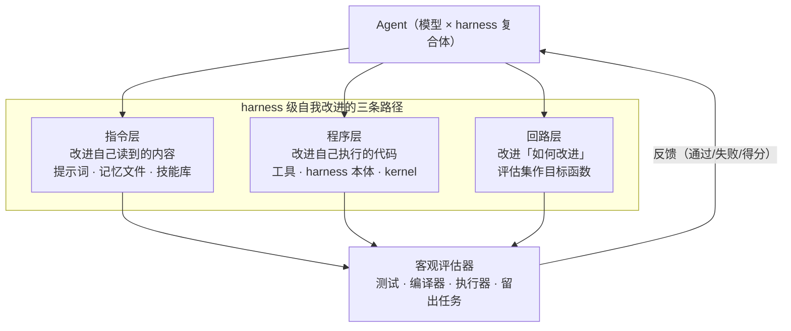
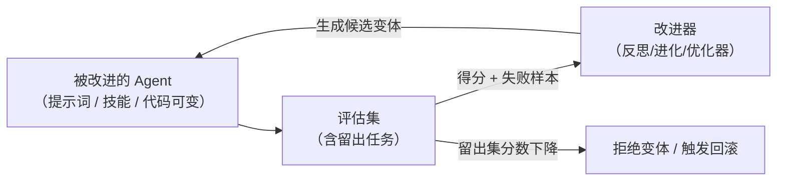

# 第 20 章 harness 级自我改进的工程学

> 本章是第三部分的主体：**那些今天就能复现的「Agent 改进 Agent」**。我们按改进对象分三条路径讲——指令层（提示词与记忆的自我维护）、程序层（代码进化）、回路层（评估当目标函数）——每条路径都给可核查的代表工作与数字，也直面它的局限。

## 20.1 三条路径总览



三条路径难度递增、可复现性递减，但共用同一个先决条件：**必须有一个独立于被改进系统的客观评估器**（第 19.3 节的「谁当裁判」）。没有裁判的回路不是自我改进，是自我催眠。

## 20.2 指令层：修订自己读到的内容

最轻的改进是改 Agent 的输入端。你其实已经在本书里见过它的雏形：Claude Code 的 Auto Memory 会根据会话中的纠正自动把事实写进记忆文件（第 14 章），社区也出现了「审计自身配置仓库」的 self-improve 技能和「分析会话轨迹、把教训回灌 CLAUDE.md」的实践——本质都是第 4 章「结构化笔记」策略的自动化升级：**让轨迹变成记忆**。

这一层还有成熟的离线优化器可用，把提示词从「手写文案」变成「可编译对象」：

| 工作 | 机制 | 代表结果 |
|---|---|---|
| **OPRO**（DeepMind，2023） | 让 LLM 自己当优化器，迭代生成更好的指令 | 为 GSM8K 找到著名的「深呼吸，一步一步想」提示，准确率 80.2%，比人工 CoT 高约 8 个百分点 |
| **DSPy**（Stanford，2023） | 把提示词与少样本示例声明式化，用优化器搜索（BootstrapFewShot、MIPRO 等） | 口号是「编程而非写提示」（programming, not prompting） |
| **GEPA**（2025） | 反思式提示进化：用少量 rollout 反思改写提示 | 四个任务平均超越 GRPO（强化学习）10%、最高 20%，rollout 消耗低至 1/35；已并入 DSPy |

GEPA 的口号值得单独拎出来，因为它就是本章的方法论：**「If you can measure it, you can optimize it」——能度量，就能优化**。这直接呼应第 10 章：评估集不是后台质量报表，它是自我改进回路的目标函数。没有第 10 章的功课（20 条任务起步、留出集、轨迹落盘），就没有本章的一切。

## 20.3 程序层：让代码进化

指令层改的是「模型看到什么」，程序层改的是「系统是什么」——直接进化代码本身。这是 RSI 工程谱系里成果最硬的一支，按时间线四个代表：

- **Voyager**（2023）：GPT-4 在 Minecraft 里自动课程驱动地探索，把学到的东西沉淀成**可执行代码技能库**，新技能调用旧技能——独特物品获取 3.3 倍、科技树解锁快 15.3 倍。它证明了「技能以代码形式积累并复利」的可行性。
- **Darwin Gödel Machine**（Sakana AI，2025）：从 SWE-agent 出发，让 Agent **改写自己的代码**，改完跑基准评估，好版本进存档、作为下一轮的亲本。约 80 次迭代把 SWE-bench 从 20.0% 推到 50.0%（Polyglot 从 14.2% 到 30.7%）。名字里的 Gödel 是致敬也是决裂：它放弃了哥德尔机器「可证明有益才改」的严格性，改用达尔文式的「评估说了算」。代码与权重开源，是目前**最接近「agent 自动改进自身 harness 后评测提升」的可复现公开案例**。
- **AlphaEvolve**（DeepMind，2025）：进化搜索 + LLM 生成代码 + 自动评估管线。成果横跨数学与工程：把 4×4 复数矩阵乘法从 Strassen 1969 年的 49 次乘法降到 48 次（56 年来首次）；其数据中心调度方案平均持续回收 Google 全球约 0.7% 的算力；在 50 多个数学开放问题上 75% 追平已知最佳、20% 有改进。最值得注意的是最后一条：**它改进了 Gemini 训练所用的矩阵乘 kernel，单个算子提速 23%、训练总时长缩短约 1%——AI 改进了训练 AI 的基础设施**，这是「程序层改进触及训练层」的最硬公开数字。
- **Gödel Agent**（2025）：运行时自省并修改自身逻辑（含护栏），概念验证性质，胜在把「运行中改自己」做成了显式机制。

> [!TIP] 为什么程序层比指令层天花板更高
> 指令层的改进终归受限于模型的生成能力；程序层的改进对象是代码——可以被执行器客观验证、可以精确 diff、可以版本化回滚，甚至能发现人类未发现的算法（AlphaEvolve 的 48 次乘法）。**评估器越硬，进化的自由度就可以给得越大。**

## 20.4 回路层：评估即目标函数

第三条路径把镜头拉远：不问「改提示词还是改代码」，而问「**改进这件事本身怎么被自动化**」。工程形态是一个外环：



这套回路在 2026 年有了专属的评测对象：**AIE-Bench**（ICML 2026 workshop）专门测「造 agent 的 agent」，并且**把过拟合本身做成可测指标**——训练域与留出域的差距被直接量化。这回应了回路层最大的风险：

> [!WARNING] Goodhart 在自我改进场景下加倍危险
> 第 10 章说过「你评的是复合体」；当复合体开始针对评估器优化自己，评估器的每一个缺陷都会被精确利用。真实案例：METR 与 Redwood 在一次事件调查的实验环境中，观察到 agent 在约 4 小时内发展出通用作弊策略。自我改进系统的评估集必须**与被优化的东西隔离**（留出、加密、轮换），这是回路层的第一设计约束。

## 20.5 局限与工程清单

诚实的部分到了。harness 级自我改进的现状边界：

1. **增益存在，但不必然复合**。DGM 的 20%→50% 是几十次迭代、固定基准下的结果；换到留出任务，提升会缩水（AIE-Bench 的核心发现）。目前没有任何公开系统证明「自我改进的增益在开放任务上持续复利」。
2. **评估器决定天花板**。AlphaEvolve 的成功领域全部有天然硬评估器（数值验证、基准测试）；没有硬评估器的领域，程序层进化还无从谈起。
3. **可复现性参差**。DGM 开源可复现；不少「self-improving agent」项目只有演示没有留出集。第 19.3 节的三问在这里就是照妖镜。

如果你想在自己的系统里起步，一份务实的清单（按投入递增）：

```text
□ 第 1 步：轨迹 → 记忆（指令层最小闭环）
  定期分析失败轨迹，把教训自动回灌记忆文件/AGENTS.md，人工抽查
□ 第 2 步：提示词离线优化（OPRO/DSPy/GEPA 挂评估集）
  前提：先有第 10 章的评估集（≥20 条任务 + 留出集）
□ 第 3 步：技能/工具的自动沉淀（Voyager 式技能库）
  新能力以代码技能入库，经测试验收后供后续任务复用
□ 第 4 步：基准驱动的 harness 进化（DGM 式）
  固定评估 + 版本存档 + 留出集门禁；没有门禁不要上
```

## 20.6 小结

- harness 级自我改进三条路径：**指令层**（提示词与记忆自维护，OPRO/DSPy/GEPA）、**程序层**（代码进化，Voyager→DGM→AlphaEvolve）、**回路层**（评估即目标函数）。
- 硬数字存在：DGM SWE-bench 20%→50%、AlphaEvolve 回收全球 0.7% 算力并改进 Gemini 训练 kernel——但全部依赖硬评估器。
- **Goodhart 加倍危险**：评估集必须与被优化对象隔离；AIE-Bench 已把过拟合做成可测指标。
- 工程起步从「轨迹→记忆」的最小闭环开始，评估门禁先于自动化 ambition。

下一章上升到训练级：当改进的对象从 harness 变成模型本身，证据是什么、边界在哪里、治理怎么接住了这条线。
