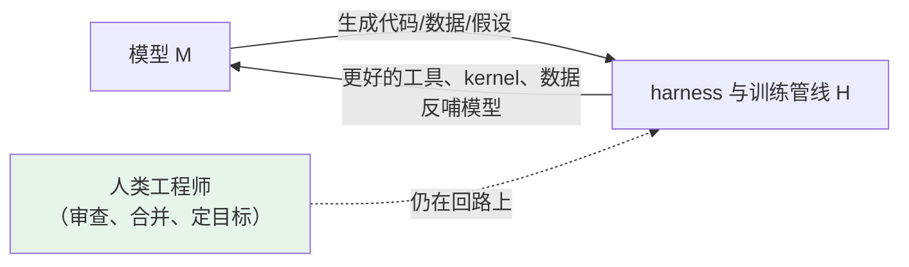

# 第 21 章 训练级自我改进与边界

> 最后一个章节回答两个问题：**当改进的对象从 harness 变成模型本身，现有的证据长什么样？以及，「智能爆炸」的争论与治理，接住了这条线吗？** 本章结束处，也是全书的收束点。

## 21.1 训练级的三类工作

训练级自我改进的共同形态是：**模型（配合 harness）生产改进模型自身的素材，由客观验证器筛掉错的**。三篇代表论文覆盖三种拓扑：

| 工作 | 机制 | 关键点 |
|---|---|---|
| **SEAL**（MIT，2025） | 模型生成自然语言「自编辑」（self-edits）——即自我生成的微调数据与更新指令——执行为**权重更新**，再以下游表现为奖励，用强化学习学会生成更好的自编辑 | 「自我改进」第一次落到了权重上 |
| **Absolute Zero**（清华+字节，2025） | 单一模型既是**出题者**又是**解题者**，用**代码执行器当客观验证器**，零外部数据训练推理能力 | 验证器完全客观（执行结果），且观察到对通用能力的正外溢 |
| **R-Zero**（Sea AI Lab+NUS，2025） | 三个 LLM 分别担任策略、 rollout 生成与验证器，**互相进化** | 拓扑从自博弈升级为群体博弈 |

三者的共同约束值得注意：**都依赖可验证的封闭域任务**（数学、代码、逻辑）。这与第 20 章的结论同构——评估器硬度决定自我改进的可行域。在开放域（品味、判断、事实性难以机器判定）上，训练级自我改进目前没有可靠方案；所谓「合成数据占比过半」也**没有任何旗舰实验室的一手数字**，只有 Epoch AI 对公开人类文本将在 2026–2028 年间耗尽的推算，构成转向自生成数据的结构性动因。

## 21.2 「AI 加速 AI 研发」：证据与口径

训练级之上还有一个正在被密集披露的层次：机构层面用 AI 自动化自己的研发管线。2026 年最重要的一份公开材料是 Anthropic 的《When AI Builds Itself》（2026-06）：

- **Claude 已写下 Anthropic 仓库中超过 80% 的合并代码**（实验室自述口径，配套第三方评估安排）；
- 工程师每季交付的代码量约为数年前的 **8 倍**；
- 同年 9 月发布的 R&D Automation Index 给出更细的刻度：AI 主导（AL4）的研发工作占比从 2026 年 2 月的不足 1% 升至 8 月的 **26%**，约 3 万个并发 Agent 参与研发——而**完全自主（AL5）的占比为 0**。

「26% 与 0%」这组数字是理解当前阶段的最好注脚：**AI 已经在大幅承担研发工作，但回路里始终留着人**。加上第 20 章的 AlphaEvolve 改进 Gemini 训练 kernel，可以画出当前的证据图谱：

注意图中虚线的位置：**今天所有「AI 自我改进」的公开样本，人都还在回路上**——这正是 Good 式全自动循环与现实的差距所在。

> [!WARNING] 口径纪律
> 这一节的数字几乎都是**实验室自述**（80%、8×、26%），引用时应注明口径；早期流传的「Claude Code 九成代码由自己写成」等说法未经官方一手确认，本书不采用。鉴别此类消息，第 19.3 节三问照常适用。

## 21.3 证据的另一面：METR 的测量

把镜头从厂商自述切到独立测量机构 METR，证据的两面性立刻显形：

- **能力时程曲线**：以「50% 成功率对应的人类任务耗时」为刻度，2019–2025 年整体趋势约为**每 7 个月翻倍**，2024–2025 段加速到约 4 个月（Kwa et al., 2025，NeurIPS）。这条被中文社区称作「Agent 版摩尔定律」的曲线，是「能力在涨」一侧最扎实的独立证据。
- **随机对照试验的冷水**：同一机构 2025 年 7 月发表的 RCT（16 名资深开源维护者、246 个真实任务）发现，使用当时工具的**开发者反而慢了约 19%**——而他们事前预测自己会快 24%；2026 年初用新一代工具复测，才转为约 +18% 提速。

两条证据合起来的结论比任何单条都重要：**能力曲线在涨是真的，但「能力 → 实际生产力」的转化存在滞后与波动，且测量对象永远是「模型 × harness × 人」的复合体**（第 10 章与第 12 章的观点在最高处会合）。至于「智能爆炸会不会发生」，双方阵营的代表作列表如下，读者自行取用——本书站在证据一侧，不预测：

| 加速派 | 怀疑派 |
|---|---|
| 《AI 2027》情景报告（AI Futures Project，2025-04） | METR RCT（2025-07）：-19% |
| Altman《The Gentle Singularity》（2025-06） | Epoch AI《multi-decade timelines》（2025-04）：收益递减+算力瓶颈 |
| Anthropic《When AI Builds Itself》（2026-06） | Vinyals（2026）：自改进不会引发爆炸；《AI 2027》的逐条批评（2025-04/07） |

## 21.4 安全与治理如何接住 RSI

第三层（叙事级）并非空谈——它已经落成了三张网：

1. **实验室安全框架**：OpenAI Preparedness v2 把「能递归自我改进（完全自动化 AI R&D）」定为最高风险级的定义；Anthropic RSP 为 AI R&D 设阈值（v3.0 于 2026-02 生效，触发更高级保障要求）；DeepMind 前沿安全框架将「ML 研发」列为关键能力域。用本书的语言：这些阈值都是为「模型 × harness」复合体设下的**能力红线**。
2. **法律**：加州 SB 53（2025-09 签署）要求前沿开发者公开安全框架并接受第三方审计，「自我改进」明确在覆盖能力之列；欧盟 GPAI 行为准则（2025-07 终版）要求监测能力跃迁轨迹。
3. **行业自组织**：三大实验室筹建中的安全标准机构（2026-09 报道）继续把这条线制度化。

对工程师而言，治理层不是背景噪音：**你的 harness 设计（权限、沙箱、审批、评估门禁）就是这些框架要求的第一线落地**——第 8 章的纵深防御清单，在 RSI 语境下从「防误操作」升级为「防改进回路失控」。

## 21.5 全书结语：harness 改进 harness

回到前言的那个公式：**Agent = 模型 + 工具 + 循环 + 上下文 + 护栏**。

- 第一部分把公式逐项拆开讲透——它们是稳定的工程原理；
- 第二部分用六个 harness 证明——差异只在于把哪一项做到什么程度、用什么代价换；
- 第三部分把镜头转向未来——**这些 harness，正在开始改进 harness 自身**。

这就是当下的 RSI：不是科幻式的起飞，而是一条被客观评估器、留出集、权限与审计约束着的工程回路。AlphaEvolve 的 48 次乘法、DGM 的 20%→50%、Anthropic 的 26% 与 0%，都是这条回路上的真实里程碑；而 METR 的 -19%、AIE-Bench 的过拟合量化、安全框架里的红线，则是同样真实的护栏。

如果你只从本书带走三句话，让它们是这三句：

1. **能度量，才能优化**——评估集是一切自我改进的地基（第 10 章）；
2. **你不是模型，你就是 harness**——工具、循环、上下文、护栏，每一项都值得刻意设计（第 1–12 章）；
3. **深的是取舍，浅的是原理**——读懂任何一个新 Agent（或它的自我改进版本），用的都是同一张地图（第 12 章）。

祝你在人机协作的这条曲线上，找到自己产品的位置——也希望当 Agent 开始改进它自己的那一天，你的名字在评估门禁的审批人列表里。
